# FlashAttention-3: Fast and Accurate Attention with Asynchrony and Low-precision

Jay Shah $^{*1}$ , Ganesh Bikshandi $^{*1}$ , Ying Zhang $^{2}$ , Vijay Thakkar $^{3,4}$ , Pradeep Ramani $^{3}$ , and Tri Dao $^{5,6}$

$^{1}$ Colfax Research $^{2}$ Meta $^{3}$ NVIDIA $^{4}$ Georgia Tech $^{5}$ Princeton University $^{6}$ Together AI

{jayhshah,ganesh}@colfax-intl.com, yingz@meta.com, {vithakkar,prraman}@nvidia.com, tri@tridao.me

July 16, 2024

## Abstract

Attention, as a core layer of the ubiquitous Transformer architecture, is the bottleneck for large language models and long-context applications. FLASHATTENTION elaborated an approach to speed up attention on GPUs through minimizing memory reads/writes. However, it has yet to take advantage of new capabilities present in recent hardware, with FLASHATTENTION-2 achieving only 35% utilization on the H100 GPU. We develop three main techniques to speed up attention on Hopper GPUs: exploiting asynchrony of the Tensor Cores and TMA to (1) overlap overall computation and data movement via warp-specialization and (2) interleave block-wise matmul and softmax operations, and (3) block quantization and incoherent processing that leverages hardware support for FP8 low-precision. We demonstrate that our method, FLASHATTENTION-3, achieves speedup on H100 GPUs by 1.5-2.0× with FP16 reaching up to 740 TFLOPs/s (75% utilization), and with FP8 reaching close to 1.2 PFLOPs/s. We validate that FP8 FLASHATTENTION-3 achieves 2.6× lower numerical error than a baseline FP8 attention.

## 1 Introduction

For the Transformer architecture [59], the attention mechanism constitutes the primary computational bottleneck, since computing the self-attention scores of queries and keys has quadratic scaling in the sequence length. Scaling attention to longer context will unlock new capabilities (modeling and reasoning over multiple long documents [24, 43, 50] and files in large codebases [30, 48]), new modalities (high-resolution images [11], audio [23], video [25]), and new applications (user interaction with long history [53], agent workflow with long horizon [62]). This has generated significant interest in making attention faster in the long-context regime, including by approximation [14, 27, 56] and software optimization ([17, 29, 45]), or even alternative architectures [22, 42, 55].

In this work, we build on the work of Dao et al. $[17]$ on developing exact-attention algorithms that integrate knowledge of the GPU's execution model and hardware characteristics into their high-level design. In $[17]$ , Dao et al. introduced FLASHATTENTION, a novel tiling strategy for parallelizing attention that eliminates intermediate reads/writes to slow global memory through fusing all of the attention operations into a single GPU kernel. Dao $[15]$ restructured the algorithm as FLASHATTENTION-2 to also parallelize over the sequence length dimension and perform the inner loop of the forward pass over blocks of the key and value matrices, thus improving the occupancy and distribution of work on the GPU. However, we observe that FLASHATTENTION-2 nonetheless achieves poor utilization on newer GPUs relative to optimized matrix-multiplication (GEMM) kernels, such as 35% vs. 80-90% on the Hopper H100 GPU. Partially, this may be attributed to implementation-level differences, such as not using Hopper-specific instructions in place of Ampere ones when targeting the Tensor Cores. Several work such as ThunkerKitten $[52]$ and cuDNN 9 $[39]$ has shown that with Hopper-specific instructions and tile-based abstractions, one can speedup attention computation and simplify the implementation.

More fundamentally, FLASHATTENTION-2's algorithm adheres to a simplified synchronous model and makes no explicit use of asynchrony and low-precision in its design. Asynchrony is a result of hardware specialization to accelerate the most important operations in a ML workload: specific hardware units performing matrix multiplication (Tensor Cores) or memory loading (Tensor Memory Accelerator – TMA), separate from the rest of the CUDA cores performing logic, integer, and floating point computation. Low precision such as FP8 in Hopper and FP4 in Blackwell, continuing the trend of FP16 (Pascal in 2017) and BF16 (Ampere in 2020), is a proven technique to get double or quadruple throughput for the same power and chip area. We review the capabilities afforded by Hopper in these directions in §2.2. The technical challenge is to redesign FLASHATTENTION-2 to make use of these hardware features: asynchrony requires overlapping computation between matmul and softmax even though one depends on the output of the other, and low-precision requires care to minimize quantization error, especially in the case of outlier features in LLMs [20, 54].

To this end, we propose FLASHATTENTION-3, which contributes and synthesizes three new ideas to further improve performance on newer GPU architectures: $^{1}$

1. Producer-Consumer asynchrony: We define a warp-specialized software pipelining scheme that exploits the asynchronous execution of data movement and Tensor Cores by splitting producers and consumers of data into separate warps, thereby extending the algorithm's ability to hide memory and instruction issue latencies.

2. Hiding softmax under asynchronous block-wise GEMMs: We overlap the comparatively low-throughput non-GEMM operations involved in softmax, such as floating point multiply-add and exponential, with the asynchronous WGMMA instructions for GEMM. As part of this, we rework the FLASHATTENTION-2 algorithm to circumvent certain sequential dependencies between softmax and the GEMMs. For example, in the 2-stage version of our algorithm, while softmax executes on one block of the scores matrix, WGMMA executes in the asynchronous proxy to compute the next block.

3. Hardware-accelerated low-precision GEMM: We adapt the forward pass algorithm to allow for targeting the FP8 Tensor Cores for GEMM, nearly doubling the measured TFLOPs/s. This requires bridging the different layout conformance requirements of WGMMA in terms of how blocks of FP32 accumulator and FP8 operand matrices are assumed to be laid out in memory. We use the techniques of block quantization and incoherent processing to mitigate the loss of accuracy that results from moving to FP8 precision.

To validate our method empirically, we benchmark FLASHATTENTION-3 on the H100 SXM5 GPU over a range of parameters and show that (1) FP16 achieves 1.5-2.0× speedup over FLASHATTENTION-2 in the forward pass (reaching up to 740 TFLOPs/s) and 1.5-1.75× in the backward pass, (2) FP8 achieves close to 1.2 PFLOPs/s, and (3) for large sequence length, FP16 outperforms and FP8 is competitive $^{2}$ with a state-of-the-art implementation of attention from NVIDIA's cuDNN library. We also validate that FP16 FLASHATTENTION-3 yields the same numerical error as FLASHATTENTION-2 and is better than the standard attention implementation as intermediate results (e.g., softmax rescaling) are kept in FP32. Moreover, FP8 FLASHATTENTION-3 with block quantization and incoherent processing is 2.6× more accurate than standard attention with per-tensor quantization in cases with outlier features.

We open-source FLASHATTENTION-3 with a permissive license $^{3}$ and plan to integrate it with PyTorch and Hugging Face libraries to benefit the largest number of researchers and developers.

## 2 Background: Multi-Head Attention and GPU Characteristics

## 2.1 Multi-Head Attention

Let $\mathbf{Q},\mathbf{K},\mathbf{V}\in \mathbb{R}^{N\times d}$ be the query, key and value input sequences associated to a single head, where $N$ is the sequence length and $d$ is the head dimension. Then the attention output $\mathbf{O}$ is computed as:

$$
\mathbf {S} = \alpha \mathbf {Q} \mathbf {K} ^ {\top} \in \mathbb {R} ^ {N \times N}, \quad \mathbf {P} = \operatorname{softmax} (\mathbf {S}) \in \mathbb {R} ^ {N \times N}, \quad \mathbf {O} = \mathbf {P V} \in \mathbb {R} ^ {N \times d},
$$

$^{1}$ We describe our results in the context of NVIDIA's Hopper architecture. However, our algorithm is operative for any GPU architecture with sufficiently robust asynchronous execution and low-precision capabilities.

where softmax is applied row-wise and one typically sets $\alpha = 1/\sqrt{d}$ as the scaling factor. In practice, we subtract $\text{rowmax}(\mathbf{S})$ from S to prevent numerical instability with the exponential function. For multi-head attention (MHA), each head has its own set of query, key and value projections, and this computation parallelizes across multiple heads and batches to produce the full output tensor.

Now let $\phi$ be a scalar loss function and let $\mathbf{d}(-) = \partial \phi / \partial (-)$ be notation for the gradient. Given the output gradient $\mathbf{dO} \in \mathbb{R}^{N \times d}$ , we compute $\mathbf{dQ}$ , $\mathbf{dK}$ , and $\mathbf{dV}$ according to the chain rule as follows:

$$
\begin{array}{r l} & {\mathbf {d V} = \mathbf {P} ^ {\top} \mathbf {d O} \in \mathbb {R} ^ {N \times d}} \\ & {\mathbf {d P} = \mathbf {d O V} ^ {\top} \in \mathbb {R} ^ {N \times N}} \\ & {\mathbf {d S} = \mathrm{dsoftmax} (\mathbf {d P}) \in \mathbb {R} ^ {N \times N}} \\ & {\mathbf {d Q} = \alpha \mathbf {d S K} \in \mathbb {R} ^ {N \times d}} \\ & {\mathbf {d K} = \alpha \mathbf {d S} ^ {\top} \mathbf {Q} \in \mathbb {R} ^ {N \times d},} \end{array}
$$

Here, we have that $\mathbf{d}s = (\mathrm{diag}(p) - pp^{\top})\mathbf{d}p$ for $p = \mathrm{softmax}(s)$ as a function of a vector s, and we write $\mathrm{dsoftmax}(\mathbf{dP})$ for this formula applied row-wise. Finally, this computation again parallelizes across the number of heads and batches for the backward pass of MHA.

## 2.2 GPU hardware characteristics and execution model

We describe the aspects of the GPU's execution model relevant for FLASHATTENTION-3, with a focus on the NVIDIA Hopper architecture as a concrete instantiation of this model.

Memory hierarchy: The GPU's memories are organized as a hierarchy of data locales, with capacity inversely related to bandwidth (Table 1) $^{4}$ . Global memory (GMEM), also known as HBM, is the off-chip DRAM accessible to all streaming multiprocessors (SMs). Data from GMEM gets transparently cached into an on-chip L2 cache. Next, each SM contains a small on-chip, programmer-managed highly banked cache called shared memory (SMEM). Lastly, there is the register file within each SM.

Thread hierarchy: The GPU's programming model is organized around logical groupings of execution units called threads. From the finest to coarsest level, the thread hierarchy is comprised of threads, warps (32 threads), warpgroups (4 contiguous warps), threadblocks (i.e., cooperative thread arrays or CTAs), threadblock clusters (in Hopper), and grids.

These two hierarchies are closely interlinked. Threads in the same CTA are co-scheduled on the same SM, and CTAs in the same cluster are co-scheduled on the same GPC. SMEM is directly addressable by all threads within a CTA, whereas each thread has at most 256 registers (RMEM) private to itself.

Table 1: Thread-Memory hierarchy for the NVIDIA Hopper H100 SXM5 GPU.

<table><tr><td>Hardware Level</td><td>Parallel Agent</td><td>Data Locale</td><td>Capacity @ Bandwidth</td></tr><tr><td>Chip</td><td>Grid</td><td>GMEM</td><td>80 GiB @ 3.35 TB/s</td></tr><tr><td>GPC</td><td>Threadblock Clusters</td><td>L2</td><td>50 MiB @ 12 TB/s</td></tr><tr><td>SM</td><td>Threadblock (CTA)</td><td>SMEM</td><td>228 KiB per SM, 31TB/s per GPU</td></tr><tr><td>Thread</td><td>Thread</td><td>RMEM</td><td>256 KiB per SM</td></tr></table>

Asynchrony and warp-specialization: GPUs are throughput processors that rely on concurrency and asynchrony to hide memory and execution latencies. For async memory copy between GMEM and SMEM, Hopper has the Tensor Memory Accelerator (TMA) as a dedicated hardware unit $[38, §7.29]$ . Furthermore, unlike prior architectures such as Ampere, the Tensor Core of Hopper, exposed via the warpgroup-wide WGMMA instruction $[40, §9.7.14]$ , is also asynchronous and can source its inputs directly from shared memory.

Hardware support for asynchrony allows for warp-specialized kernels, where the warps of a CTA are divided into producer or consumer roles that only ever issue either data movement or computation. Generically, this improves the compiler's ability to generate optimal instruction schedules $[4]$ . In addition, Hopper supports the dynamic reallocation of registers between warpgroups via setmaxnreg $[40, §9.7.17.1]$ , so those warps doing MMAs can obtain a larger share of RMEM than those just issuing TMA (for which only a single thread is needed).

Low-precision number formats: Modern GPUs have specialized hardware units for accelerating low-precision computation. For example, the WGMMA instruction can target the FP8 Tensor Cores on Hopper to deliver 2x the throughput per SM when compared to FP16 or BF16.

However, correctly invoking FP8 WGMMA entails understanding the layout constraints on its operands. Given a GEMM call to multiply $A \times B^{T}$ for an $M \times K$ -matrix A and an $N \times K$ -matrix B, we say that the A or B operand is mn-major if it is contiguous in the outer M or N dimension, and k-major if is instead contiguous in the inner K-dimension. Then for FP16 WGMMA, both mn-major and k-major input operands are accepted for operands in SMEM, but for FP8 WGMMA, only the k-major format is supported. Moreover, in situations such as attention where one wants to fuse back-to-back GEMMs in a single kernel, clashing FP32 accumulator and FP8 operand layouts pose an obstacle to invoking dependent FP8 WGMMAs.

In the context of attention, these layout restrictions entail certain modifications to the design of an FP8 algorithm, which we describe in §3.3.

## 2.3 Standard Attention and Flash Attention

Following Dao et al. [17], we let standard attention denote an implementation of attention on the GPU that materializes the intermediate matrices S and P to HBM. The main idea of FLASHATTENTION was to leverage a local version of the softmax reduction to avoid these expensive intermediate reads/writes and fuse attention into a single kernel. Local softmax corresponds to lines 18-19 of the consumer mainloop in Algorithm 1 together with the rescalings of blocks of O. The simple derivation that this procedure indeed computes O can be found in [15, §2.3.1].

## 3 FlashAttention-3: Algorithm

In this section, we describe the FLASHATTENTION-3 algorithm. For simplicity, we focus on the forward pass, with the backward pass algorithm described in Appendix B.1. We first indicate how to integrate warp-specialization with a circular SMEM buffer into the base algorithm of FLASHATTENTION-2. We then explain how to exploit asynchrony of WGMMA to define an overlapped GEMM-softmax 2-stage pipeline. Finally, we describe the modifications needed for FP8, both in terms of layout conformance and accuracy via block quantization and incoherent processing.

## 3.1 Producer-Consumer asynchrony through warp-specialization and pingpong scheduling

Warp-specialization As with FLASHATTENTION-2, the forward pass of FLASHATTENTION-3 is embarrassingly parallel in the batch size, number of heads, and query sequence length. Thus, it will suffice to give a CTA-level view of the algorithm, which operates on a tile $Q_{i}$ of the query matrix to compute the corresponding tile $O_{i}$ of the output. To simplify the description, we first give the warp-specialization scheme with a circular SMEM buffer that does not have in addition the GEMM-softmax overlapping. Let d be the head dimension, N the sequence length, and fix a query block size $B_{r}$ to divide Q into $T_{r} = \left\lceil \frac{N}{B_{r}} \right\rceil$ blocks $Q_{1}, \ldots, Q_{T_{r}}$ .

<div class="mineru-algorithm" style="white-space: pre-wrap; font-family:monospace;">
Algorithm 1 FLASHATTENTION-3 forward pass without intra-consumer overlapping – CTA view
Require: Matrices  $Q_{i} \in R^{B_{r} \times d}$  and K,  $V \in R^{N \times d}$  in HBM, key block size  $B_{c}$  with  $T_{c} = \lceil \frac{N}{B_{c}} \rceil$ .
1: Initialize pipeline object to manage barrier synchronization with s-stage circular SMEM buffer.
2: if in producer warpgroup then
3:    Deallocate predetermined number of registers.
4:    Issue load  $Q_{i}$  from HBM to shared memory.
5:    Upon completion, commit to notify consumer of the load of  $Q_{i}$ .
6:    for  $0 \leq j &lt; T_{c}$  do
7:    Wait for the (j % s)th stage of the buffer to be consumed.
8:    Issue loads of  $K_{j}, V_{j}$  from HBM to shared memory at the (j % s)th stage of the buffer.
9:    Upon completion, commit to notify consumers of the loads of  $K_{j}, V_{j}$ .
10: end for
11: else
12:    Reallocate predetermined number of registers as function of number of consumer warps.
13:    On-chip, initialize  $O_{i} = (0) \in R^{B_{r} \times d}$  and  $\ell_{i}, m_{i} = (0), (-\infty) \in R^{B_{r}}$ .
14:    Wait for  $Q_{i}$  to be loaded in shared memory.
15:    for  $0 \leq j &lt; T_{c}$  do
16:    Wait for  $K_{j}$  to be loaded in shared memory.
17:    Compute  $S_{i}^{(j)} = Q_{i}K_{j}^{T}$  (SS-GEMM). Commit and wait.
18:    Store  $m_{i}^{old} = m_{i}$  and compute  $m_{i} = \max(m_{i}^{old}, rowmax(S_{i}^{(j)}))$ .
19:    Compute  $\widetilde{\mathbf{P}}_{i}^{(j)} = \exp(\mathbf{S}_{i}^{(j)} - m_{i})$  and  $\ell_{i} = \exp(m_{i}^{old} - m_{i})\ell_{i} + rowsum(\widetilde{\mathbf{P}}_{i}^{(j)})$ .
20:    Wait for  $V_{j}$  to be loaded in shared memory.
21:    Compute  $O_{i} = diag(exp(m_{i}^{old} - m_{i}))^{-1}O_{i} + \widetilde{\mathbf{P}}_{i}^{(j)}V_{j}$  (RS-GEMM). Commit and wait.
22:    Release the (j % s)th stage of the buffer for the producer.
23: end for
24:    Compute  $O_{i} = diag(\ell_{i})^{-1}O_{i}$  and  $L_{i} = m_{i} + log(\ell_{i})$ .
25:    Write  $O_{i}$  and  $L_{i}$  to HBM as the ith block of O and L.
26: end if

For our implementation of Algorithm 1 on Hopper, we use setmaxnreg for (de)allocations, TMA for loads of  $Q_{i}$  and  $\{K_{j}, V_{j}\}_{0 \leq j &lt; T_{c}}$ , and WGMMA to execute the GEMMs in the consumer mainloop, with the SS or RS prefix indicating whether the first operand is sourced from shared memory or register file. For interpreting the execution flow of Algorithm 1, note that issuing TMA loads does not stall on the completion of other loads due to asynchrony. Moreover, in the producer mainloop, no waits will be issued for the first s iterations as the buffer gets filled.
</div>

Pingpong scheduling The asynchronous nature of WGMMA and TMA, along with warp-specialization, opens up the opportunity to overlap the softmax computation of one warpgroup with the GEMM of another warpgroup. To motivate this, notice that non-matmul operations have much lower throughput than matmul operations on modern hardware accelerators. As an example, the H100 SXM5 GPU has 989 TFLOPS of FP16 matmul but only 3.9 TFLOPS of special functions such as exponential $^{5}$ (necessary for softmax). For the attention forward pass in FP16 with head dimension 128, there are 512x more matmul FLOPS compared to exponential operations, but the exponential has 256x lower throughput, so exponential can take 50% of the cycle compared to matmul. The situation is even worse with FP8, where the matmul throughput doubles but the exponential throughput stays the same.

Since the exponential is performed by a separate hardware unit (the multi-function unit), ideally we'd want the exponential calculation to be scheduled when the Tensor Cores are performing the matmul. To do so, we use synchronization barriers (bar.sync instructions) to force the GEMMs (GEMM1 - PV of one iteration, and GEMM0 - $\mathbf{Q}\mathbf{K}^{\top}$ of the next iteration) of warpgroup 1 to be scheduled before the GEMMs of warpgroup 2. As a result, the softmax of warpgroup 1 will be scheduled while warpgroup 2 is performing its GEMMs. Then the roles swap, with warpgroup 2 doing softmax while warpgroup 1 doing GEMMs (hence, "pingpong" scheduling). This is illustrated in Fig. 1. Though in practice the pingpong scheduling is not as clean as depicted in the figure, we generally find this to improve performance (e.g., from 570 TFLOPS to 620-640 TFLOPS for FP16 forward with head dimension 128 and sequence length 8192).

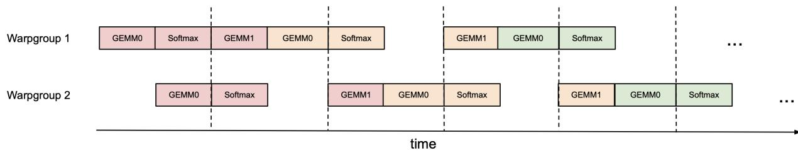  
Figure 1: Pingpong scheduling for 2 warpgroups to overlap softmax and GEMMs: the softmax of one warpgroup should be scheduled when the GEMMs of another warpgroup are running. The same color denotes the same iteration.

Attention variants For multi-query attention [51] and grouped query attention [3], we follow the approach in FLASHATTENTION-2 and adjust the tensor indexing to avoid duplicating K and V in HBM.

## 3.2 Intra-warpgroup overlapping GEMMs and softmax

Even within one warpgroup, we can overlap some instructions in the softmax with some instructions in the GEMMs. We describe one technique to do so.

In the attention algorithm, operations within the inner loop (main loop) have sequential dependencies that impede parallelization within a single iteration. For example, (local) softmax (lines 18 to 19) relies on the output $\mathbf{S}_i^{(j)}$ of the first GEMM, while the second GEMM takes its result $\widetilde{\mathbf{P}}_i^{(j)}$ as an operand. Indeed, the wait statements in lines 17 and 21 of Algorithm 1 serialize the execution of softmax and GEMMs. However, we can break these dependencies by pipelining across iterations through additional buffers in registers. Pursuing this idea, we propose the following two-stage $^6$ GEMM-softmax pipelining algorithm:

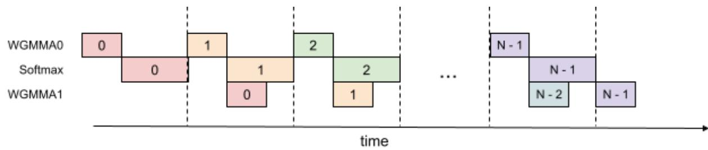  
Figure 2: 2-stage WGMMA-softmax pipelining

<div class="mineru-algorithm" style="white-space: pre-wrap; font-family:monospace;">
Algorithm 2 FLASHATTENTION-3 consumer warpgroup forward pass

Require: Matrices  $Q_{i} \in R^{B_{r} \times d}$  and K,  $V \in R^{N \times d}$  in HBM, key block size  $B_{c}$  with  $T_{c} = \left\lceil \frac{N}{B_{c}} \right\rceil$ .

1: Reallocate predetermined number of registers as function of number of consumer warps.

2: On-chip, initialize  $O_{i} = (0) \in R^{B_{r} \times d}$  and  $\ell_{i}, m_{i} = (0), (-\infty) \in R^{B_{r}}$ .

3: Wait for  $Q_{i}$  and  $K_{0}$  to be loaded in shared memory.

4: Compute  $S_{cur} = Q_{i}K_{0}^{T}$  using WGMMA. Commit and wait.

5: Release the 0th stage of the buffer for K.

6: Compute  $m_{i}, \tilde{P}_{cur}$  and  $\ell_{i}$  based on  $S_{cur}$ , and rescale  $O_{i}$ .

7: for  $1 \leq j &lt; T_{c} - 1$  do

8: Wait for  $K_{j}$  to be loaded in shared memory.

9: Compute  $S_{next} = Q_{i}K_{j}^{T}$  using WGMMA. Commit but do not wait.

10: Wait for  $V_{j-1}$  to be loaded in shared memory.

11: Compute  $O_{i} = O_{i} + \tilde{P}_{cur}V_{j-1}$  using WGMMA. Commit but do not wait.

12: Wait for the WGMMA  $Q_{i}K_{j}^{T}$ .

13: Compute  $m_{i}, \tilde{P}_{next}$  and  $\ell_{i}$  based on  $S_{next}$ .

14: Wait for the WGMMA  $\tilde{P}_{cur}V_{j-1}$  and then rescale  $O_{i}$ .

15: Release the (j % s)th, resp. (j - 1 % s)th stage of the buffer for K, resp. V.

16: Copy  $S_{next}$  to  $S_{cur}$ .

17: end for

18: Wait for  $V_{T_{c}-1}$  to be loaded in shared memory.

19: Compute  $O_{i} = O_{i} + \tilde{P}_{last}V_{T_{c}-1}$  using WGMMA. Commit and wait.

20: Epilogue: Rescale  $O_{i}$  based on  $m_{i}$ . Compute  $L_{i}$  based on  $m_{i}$  and  $\ell_{i}$ . Write  $O_{i}$  and  $L_{i}$  to HBM as the i-th block of O and L.
</div>

Algorithm 2 functions as a replacement for the consumer path of Algorithm 1 to comprise the complete FLASHATTENTION-3 algorithm for FP16 precision. At a high-level, we use WGMMA as a metonym for asynchronous GEMM. Within the mainloop (lines 8 to 16), the second WGMMA operation of iteration j (line 11) is overlapped with softmax operations from iteration $j + 1$ (line 13).

While the pipelined structure illustrated above offers theoretical performance gains, there are several practical aspects to consider:

Compiler reordering The pseudocode represents an idealized execution order but the compiler (NVCC) often rearranges instructions for optimization. This can disrupt the carefully crafted WGMMA and non-WGMMA operation pipelining sequence, potentially leading to unexpected behavior or diminished performance gains. An analysis of the SASS code shows that the compiler generates overlapped code as expected (Section B.2).

Register pressure To maintain optimal performance, register spilling should be minimized. However, the 2-stage pipeline requires additional registers to store intermediate results and maintain context between stages. Specifically, an extra $S_{next}$ must be kept in registers, leading to extra register usage of size $B_{r} \times B_{c} \times sizeof(float)$ per threadblock. This increased register demand may conflict with using larger block sizes (another common optimization), which is also register-hungry. In practice, trade-offs should be made based on profiling results.

3-stage pipelining Extending the 2-stage algorithm described above, we propose a 3-stage variant that would further overlap the second WGMMA with softmax. While this approach offers the potential for even higher Tensor Core utilization, it requires even more registers due to an additional stage in the pipeline, making the trade-off between tile size and pipeline depth more difficult to balance. A detailed description of the 3-stage algorithm and its evaluation results can be found in Appendix B.3.

## 3.3 Low-precision with FP8

Efficiency: layout transformations. Computing the forward pass of FLASHATTENTION-3 in FP8 precision poses additional challenges not encountered for FP16 in terms of layout conformance.

<table><tr><td>T0 {d0, d1}</td><td>T1 {d0, d1}</td><td>T2 {d0, d1}</td><td>T3 {d0, d1}</td><td>T0 {d4, d5}</td><td>T1 {d4, d5}</td><td>T2 {d4, d5}</td><td>T3 {d4, d5}</td></tr><tr><td>T0 {d2, d3}</td><td>T1 {d2, d3}</td><td>T2 {d2, d3}</td><td>T3 {d2, d3}</td><td>T0 {d6, d7}</td><td>T1 {d6, d7}</td><td>T2 {d6, d7}</td><td>T3 {d6, d7}</td></tr></table>

Figure 3: FP32 accumulator register WGMMA layout – rows 0 and 8, threads 0-3, entries 0-7.

<table><tr><td>T0 {a0, a1}</td><td>T0 {a2, a3}</td><td>T1 {a0, a1}</td><td>T1 {a2, a3}</td><td>T2 {a0, a1}</td><td>T2 {a2, a3}</td><td>T3 {a0, a1}</td><td>T3 {a2, a3}</td></tr><tr><td>T0 {a4, a5}</td><td>T0 {a6, a7}</td><td>T1 {a4, a5}</td><td>T1 {a6, a7}</td><td>T2 {a4, a5}</td><td>T2 {a6, a7}</td><td>T3 {a4, a5}</td><td>T3 {a6, a7}</td></tr></table>

Figure 4: FP8 operand A register WGMMA layout – rows 0 and 8, threads 0-3, entries 0-7.

First, we note that the input tensors Q, K, and V are typically given as contiguous in the head dimension, while to satisfy the k-major constraint on FP8 WGMMA for the second GEMM we need V, or rather the tiles of V loaded into SMEM, to be contiguous in the sequence length dimension. Since the TMA load itself cannot change the contiguous dimension, we then need to either (1) transpose V in GMEM as a pre-processing step, or (2) do an in-kernel transpose of tiles of V after loading them into SMEM. To implement option (1), we can either (1a) fuse the transpose to the epilogue of a preceding step such as the rotary embedding, or (1b) call a standalone pre-processing transpose kernel $^{7}$ to exchange the strides of the sequence length and head dimensions. However, (1a) is difficult to integrate into a standard library, and (1b) is too wasteful in a memory-bound situation such as inference.

Instead, for FP8 FLASHATTENTION-3 we opt for option (2). For the in-kernel transpose, we take advantage of the LDSM (ldmatrix) and STSM (stmatrix) instructions, which involve a warp of threads collectively loading SMEM to RMEM and storing RMEM to SMEM at a granularity of 128 bytes. $^{8}$ The LDSM/STSM instructions are both register efficient, allowing us to execute them in the producer warpgroup, and capable of transposing layouts when doing memory copy. Moreover, after the first iteration we can arrange for the transpose of the next V tile to be executed in the shadow of the two WGMMAs that involve the preceding V and current K tile.

Second, we observe that unlike with FP16, the memory layout of the FP32 accumulator of an FP8 WGMMA is different from that assumed for its operand A when held in registers. We depict fragments of these two layouts in Fig. 3 and Fig. 4, where the entries are held in registers per thread in the listed order. By using byte permute instructions, we can then transform the first WGMMA's accumulator into a format suitable for the second WGMMA, and compatibly with the layout of the V tile produced by the in-kernel transpose. Specifically, with reference to Fig. 3, we change the order in sequence to

## $\{d0 d1 d4 d5 d2 d3 d6 d7\}$ ,

and this register permutation is then replicated over every 8 bytes. In terms of the logical shape of the P tile, this maneuver permutes its columns (e.g., columns 0189 now become the first four columns). For WGMMA to then compute the correct output tile, we can correspondingly arrange for the in-kernel transpose to write out a matching row permutation of the V tile. $^{9}$

Accuracy: block quantization and incoherent processing. With FP8 (e4m3) format, one only uses 3 bits to store the mantissa and 4 bits for the exponent. This results in higher numerical error than FP16/BF16. Moreover, large models typically have outlier values $[20, 54]$ that are much larger in magnitude than most other values, making quantization difficult. One typically use per-tensor scaling $[37]$ by keeping one scalar per tensor (e.g., one for Q, for K, and for V). To reduce the numerical error of attention in FP8, we employ two techniques:

1. Block quantization: we keep one scalar per block, so that for each of Q, K, V we split the tensor into blocks of size $B_{r} \times d$ or $B_{c} \times d$ and quantize them separately. This quantization can be fused with an operation right before attention (e.g., rotary embedding) with no additional slow down (since rotary embedding is memory-bandwidth bound). As the FLASHATTENTION-3 algorithm naturally operates on blocks, we can scale each block of S to account for this block quantization at no computation cost.

2. Incoherent processing: to even out outliers, we multiply Q and K with a random orthogonal matrix M before quantizing to FP8. Since M is orthogonal, $MM^{\top} = I$ and so $(\mathbf{QM})(\mathbf{KM})^{\top} = \mathbf{QK}^{\top}$ , i.e., multiplying both Q and K with M does not change the attention output. This serves to “spread out” the outliers since each entry of QM or KM is a random sum of entries of Q or K, thus reducing quantization error. In practice, we follow Chee et al. [9] and Tseng et al. [58] and choose M to be the product of random diagonal matrices of $\pm1$ and a Hadamard matrix, which can be multiplied in $O(d \log d)$ instead of $O(d^{2})$ , and can also be fused with the rotary embedding at no extra computation cost.

We validate that these two techniques reduces numerical error by up to $2.6\times$ in §4.3.

## 4 Empirical Validation

We use the primitives from CUTLASS [57] such as WGMMA and TMA abstractions to implement FLASHATTENTION-3 and evaluate its efficiency and accuracy.

\- Benchmarking attention. We measure the runtime of FLASHATTENTION-3 across different sequence lengths and compare it to a standard implementation in PyTorch, FLASHATTENTION-2, FLASHATTENTION-2 in Triton (which uses H100-specific instructions), as well as a vendor's implementation of FLASHATTENTION-2 optimized for H100 GPUs from cuDNN. We confirm that FLASHATTENTION-3 is up to 2.0× faster than FLASHATTENTION-2 and 1.5× faster than FLASHATTENTION-2 in Triton. FLASHATTENTION-3 reaches up to 740 TFLOPs/s, 75% of the theoretical maximum TFLOPs/s on H100 GPUs.

\- Ablation study. We confirm that our algorithmic improvements with warp-specialization and GEMM-softmax pipelining contribute to the speedup of FLASHATTENTION-3.

\- Accuracy of FP8 attention. We validate that block quantization and incoherent processing reduces the numerical error of FP8 FLASHATTENTION-3 by 2.6×.

## 4.1 Benchmarking Attention

We measure the runtime of different attention methods on an H100 80GB SXM5 GPU for different settings (without / with causal mask, head dimension 64 or 128) for FP16 inputs. We report the results in Fig. 5 and Fig. 6, showing that FLASHATTENTION-3 is around $1.5 - 2.0 \times$ faster than FLASHATTENTION-2 in the forward pass and $1.5 - 1.75 \times$ faster in the backward pass. Compared to a standard attention implementation, FLASHATTENTION-3 can be up to $3 - 16 \times$ faster. For medium and long sequences (1k and above), FLASHATTENTION-3 even surpasses the speed of a vendor's library (cuDNN - closed source) that has been optimized for H100 GPUs.

Benchmark settings: We vary the sequence length as 512, 1k, ..., 16k, and set batch size so that the total number of tokens is 16k. We set the hidden dimension to 2048, and head dimension to be either 64, 128, or 256 (i.e., 32 heads, 16 heads, or 8 heads). To calculate the FLOPs of the forward pass, we use:

$$
4 \cdot \mathrm{seqlen} ^ {2} \cdot \mathrm{headdimension} \cdot \mathrm{numberofheads}.
$$

With causal masking, we divide this number by 2 to account for the fact that approximately only half of the entries are calculated. To get the FLOPs of the backward pass, we multiply the forward pass FLOPs by 2.5 (since there are 2 matmuls in the forward pass and 5 matmuls in the backward pass, due to recomputation).

We also measure the runtime for FP8 for the forward pass under similar settings. We report the results for headdim 256 in Fig. 7 and give the full results in Appendix C.2.

## 4.2 Ablation Study: 2-Stage Pipelining Experiments

We ablate both the 2-stage WGMMA-softmax pipelining and warp-specialization for non-causal FP16 FLASHATTENTION-3 with fixed parameters {batch, seqlen, nheads, hdim} = {4, 8448, 16, 128}. The result in Table 2 confirms that our algorithmic improvements (asynchrony with warp-specialization and overlapping between GEMM and softmax) lead to significant speedup, from 570 to 661 TFLOPs.

Attention forward speed, head dim 64 (H100 80GB SXM5)  
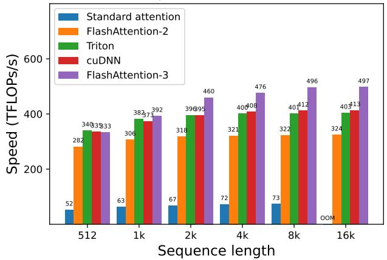  
(a) Forward, without causal mask, head dim 64

Attention forward speed, head dim 64 (H100 80GB SXM5)  
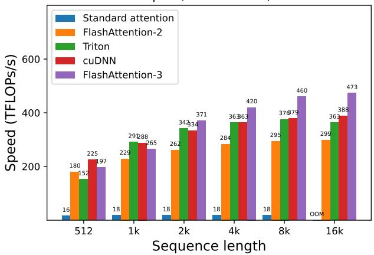  
(b) Forward, with causal mask, head dim 64

Attention forward speed, head dim 128 (H100 80GB SXM5)  
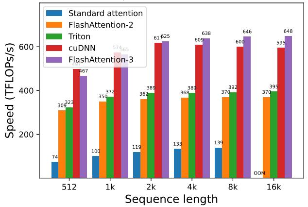  
(c) Forward, without causal mask, head dim 128

Attention forward speed, head dim 128 (H100 80GB SXM5)  
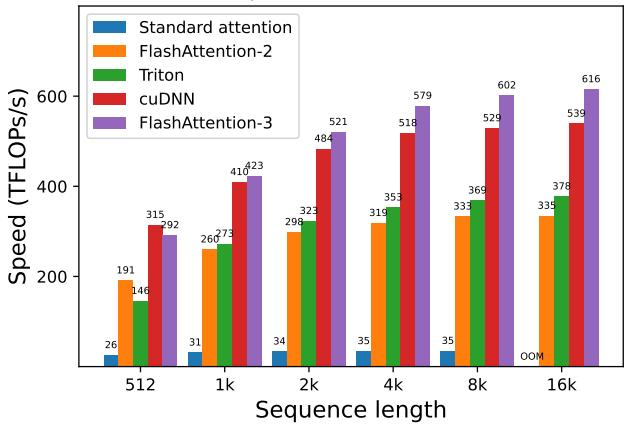  
(d) Forward, with causal mask, head dim 128

Attention forward speed, head dim 256 (H100 80GB SXM5)  
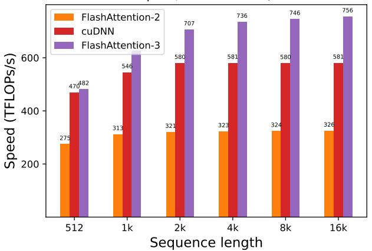  
(e) Forward, without causal mask, head dim 256

Attention forward speed, head dim 256 (H100 80GB SXM5)  
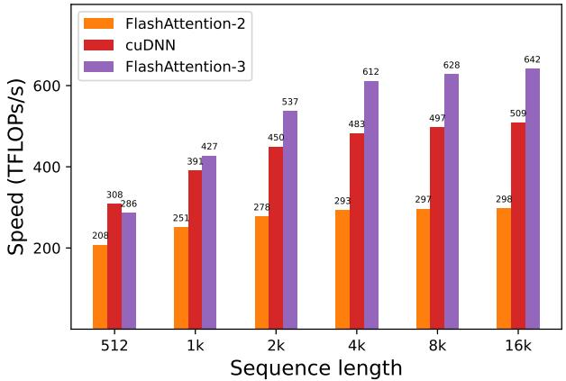  
(f) Forward, with causal mask, head dim 256  
Figure 5: Attention forward speed (FP16/BF16) on H100 GPU

## 4.3 Numerical Error Validation

As there has been interest in the numerical error $[21]$ of FLASHATTENTION, we compare FLASHATTENTION-2, FLASHATTENTION-3, and a standard implementation of attention against a reference implementation in FP64. To simulate outlier features and activations in LLMs $[20, 54]$ , we generate the entries of Q, K, V with the following

Attention backward speed, head dim 64 (H100 80GB SXM5)  
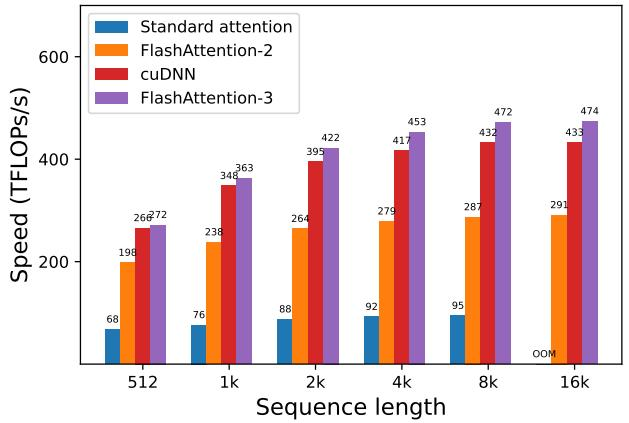  
(a) Backward, without causal mask, head dim 64

Attention backward speed, head dim 128 (H100 80GB SXM5)  
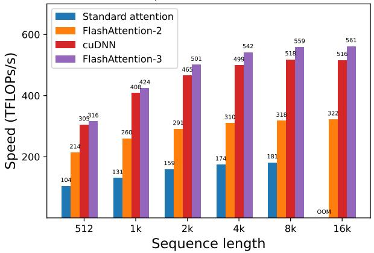  
(b) Backward, without causal mask, head dim 128

Figure 6: Attention backward speed (FP16/BF16) on H100 GPU  
Attention forward speed, head dim 256 (H100 80GB SXM5)  
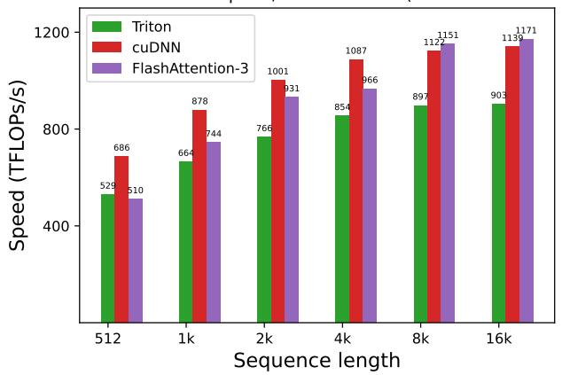  
(a) Forward, without causal mask, head dim 256

Attention forward speed, head dim 256 (H100 80GB SXM5)  
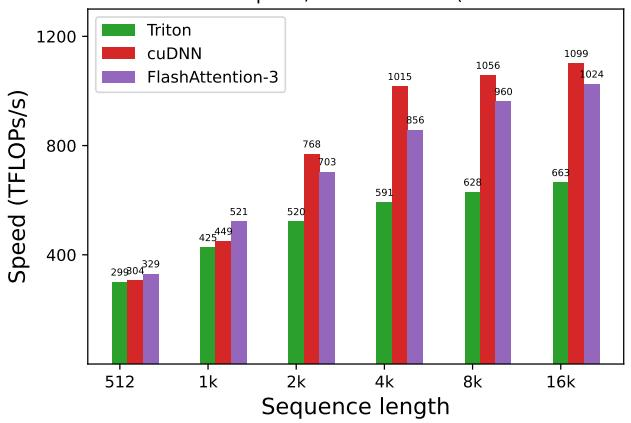  
(b) Forward, with causal mask, head dim 256  
Figure 7: Attention forward speed (FP8) on H100 GPU

Table 2: Pipelining ablation measurements

<table><tr><td>Configuration</td><td>Time</td><td>TFLOPs/s</td></tr><tr><td>FLASHATTENTION-3</td><td>3.538 ms</td><td>661</td></tr><tr><td>No GEMM-Softmax Pipelining, Warp-Specialization</td><td>4.021 ms</td><td>582</td></tr><tr><td>GEMM-Softmax Pipelining, No Warp-Specialization</td><td>4.105 ms</td><td>570</td></tr></table>

distribution:

$$
\mathcal {N} (0, 1) + \mathcal {N} (0, 1 0 0) \cdot \mathrm{Bernoulli} (0. 0 0 1).
$$

That is, each entry is normally distributed with zero mean and standard deviation 1, but for $0.1\%$ of entries we add an independent term that's normally distributed with standard deviation 10. We then measure the root mean squared error (RMSE) in Table 3. In FP16, both FLASHATTENTION-2 and FLASHATTENTION-3 achieves $1.7 \times$ lower RMSE compared to the standard implementation since intermediate results (softmax) are kept in FP32. The baseline attention in FP8 uses per-tensor scaling, with matmul accumulator in FP32 and intermediate softmax results kept in FP16. Thanks to block quantization and incoherent processing, FLASHATTENTION-3 in FP8 is $2.6 \times$ more accurate than this baseline.

Table 3: Numerical error comparisons in FP16 and FP8 (e4m3).

<table><tr><td>MethodRMSE</td><td>Baseline FP163.2e-4</td><td>FLASHATTENTION-2 FP161.9e-4</td><td>FLASHATTENTION-3 FP161.9e-4</td></tr><tr><td>MethodRMSE</td><td>Baseline FP82.4e-2</td><td>FLASHATTENTION-3 FP89.1e-3</td><td>No block quant9.3e-3</td></tr></table>

## 5 Dicussion, Limitations, Conclusion

With FLASHATTENTION-3, we have demonstrated that new programming techniques and hardware features such as asynchrony and low-precision can have a dramatic impact on the efficiency and accuracy of attention. We are able to speed up attention by 1.5-2.0× times compared to FLASHATTENTION-2, and reduce FP8 numerical error by 2.6× compared to standard per-tensor quantization. Some limitations of our work that we hope to address in the future include: optimizing for LLM inference, integrating a persistent kernel design into the FP8 kernel, $^{10}$ and understanding the effects of low-precision attention in large-scale training. Though we have focused on Hopper GPUs in this work, we expect that the techniques developed here will apply to other hardware accelerators. We hope that a faster and more accurate primitive such as attention will unlock new applications in long-context tasks.

## Acknowledgments

We are grateful to the NVIDIA CUTLASS team (especially Haicheng Wu, Aniket Shivam, and Cris Cecka) for helping us understand Hopper's programming model and for their library, which provides clean and powerful building blocks for the implementation of FLASHATTENTION-3. We thank the cuDNN team for the idea of in-kernel transpose for FP8. The idea of overlapping GEMMs and softmax was inspired by insightful conversations with Christopher Ré, Benjamin Spector, Aniket Shivam, and Markus Hoehnerbach. The pingpong scheduling is adapted from the warp-specialized pingpong GEMM implementation in CUTLASS. We appreciate Driss Guessous for integrating FLASHATTENTION to PyTorch. FLASHATTENTION-3 has benefited from helpful discussions with Horace He on different attention variants, with Hao Liu and Phil Wang on distributed attention, and with Daniel Haziza and Chris De Sa on quantization. We thank Meta, Together AI, and Princeton Language and Intelligence (PLI) for compute support.

## References

[1] Ahmad Abdelfattah, Azzam Haidar, Stanimire Tomov, and Jack Dongarra. Performance, design, and autotuning of batched gemm for gpus. pages 21–38, 06 2016. ISBN 978-3-319-41320-4. doi: 10.1007/978-3-319-41321-1\_2.

[2] AI21. Introducing jamba: Ai21's groundbreaking ssm-transformer model. AI21 blog, 2024.

[3] Joshua Ainslie, James Lee-Thorp, Michiel de Jong, Yury Zemlyanskiy, Federico Lebrón, and Sumit Sanghai. Gqa: Training generalized multi-query transformer models from multi-head checkpoints. arXiv preprint arXiv:2305.13245, 2023.

[4] Michael Bauer, Henry Cook, and Brucek Khailany. CudaDMA: Optimizing GPU Memory Bandwidth via Warp Specialization. In Proceedings of 2011 International Conference for High Performance Computing, Networking, Storage and Analysis, SC '11, New York, NY, USA, 2011. Association for Computing Machinery. ISBN 9781450307710. doi: 10.1145/2063384.2063400. URL https://doi.org/10.1145/2063384.2063400.

[5] Maximilian Beck, Korbinian Pöppel, Markus Spanring, Andreas Auer, Oleksandra Prudnikova, Michael Kopp, Günter Klambauer, Johannes Brandstetter, and Sepp Hochreiter. xlstm: Extended long short-term memory. arXiv preprint arXiv:2405.04517, 2024.

[6] Iz Beltagy, Matthew E Peters, and Arman Cohan. Longformer: The long-document transformer. arXiv preprint arXiv:2004.05150, 2020.

[7] Ganesh Bikshandi and Jay Shah. Delivering 1 PFLOP/s of Performance with FP8 FlashAttention-2, 2024. URL https://research.colfax-intl.com/adding-fp8-to-flashattention/.

[8] William Brandon, Aniruddha Nrusimha, Kevin Qian, Zachary Ankner, Tian Jin, Zhiye Song, and Jonathan Ragan-Kelley. Striped attention: Faster ring attention for causal transformers. arXiv preprint arXiv:2311.09431, 2023.

[9] Jerry Chee, Yaohui Cai, Volodymyr Kuleshov, and Christopher M De Sa. Quip: 2-bit quantization of large language models with guarantees. Advances in Neural Information Processing Systems, 36, 2024.

[10] Beidi Chen, Tri Dao, Eric Winsor, Zhao Song, Atri Rudra, and Christopher Ré. Scatterbrain: Unifying sparse and low-rank attention. In Advances in Neural Information Processing Systems (NeurIPS), 2021.

[11] Richard J Chen, Chengkuan Chen, Yicong Li, Tiffany Y Chen, Andrew D Trister, Rahul G Krishnan, and Faisal Mahmood. Scaling vision transformers to gigapixel images via hierarchical self-supervised learning. In Proceedings of the IEEE/CVF Conference on Computer Vision and Pattern Recognition, pages 16144–16155, 2022.

[12] Rewon Child, Scott Gray, Alec Radford, and Ilya Sutskever. Generating long sequences with sparse transformers. arXiv preprint arXiv:1904.10509, 2019.

[13] Krzysztof Choromanski, Valerii Likhosherstov, David Dohan, Xingyou Song, Andreea Gane, Tamas Sarlos, Peter Hawkins, Jared Davis, Afroz Mohiuddin, Lukasz Kaiser, et al. Rethinking attention with performers. In The International Conference on Learning Representations (ICLR), 2021.

[14] Krzysztof Marcin Choromanski, Valerii Likhosherstov, David Dohan, Xingyou Song, Andreea Gane, Tamas Sarlos, Peter Hawkins, Jared Quincy Davis, Afroz Mohiuddin, Lukasz Kaiser, et al. Rethinking attention with performers. In International Conference on Learning Representations (ICLR), 2020.

[15] Tri Dao. FlashAttention-2: Faster Attention with Better Parallelism and Work Partitioning, 2023. URL https://arxiv.org/abs/2307.08691.

[16] Tri Dao and Albert Gu. Transformers are SSMs: Generalized models and efficient algorithms with structured state space duality. In International Conference on Machine Learning (ICML), 2024.

[17] Tri Dao, Daniel Y. Fu, Stefano Ermon, Atri Rudra, and Christopher Ré. FlashAttention: Fast and memory-efficient exact attention with IO-awareness. In Advances in Neural Information Processing Systems, 2022.

[18] Tri Dao, Daniel Y Fu, Khaled K Saab, Armin W Thomas, Atri Rudra, and Christopher Ré. Hungry hungry hippos: Towards language modeling with state space models. In The International Conference on Learning Representations (ICLR), 2023.

[19] DeepSeek-AI. Deepseek-v2: A strong, economical, and efficient mixture-of-experts language model. arXiv preprint arXiv:2405.04434, 2024.

[20] Tim Dettmers, Mike Lewis, Younes Belkada, and Luke Zettlemoyer. Llm. int8(): 8-bit matrix multiplication for transformers at scale. CoRR abs/2208.07339, 2022.

[21] Alicia Golden, Samuel Hsia, Fei Sun, Bilge Acun, Basil Hosmer, Yejin Lee, Zachary DeVito, Jeff Johnson, Gu-Yeon Wei, David Brooks, et al. Is flash attention stable? arXiv preprint arXiv:2405.02803, 2024.

[22] Albert Gu and Tri Dao. Mamba: Linear-time sequence modeling with selective state spaces. 2023.

[23] Anmol Gulati, James Qin, Chung-Cheng Chiu, Niki Parmar, Yu Zhang, Jiahui Yu, Wei Han, Shibo Wang, Zhengdong Zhang, Yonghui Wu, et al. Conformer: Convolution-augmented transformer for speech recognition. arXiv preprint arXiv:2005.08100, 2020.

[24] Mandy Guo, Joshua Ainslie, David Uthus, Santiago Ontanon, Jianmo Ni, Yun-Hsuan Sung, and Yinfei Yang. Longt5: Efficient text-to-text transformer for long sequences. arXiv preprint arXiv:2112.07916, 2021.

[25] Jonathan Ho, Tim Salimans, Alexey Gritsenko, William Chan, Mohammad Norouzi, and David J Fleet. Video diffusion models. Advances in Neural Information Processing Systems, 35:8633–8646, 2022.

[26] Coleman Hooper, Sehoon Kim, Hiva Mohammadzadeh, Michael W Mahoney, Yakun Sophia Shao, Kurt Keutzer, and Amir Gholami. Kvquant: Towards 10 million context length llm inference with kv cache quantization. arXiv preprint arXiv:2401.18079, 2024.

[27] Angelos Katharopoulos, Apoorv Vyas, Nikolaos Pappas, and François Fleuret. Transformers are RNNs: Fast autoregressive transformers with linear attention. In International Conference on Machine Learning, pages 5156–5165. PMLR, 2020.

[28] Nikita Kitaev, Lukasz Kaiser, and Anselm Levskaya. Reformer: The efficient transformer. In The International Conference on Machine Learning (ICML), 2020.

[29] Woosuk Kwon, Zhuohan Li, Siyuan Zhuang, Ying Sheng, Lianmin Zheng, Cody Hao Yu, Joseph Gonzalez, Hao Zhang, and Ion Stoica. Efficient memory management for large language model serving with pagedattention. In Proceedings of the 29th Symposium on Operating Systems Principles, pages 611–626, 2023.

[30] Raymond Li, Loubna Ben Allal, Yangtian Zi, Niklas Muennighoff, Denis Kocetkov, Chenghao Mou, Marc Marone, Christopher Akiki, Jia Li, Jenny Chim, et al. Starcoder: may the source be with you! arXiv preprint arXiv:2305.06161, 2023.

[31] Hao Liu, Matei Zaharia, and Pieter Abbeel. Ring attention with blockwise transformers for near-infinite context. arXiv preprint arXiv:2310.01889, 2023.

[32] Hao Liu, Wilson Yan, Matei Zaharia, and Pieter Abbeel. World model on million-length video and language with ringattention. arXiv preprint arXiv:2402.08268, 2024.

[33] Zirui Liu, Jiayi Yuan, Hongye Jin, Shaochen Zhong, Zhaozhuo Xu, Vladimir Braverman, Beidi Chen, and Xia Hu. Kivi: A tuning-free asymmetric 2bit quantization for kv cache. arXiv preprint arXiv:2402.02750, 2024.

[34] Weile Luo, Ruibo Fan, Zeyu Li, Dayou Du, Qiang Wang, and Xiaowen Chu. Benchmarking and Dissecting the Nvidia Hopper GPU Architecture, 2024. URL https://arxiv.org/abs/2402.13499.

[35] Xuezhe Ma, Chunting Zhou, Xiang Kong, Junxian He, Liangke Gui, Graham Neubig, Jonathan May, and Luke Zettlemoyer. Mega: Moving average equipped gated attention. In The International Conference on Learning Representations (ICLR), 2023.

[36] Xuezhe Ma, Xiaomeng Yang, Wenhan Xiong, Beidi Chen, Lili Yu, Hao Zhang, Jonathan May, Luke Zettlemoyer, Omer Levy, and Chunting Zhou. Megalodon: Efficient llm pretraining and inference with unlimited context length. arXiv preprint arXiv:2404.08801, 2024.

[37] Paulius Micikevicius, Dusan Stosic, Neil Burgess, Marius Cornea, Pradeep Dubey, Richard Grisenthwaite, Sangwon Ha, Alexander Heinecke, Patrick Judd, John Kamalu, et al. Fp8 formats for deep learning. arXiv preprint arXiv:2209.05433, 2022.

[38] NVIDIA. CUDA Programming Guide Version 12.4, 2024. URL https://docs.nvidia.com/cuda/cuda-c-programming-guide/index.html.

[39] Nvidia. Accelerating transformers with nvidia cudnn 9. Nvidia blog, 2024. URL https://developer.nvidia.com/blog/accelerating-transformers-with-nvidia-cudnn-9/.

[40] NVIDIA. Parallel Thread Execution ISA Version 8.4, 2024. URL https://docs.nvidia.com/cuda/pdf/ptx\_isa\_8.4.pdf.

[41] Muhammad Osama, Duane Merrill, Cris Cecka, Michael Garland, and John D. Owens. Stream-k: Work-centric parallel decomposition for dense matrix-matrix multiplication on the gpu. In Proceedings of the 28th ACM SIGPLAN Annual Symposium on Principles and Practice of Parallel Programming, PPOPP '23, pages 429–431, New York, NY, USA, 2023. Association for Computing Machinery. ISBN 9798400700156. doi:10.1145/3572848.3577479. URL https://doi.org/10.1145/3572848.3577479.

[42] Bo Peng, Eric Alcaide, Quentin Anthony, Alon Albalak, Samuel Arcadinho, Huanqi Cao, Xin Cheng, Michael Chung, Matteo Grella, Kranthi Kiran GV, et al. RWKV: Reinventing RNNs for the Transformer era. arXiv preprint arXiv:2305.13048, 2023.

[43] Bowen Peng, Jeffrey Quesnelle, Honglu Fan, and Enrico Shippole. Yarn: Efficient context window extension of large language models. arXiv preprint arXiv:2309.00071, 2023.

[44] Hao Peng, Nikolaos Pappas, Dani Yogatama, Roy Schwartz, Noah A Smith, and Lingpeng Kong. Random feature attention. In The International Conference on Learning Representations (ICLR), 2021.

[45] Markus N Rabe and Charles Staats. Self-attention does not need $O(n^{2})$ memory. arXiv preprint arXiv:2112.05682, 2021.

[46] Colfax Research. Tutorial: Matrix Transpose in CUTLASS, 2024. URL https://research.colfax-intl.com/tutorial-matrix-transpose-in-cutlass/.

[47] Aurko Roy, Mohammad Saffar, Ashish Vaswani, and David Grangier. Efficient content-based sparse attention with routing Transformers. arXiv preprint arXiv:2003.05997, 2020.

[48] Baptiste Roziere, Jonas Gehring, Fabian Gloeckle, Sten Sootla, Itai Gat, Xiaoqing Ellen Tan, Yossi Adi, Jingyu Liu, Tal Remez, Jérémy Rapin, et al. Code llama: Open foundation models for code. arXiv preprint arXiv:2308.12950, 2023.

[49] Rya Sanovar, Srikant Bharadwaj, Renee St. Amant, Victor Rühle, and Saravan Rajmohan. Lean attention: Hardware-aware scalable attention mechanism for the decode-phase of transformers. 2024.

[50] Uri Shaham, Elad Segal, Maor Ivgi, Avia Efrat, Ori Yoran, Adi Haviv, Ankit Gupta, Wenhan Xiong, Mor Geva, Jonathan Berant, et al. Scrolls: Standardized comparison over long language sequences. arXiv preprint arXiv:2201.03533, 2022.

[51] Noam Shazeer. Fast transformer decoding: One write-head is all you need. arXiv preprint arXiv:1911.02150, 2019.

[52] Benjamin Spector, Aaryan Singhal, Simran Arora, and Christopher Ré, 2024. URL https://github.com/HazyResearch/ThunderKittens.

[53] Fei Sun, Jun Liu, Jian Wu, Changhua Pei, Xiao Lin, Wenwu Ou, and Peng Jiang. Bert4rec: Sequential recommendation with bidirectional encoder representations from transformer. In Proceedings of the 28th ACM international conference on information and knowledge management, pages 1441–1450, 2019.

[54] Mingjie Sun, Xinlei Chen, J Zico Kolter, and Zhuang Liu. Massive activations in large language models. arXiv preprint arXiv:2402.17762, 2024.

[55] Yutao Sun, Li Dong, Shaohan Huang, Shuming Ma, Yuqing Xia, Jilong Xue, Jianyong Wang, and Furu Wei. Retentive network: A successor to transformer for large language models. arXiv preprint arXiv:2307.08621, 2023.

[56] Yi Tay, Mostafa Dehghani, Dara Bahri, and Donald Metzler. Efficient transformers: A survey. arXiv preprint arXiv:2009.06732, 2020.

[57] Vijay Thakkar, Pradeep Ramani, Cris Cecka, Aniket Shivam, Honghao Lu, Ethan Yan, Jack Kosaian, Mark Hoemmen, Haicheng Wu, Andrew Kerr, Matt Nicely, Duane Merrill, Dustyn Blasig, Fengqi Qiao, Piotr Majcher, Paul Springer, Markus Hohnerbach, Jin Wang, and Manish Gupta. CUTLASS, January 2023. URL https://github.com/NVIDIA/cutlass.

[58] Albert Tseng, Jerry Chee, Qingyao Sun, Volodymyr Kuleshov, and Christopher De Sa. Quip#: Even better llm quantization with hadamard incoherence and lattice codebooks. arXiv preprint arXiv:2402.04396, 2024.

[59] Ashish Vaswani, Noam Shazeer, Niki Parmar, Jakob Uszkoreit, Llion Jones, Aidan N Gomez, Lukasz Kaiser, and Illia Polosukhin. Attention is all you need. Advances in neural information processing systems, 30, 2017.

[60] Roger Waleffe, Wonmin Byeon, Duncan Riach, Brandon Norick, Vijay Korthikanti, Tri Dao, Albert Gu, Ali Hatamizadeh, Sudhakar Singh, Deepak Narayanan, et al. An empirical study of mamba-based language models. arXiv preprint arXiv:2406.07887, 2024.

[61] Yunyang Xiong, Zhanpeng Zeng, Rudrasis Chakraborty, Mingxing Tan, Glenn Fung, Yin Li, and Vikas Singh. Nyströmformer: A nystöm-based algorithm for approximating self-attention. In Proceedings of the AAAI Conference on Artificial Intelligence. AAAI Conference on Artificial Intelligence, volume 35, page 14138, 2021.

[62] Shunyu Yao, Jeffrey Zhao, Dian Yu, Nan Du, Izhak Shafran, Karthik Narasimhan, and Yuan Cao. React: Synergizing reasoning and acting in language models. arXiv preprint arXiv:2210.03629, 2022.

[63] Manzil Zaheer, Guru Guruganesh, Kumar Avinava Dubey, Joshua Ainslie, Chris Alberti, Santiago Ontanon, Philip Pham, Anirudh Ravula, Qifan Wang, Li Yang, et al. Big bird: Transformers for longer sequences. Advances in Neural Information Processing Systems, 33, 2020.

[64] Zyphra. Zyphra unveils zamba: A compact 7b ssm hybrid model. Zyphra blog, 2024.

## A Related Work

Attention variants and distributed attention Ever since attention became popular with the Transformer architecture $[59]$ , there has been a large body of work on approximating attention to scale it to longer sequences. These approximation methods can generally be categorized into two classes: sparse and low-rank. Sparse attention only computes some entries of the attention matrix (softmax( $QK^{T}$ )) and assumes that other entries are zero. Different methods have different ways of choosing which entries should be zero, either with a fixed pattern $[12]$ , with a sliding window $[6]$ , or with a dynamic pattern through hashing $[28]$ or routing $[47]$ . The low-rank approach instead assumes that the attention matrix has a low-rank structure, and apply a pointwise nonlinearity to the query and key $[27]$ with random projection $[13, 44, 61]$ . One can also combine the sparse and low-rank approximation for better quality $[10, 63]$ . However, these approximation methods typically do not offer the same model quality as standard attention $[56]$ , and so most large-scale models do not employ these techniques.

There are other variants of attention aimed at reducing the size of the KV cache to improve inference efficiency. Multi-query attention $[51]$ and grouped query attention $[3]$ tie different heads of K and V, and multiple query heads interact with the same key and value head. Multi-head latent attention $[19]$ parameterizes the K and V as low-rank projections of a shared matrix to further reduce the KV cache size. However, all of these approaches do not change the core computation softmax( $QK^{T}$ )V during training and simply change how Q,K,V are obtained. As a result, any efficiency or accuracy improvement to the standard attention computation benefits these methods.

To extend to even longer context, attention computation can be distributed across multiple GPUs. Methods such as Ring attention $[31, 32]$ and variants $[8]$ can reach a context length of up to 1 million. They use FLASHATTENTION (or FLASHATTENTION-2) as a primitive, and so the improvement from FLASHATTENTION-3 would benefit these distributed attention methods as well.

Alternative architectures Motivated by the limitations of attention, a variety of alternative architectures have been proposed. They build on the connection between linear attention $[27]$ and recurrent neural networks (RNNs). RWKV $[42]$ , H3 $[18]$ , MEGA $[35]$ , Retnet $[55]$ enhance the expressivity of the simple cumulative sum in linear attention with more sophisticated recurrences. Mamba $[22]$ and xLSTM $[5]$ use learnable weighting for the recurrence and can match the quality of Transformers in language modeling at small or medium scale. These approaches can be connected to generalizations of linear attention through the lens of the structure of the token-mixing matrix $[16]$ . These models have started to see some traction, seeing usage in some medium to large-scale models such as Jamba $[2]$ , Zamba $[64]$ , Megalodon $[36]$ , and Mamba2-hybrid $[60]$ . For the highest quality, these SSM- and RNN-based models still employ many layers of attention. We expect that techniques to speed up attention presented in this work will be useful to speedup these alternative architectures.

Low-precision attention Quantization is a promising approach to speed up attention, but they have mostly focused on reducing the space for KV cache for inference efficiency. QuIP [9] and QuIP#[58] use incoherent processing to reduce the quantization, and we adapted this technique for FP8 FLASHATTENTION-3. Recent work suggests that for inference the KV cache is highly compressible down to 4-, 3-, or even 2-bits [26, 33]. However, quantization during training is still challenging as higher precision is typically required for stable training.

Hardware-aware Algorithms Our work presented in this paper focuses on the micro-architecture specific tuning to leverage new instruction sets and adopt a natively asynchronous programming model. There are other orthogonal axes for hardware-aware algorithm co-design being explored. A recent example of this is LeanAttention $[49]$ , which recognizes the poor GPU occupancy and high memory bandwidth requirements of the sequential token generation phase as primary bottlenecks for inference and optimizes it via a smarter load balancing strategy similar to Stream-K load balancing $[41]$ to achieve nearly peak occupancy. There is a large literature on optimizing GEMM for specific hardware that employs many of the same techniques. As an example, Abdelfattah et al. $[1]$ presents a high performance batched GEMM kernel on K40c Graphics Processing Units (GPU) for both fixed and variable sizes, proposing specialized GEMM designs and a comprehensive autotuning process to deliver state-of-the-art performance.

## B Addition Details on Algorithms

## B.1 Asynchrony Through Warp Specialization for the Backward Pass

Similar to the forward pass § 3.1, we use warp specialization to handle asynchrony. Instead of just a simple producer-consumer pattern in the forward pass, we add one extra role of a dQ writer, since we need to accumulate the value of dQ produced by each thread block to the global value of dQ. This dQ accumulation introduces memory contention (many thread blocks writing to the same location) so having a separate warp to handle this (along with asynchrony) will avoid blocking the rest of the warps in the thread block to perform the next computation (matmul).

We include the backward pass with warp specialization in Algorithm 3.

```txt
Algorithm 3 FLASHATTENTION-3 backward pass with warp specialization

Require: Matrices Q, K, V, O, dO ∈ R^{N×d} in HBM, logsumexp vector L ∈ R^N in HBM, block sizes B_c, B_r.

1: In a preprocessing kernel, compute D = rowsum(dO ∘ O) ∈ R^d (pointwise multiply), write D to HBM and divide it into T_r blocks D_1, ..., D_T_r of size B_r each.

2: Divide Q into T_r = [N/B_r] blocks Q_1, ..., Q_T_r of size B_r × d each, and divide K, V in to T_c = [N/B_c] blocks K_1, ..., K_T_c and V_1, ..., V_T_c, of size B_c × d each.

3: Divide dO into T_r blocks dO_i, ..., dO_T_r of size B_r × d each, and divide L into T_r blocks L_i, ..., L_T_r of size B_r each.

4: Initialize pipeline object to manage barrier synchronization with s-stage circular SMEM buffer.

5: if in producer warpgroup then

6:    Deallocate predetermined number of registers.

7:    Issue load K_j and V_j from HBM to shared memory.

8:    Upon completion, commit to notify consumer of the load of K_j and V_j.

9:    for 1 ≤ i ≤ T_r do

10:    Wait for the (i % s)th stage of the buffer to be consumed.

11:    Issue loads of Q_i, dO_i from HBM to shared memory at the (i % s)th stage of the buffer.

12:    Upon completion, commit to notify consumers of the loads of Q_i, dO_i.

13:    end for

14: else if in consumer warpgroups then

15:    Reallocate predetermined number of registers as function of number of consumer warps.

16:    On-chip, Initialize dK_j = (0)_{B_c×d}, dV_j = (0)_{B_c×d}

17:    Wait for K_j and V_j to be loaded in shared memory.

18:    for 1 ≤ i ≤ T_r do

19:    Wait for Q_i to be loaded in shared memory.

20:    Load L_i, D_i from HBM to on-chip SRAM.

21:    On chip, compute S_i^{(j)} = Q_i K_j^T ∈ R^{B_r × B_c} (SS-GEMM). Commit.

22:    Wait for dO_i to be loaded in shared memory.

23:    On chip, compute dP_i^{(j)} = dO_i V_j^T ∈ R^{B_r × B_c} (SS-GEMM). Commit.

24:    On chip, wait for S_i^{(j)}, then compute P_i^{(j)} = exp(S_{ij} - L_i) ∈ R^{B_r × B_c}

25:    On chip, wait for dP_i^{(j)}, then compute dS_i^{(j)} = P_i^{(j)} ∘ (dP_i^{(j)} - D_i) ∈ R^{B_r × B_c}

26:    On chip, compute dV_j ← dV_j + (P_i^{(j)})^T dO_i ∈ R^{B_c × d} (RS-GEMM). Commit.

27:    On chip, compute dK_j ← dK_j + dS_i^{(j)ᵀ} Q_i ∈ R^{B_c × d} (RS-GEMM). Commit and wait for both dV_j and dK_j.

28:    On chip, compute dQ_i^{(local)} = dS_i^{(j)} K_j ∈ R^{B_r × d} (SS-GEMM), and write dQ_i^{(local)} to smem. Notify the dQ-writer.

29:    end for

30: else if in dQ-writer warp then

31:    for 1 ≤ i ≤ T_r do

32:    Wait for dQ_i^{(local)} to be ready in smem.

33:    Using a semaphore, atomically add dQ_i^{(local)} to dQ_i in global memory.

34:    end for

35: end if
```

## B.2 2-Stage Pipelining SASS Analysis

We give simplified SASS code for the inside of the consumer warpgroup mainloop.

```txt
// Compute row_max
FMNMX.FTZ R0, R24, R6, !PT;
SHFL.BFLY PT, R185, R2, 0x2, 0x1f;
... FMNMX and SHFL.BFLY ...

// Apply exp2 and row_sum. Rescale 0.
FMUL.FTZ R2, R4, UR9;
MUFU.EX2 R185, R184;
FFMA.FTZ R24, R24, UR9, -R6.reuse;
FADD.FTZ R24, R211, R24;
... FMUL, FFMA, FMUL, MUFU.EX2, FADD ...

// FP32 -> FP16 conversion are interleaved with exp2, row_sum and 0 rescaling.
F2FP.F16.F32.PACK_AB R231, R25, R231;
... F2FP, FMUL, MUFU, FFMA, FADD ...

// Start the first WGMMA. Broken down into 8 HGMMA's.
// The first 7 HGMMA's are packed together.
WARPGROUP.ARRIVE;
HGMMA.64x192x16.F32 R24, gdesc[UR44], RZ, !UPT;
... HGMMA x 6 ...

// FP32->FP16, exp2, row_sum, 0 rescaling are interleaved with HGMMA.
F2FP.F16.F32.PACK_AB R214, R214, R187;
MUFU.EX2 R234, R5;
FADD.FTZ R237, R187, R2;
... F2FP, MUFU, FADD ...

// The last HGMMA is issued here. No need to wait.
HGMMA.64x192x16.F32 R24, gdesc[UR44], R24, gsb0;

// Start the second WGMMA. Broken down into 12 HGMMA's.
// All 12 HGMMA's are packed together. Not interleaved with other instructions.
WARPGROUP.ARRIVE;
HGMMA.64x128x16.F32 R120, R228, gdesc[UR8].tnspB, R120;
... HGMMA x 10 ...

HGMMA.64x128x16.F32 R120, R184, gdesc[UR8].tnspB, R120, gsb0;

// wgmma.wait_group at the end.
WARPGROUP.DEPBAR.LE gsb0, 0x0;
```

We make the following observations:

1. Softmax is reordered to the very beginning, even before the first WGMMA.

2. The first WGMMA is interleaved with softmax and FP32 → FP16 datatype conversion of S. This indicates that WGMMA and non-WGMMAs are executed in parallel.

3. exp2, row\_sum, O rescaling and FP32 → FP16 conversions are interleaved together.

4. The second WGMMA is not overlapped with other instructions, as expected.

Overall, SASS shows that the 2-stage pipelining idea works as expected.

## B.3 3-Stage Pipelining Algorithm

We experiment with a 3-stage pipelining algorithm to parallelize the first WGMMA from iteration $j + 2$ , softmax from iteration $j + 1$ , and the second WGMMA from iteration j. We describe this algorithm in Algorithm 4. This algorithm behaves worse than the 2-stage pipelining algorithm due to the reasons below:

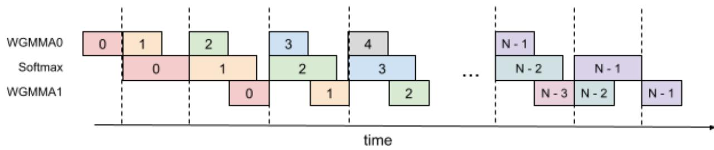  
Figure 8: 3-Stage Pipelining

```txt
Algorithm 4 FLASHATTENTION 3-stage pipelining consumer warpgroup forward pass

Require: Matrices Q, K, V ∈ R^{N×d} in HBM, block sizes B_c, B_r. Each warpgroup reads 1 block Qi of size B_r × d, T_c = [N/B_c] blocks K_1, ..., K_T_c and V_1, ..., V_T_c of size B_c × d. Each warpgroup writes 1 output block O_i of size B_r × d, and 1 logsumexp block L_i of size B_r.

1: Initialization. Load Q_i from HBM to on-chip SRAM. Initialize O_i, l_i, m_i, scale_o.

2: Wait for the producer warpgroup loading K_0 from HBM to on-chip SRAM.

3: Compute S = Q_iK_0^T using WGMMA. Commit and wait.

4: Compute m_i, P_i, l_i, scale_o based on S.

5: Wait for the producer warpgroup loading K_1 from HBM to on-chip SRAM.

6: Compute S = Q_iK_1^T using WGMMA. Commit and wait.

7: for 2 ≤ j < T_c - 2 do

8: Wait for the producer warpgroup loading K_j from HBM to on-chip SRAM.

9: Compute S_next = Q_iK_j^T using WGMMA. Commit but do not wait.

10: Wait for the producer warpgroup loading V_{j-2} from HBM to on-chip SRAM.

11: Rescale O_i based on scale_o.

12: Compute O_i = O_i + P_iV_{j-2} using WGMMA. Commit but do not wait.

13: Compute m_i, P_i_next, l_i, scale_o based on S.

14: Wait for all previous WGMMAs.

15: Copy S_next to S.

16: Copy P_i_next to P_i.

17: end for

18: Wait for the producer warpgroup loading V_{T_c-2} from HBM to on-chip SRAM.

19: Rescale O_i based on scale_o.

20: Compute O_i = O_i + P_iV_{T_c-2} using WGMMA. Commit and wait.

21: Compute m_i, P_i, l_i, scale_o based on S.

22: Wait for the producer warpgroup loading V_{T_c-1} from HBM to on-chip SRAM.

23: Rescale O_i based on scale_o.

24: Compute O_i = O_i + P_iV_{T_c-1} using WGMMA. Commit and wait.

25: Epilogue. Rescale O_i based on l_i. Compute L_i based on l_i and m_i. Write O_i and L_i to HBM as the i-th block of O and L.
```

Overlapping. We expected that softmax can be overlapped with (the first WGMMA + the second WGMMA). However, the compiler doesn't cooperate in this way. SASS code shows that only the first WGMMA is overlapped with softmax, while the second WGMMA is not. It's not clear why the compiler chooses to reorder instructions in this way.

Register pressure. This algorithm requires more registers compared to the 2-stage pipelining algorithm. In theory, it needs to store an extra $\tilde{\mathbf{P}}_i$ and $scale\_o$ , which is of size $B_r \times B_c \times sizeof(input\_data\_type) + B_r \times sizeof(float)$ . As a result, a smaller block size needs to be chosen.

## C Addition Details on Experiments and Benchmarking

## C.1 System and libraries

We benchmark the speed on an H100 80GB SXM5 (700W). We generally use the latest versions of the libraries, at the time of writing (May 2024). Specifically, we use:

\- CUDA 12.3

\- cuDNN 9.1.1.17

\- CUTLASS 3.5

\- FLASHATTENTION 2.5.8

• Triton nightly 3.0.0.post20240424212437

\- PyTorch 2.3.0

To reduce variability, we fix the GPU clock speed to 1830MHz (clock speed used to calculate the 989 TFLOPS FP16 theoretical max throughput). We repeat the benchmarks 100 times and take the average timing.

## C.2 FP8 Attention Full Results

We use following sequence lengths: 512, 1024, 2048, 4224, 8448, 16896. When sequence length $\geq 4k$ , we make it also divisible by 132 (number of SMs in H100 SXM5) to avoid wave quantization.

Attention forward speed, head dim 64 (H100 80GB SXM5)  
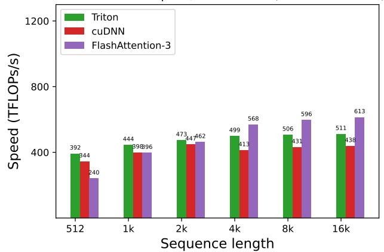  
(a) Forward, without causal mask, head dim 64

Attention forward speed, head dim 64 (H100 80GB SXM5)  
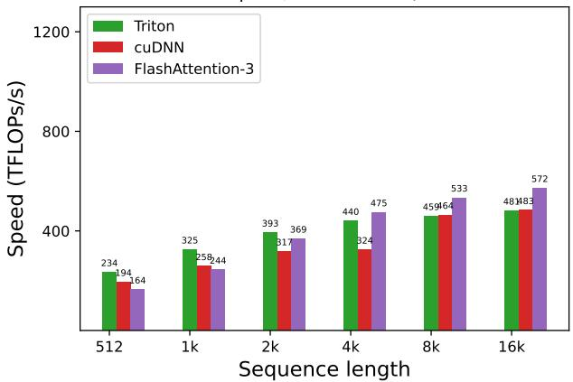  
(b) Forward, with causal mask, head dim 64

Attention forward speed, head dim 128 (H100 80GB SXM5)  
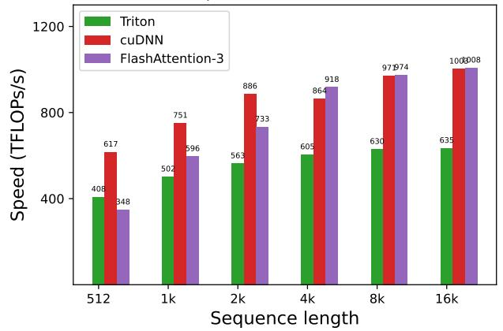  
(c) Forward, without causal mask, head dim 128

Attention forward speed, head dim 128 (H100 80GB SXM5)  
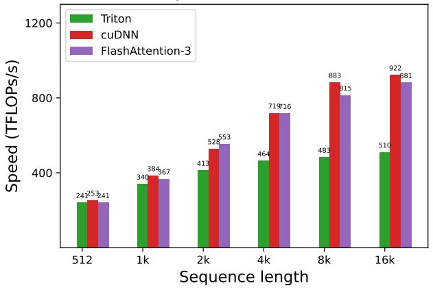  
(d) Forward, with causal mask, head dim 128

Attention forward speed, head dim 256 (H100 80GB SXM5)  
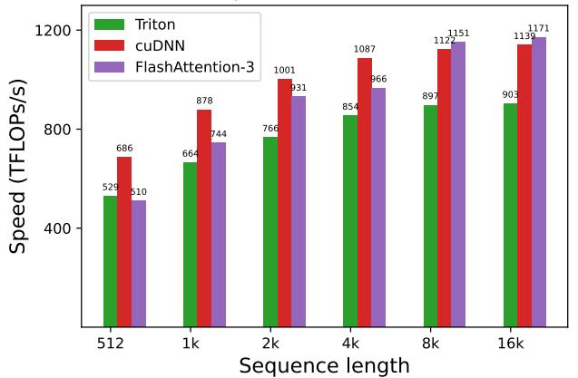  
(e) Forward, without causal mask, head dim 256

Attention forward speed, head dim 256 (H100 80GB SXM5)  
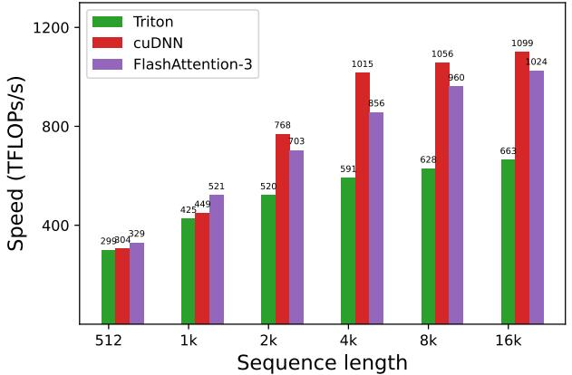  
(f) Forward, with causal mask, head dim 256  
Figure 9: Attention forward speed (FP8) on H100 GPU