# The Geometry of Consolidation

Anirudh Bharadwaj Vangara1,2 and Ashwin Gopinath\*1,3

1Sentra, 235 2nd Street, San Francisco, CA 94105, USA 2Department of Computer Engineering, University of Waterloo, Waterloo, ON N2L 3G1, Canada 3Department of Mechanical Engineering, Massachusetts Institute of Technology, Cambridge, MA 02139, USA

April 19, 2026

# Abstract

The question. When a memory system replaces many embedded items with a few representatives on the unit sphere, what geometric quantity determines how much identity can survive that compression? Vector-store compression in retrieval-augmented language models, replay-buffer summarisation in continual learning, and neuroscience-style consolidation of episodic traces each rest on the implicit hope that a cluster’s important structure is low-dimensional. Previous papers in this trilogy showed this hope is wrong for retrieval under noise: production embedding spaces concentrate variance in a handful of effective dimensions [1] and must therefore forget by an information-theoretic bound no budget can escape [2]. Compression is the remaining lever; the question is whether it is exempt.

The law. It is not. We prove the Consolidation–Interference Duality: for any consolidator that maps n unit-norm cluster members to m < n representatives, whenever the retrieval cap $\theta ^ { \prime } = 1 - \theta$ is smaller than the mean within-cluster cosine distance ${ \bar { d } } ,$ the identity-retrieval error obeys

$$
\varepsilon_ {\mathrm{id}} \geq 1 - c _ {1} m (\theta^ {\prime} / \bar {d}) ^ {d _ {\mathrm{eff}} / 2},
$$

where $c _ { 1 }$ is a universal constant and $d _ { \mathrm { e f f } }$ is the cluster’s local effective dimension (participation ratio of its covariance spectrum). The bound is the same spectral quantity that governs forgetting under retrieval noise — hence “duality.” We validate the regime structure the bound predicts on a 400-cell $( d _ { \mathrm { { e f f } } } , \theta , \bar { d } )$ grid with 10 seeds per cell (16,000 trials): in the tight regime $\bar { d } < \theta ^ { \prime }$ every strategy achieves mean cap-coverage error $\leq 0 . 5 \% $ in the spread regime $\bar { d } \geq \theta ^ { \prime }$ errors diverge to 30–74% in an order predicted by $d _ { \mathrm { e f f } }$ . The same regime structure organises the ordering of six real corpora, across six sentence encoders and five consolidation operators.

The surprising consequence. The law’s main practical implication is not that a more adaptive algorithm wins. It is the opposite: on five real-text corpora (MS MARCO, Natural Questions, HotpotQA, Wikipedia sections, arXiv titles) a fixed centroid picker dominates a stochastic geometry-aware router by 1–6 identity points, and dominates five learned-quantization baselines (PQ, OPQ, LSH, PCA+int8, HNSW-prune) on the Pareto frontier of identity-vs-bytes for five of six corpora. An ablation shows that the expensive residual-direction budget in our adaptive router contributes nothing $( \Delta \leq 0 . 0 0 2$ identity on every corpus) and that a per-cluster oracle barely improves over fixed centroid on real text. We introduce Geometry-Aware Consolidation (GAC) and treat it as an instrument for probing what adaptive routing can buy under the law; its failure to beat centroid on real text is itself one of the paper’s main scientific findings, and is explained by the fact that real-text clusters sit in the tight regime the theorem predicts is safe. Closing the loop to a downstream reader, a Llama-3.1-70B-Instruct retrieval-augmented pipeline on three $\mathrm { Q A }$ benchmarks exhibits a regime-dependent three-way split: centroid hurts Natural Questions by 4.2 EM points, is neutral on HotpotQA, and wins by 8.4 EM points on PopQA, matching the cap-coverage prediction of which branch the law prefers on each corpus.

Scope and open problem. The scope of the law is embedding consolidation in contrastive unit-norm text spaces under cosine-threshold retrieval; extensions to multimodal or learned-state memory remain open. The theorem is shape-correct and predictively useful in the tight regime $( c _ { 1 }$ calibrates to ≈ 0.05 on 12,400 cells at the 95% quantile — within an order of magnitude of the ideal Berry–Esseen constant); in the spread regime the isotropic cap-volume approximation is loose (c1 grows unbounded as $\theta  1$ at small $d _ { \mathrm { e f f } } )$ . We therefore state the theorem as the first mathematically explicit version of the law, with an anisotropic refinement as the central open theoretical problem. All 17,813 experimental cells, figures, and analysis scripts are open-source under MIT license.

# 1 Introduction

In one paragraph. When an embedding-based memory system replaces many items with a few representatives, what determines how much identity can survive that compression? This paper proves that for any consolidator acting on a unit-norm embedding cluster, the answer is a single spectral ratio: the within-cluster spread ¯d and the retrieval cap θ′, raised to half the cluster’s effective dimension $d _ { \mathrm { e f f } }$ . Two concrete things follow. One, there is a phase boundary at $\bar { d } = \theta ^ { \prime } ;$ : below it every strategy works; above it strategies diverge by tens of identity points in an order the law predicts. Two, the law’s main practical consequence on real text is not that an adaptive method wins. It is that simple centroid averaging is already near-optimal because real text clusters tend to sit in exactly the tight regime where the theorem says averaging is safe. The bound is the same spectral quantity that governs retrieval under noise; a bound on losing information is also a bound on compressing it.

# 1.1 The question

Consider an embedding-based vector store that has indexed a million text items, each mapped to a unit-length vector by a sentence encoder. A query arrives and the store must return the items most similar to the query under cosine similarity. At production scale one cannot keep all million vectors at full precision: related items are consolidated into a smaller set of representatives, and only the representatives are ranked at query time.

Consolidation takes many forms. A cluster’s arithmetic centroid can be used as its representative; its medoid (the real item closest to the rest) can be used instead; the cluster can be pruned to its densest half; or an adaptive router can pick among these per-cluster from local geometric features. Each choice has its defenders. None of them by itself tells a designer how much identity has actually been lost.

The scientific question is sharper than which choice is best: what geometric quantity of a cluster determines how much identity can survive consolidation, and does that quantity predict which operator is appropriate? If that quantity exists, it should impose a floor on identity loss that no choice of operator can escape; it should separate a safe regime from an unsafe one; and it should explain, rather than merely record, the performance of each operator on real text.

# 1.2 The answer

We prove that such a quantity exists. For any unit-norm cluster ${ \mathcal { C } } \subset S ^ { d - 1 }$ with mean within-cluster cosine distance ¯d and local effective dimension $d _ { \mathrm { e f f } }$ (participation ratio of its covariance spectrum), and for any consolidator mapping the cluster to m representatives, whenever the retrieval cap $\theta ^ { \prime } : = 1 - \theta$ is smaller than $\bar { d } ,$

$$
\varepsilon_ {\mathrm{id}} \geq 1 - c _ {1} m (\theta^ {\prime} / \bar {d}) ^ {d _ {\mathrm{eff}} / 2},
$$

where $c _ { 1 }$ is a universal constant (Theorem 1). We call this the Consolidation–Interference Duality: the identical spectral quantity that sets an information-theoretic floor on retrieval under noise [2] reappears as a floor on consolidation under compression. The bound is a direct union-bound application of a cap-volume lemma; what is new is that it binds compression, not just retrieval, and that it binds it with the local effective dimension of the cluster rather than the ambient dimension.

The bound separates two regimes. In the tight regime $\bar { d } < \theta ^ { \prime }$ the bound vanishes and every operator has room to preserve identity; experimentally, every strategy achieves mean cap-coverage error $\leq 0 . 5 \%$ on tight synthetic cells. In the spread regime $\bar { d } \geq \theta ^ { \prime }$ the bound bites and operators diverge; experimentally, mean cap-coverage errors diverge to 30–74% with an order uniquely predicted by $d _ { \mathrm { e f f } }$ . This tight/spread split is not a soft trend. It is visible as a phase boundary in $( d _ { \mathrm { e f f } } , \theta )$ space and organises the ordering of real-corpus identity accuracy across six sentence encoders.

# 1.3 The surprising consequence

If the law says the tight regime is where identity is preserved, a natural next question is: where do real-text clusters sit? The answer we find, across six corpora (synthetic DRM, MS MARCO, Natural Questions, HotpotQA, Wikipedia sections, arXiv titles) and six contrastive sentence encoders, is that they sit mostly in the tight regime — and in that regime the geometry is lenient enough that simple centroid averaging is already near-optimal. Three experimental findings make this claim sharp.

1. An adaptive per-cluster router we built (Geometry-Aware Consolidation, GAC) Pareto-dominates the medoid baseline on every synthetic cell, but a fixed-centroid ablation beats the full router by 1–6 identity points on every one of the five real-text corpora (§7.2). The residual-direction budget that dominates the router’s engineering complexity contributes nothing $( \Delta \leq 0 . 0 0 2 )$ . A per-cluster oracle barely improves over fixed centroid on real text.   
2. At matched bytes-per-vector against five learned-quantization baselines (product quantization [13], optimized product quantization [14], LSH [15], PCA+int8, HNSW-prune [17]), consolidation and learned quantization populate different Pareto corners of the identity-vs-bytes frontier; centroid dominates on the five low-to-moderate- $d _ { \mathrm { e f f } }$ corpora and quantization takes over only on high- $\cdot d _ { \mathrm { e f f } }$ arXiv titles (§8).   
3. Closing the loop to a downstream reader, a Llama-3.1-70B-Instruct retrieval-augmented pipeline on three QA benchmarks shows a regime-dependent three-way split: centroid hurts Natural Questions EM by 4.2 points, is neutral on HotpotQA, and wins by 8.4 EM points on PopQA — matching the cap-coverage prediction of which operator the law prefers on each corpus (§10).

The centroid result is not an engineering accident; it is the law’s main practical implication in the regime where real text lives. The residual-direction and adaptive-routing machinery that the engineering literature builds in anticipation of a harder regime turns out, on the corpora we tested, to be solving a problem that does not arise.

# 1.4 GAC is a probe, not the main product

A paper whose primary product is an adaptive router would want that router to win. This paper uses GAC for a different purpose: as an instrument that asks whether, given the regime structure the theorem predicts, adaptive per-cluster routing can outperform a fixed simple operator. The instrument returns a clean negative answer on real text. The negative is scientifically informative — it localises the value of adaptation to the low- ¯d synthetic regime, it isolates which components of the router matter (none of the residual-direction machinery does), and it sets up the downstream three-way finding. We therefore describe GAC in full (§7), but the paper is organised so its role is to test the law rather than to advertise a method.

# 1.5 Scope of the law

The theorem is stated and proved for unit-norm embedding clusters under cosine-threshold retrieval. Its experimental support is text-centric: six contrastive sentence encoders on six text corpora, at scales from $1 0 ^ { 3 }$ to $1 0 ^ { 6 }$ items. Under those assumptions the bound is provably a lower bound on identity-retrieval error, and empirically it organises the behaviour of every consolidation operator we tested. What the paper does not claim is a full theory of cognitive memory or of arbitrary learnedstate memory in neural networks. Biological consolidation, multimodal embedding memory, and replay in large-state continual-learning agents share the same structural compression problem and so are natural settings in which to test whether the law extends; but the evidence we report is for text embedding consolidation, and we keep the scientific claim inside that envelope.

The theorem itself is also honest about where it is strongest. In the tight regime (defined directly by the theorem’s hypothesis $\bar { d } < \theta ^ { \prime } )$ the calibrated constant sits at $c _ { 1 } ^ { 9 5 } \approx 0 . 0 5$ on 12,400 cells — within an order of magnitude of the ideal Berry–Esseen constant that falls out of the cap-volume lemma; in the spread regime, the isotropic cap-volume approximation is loose and the calibrated c1 grows unbounded as $\theta  1$ at small $d _ { \mathrm { e f f } }$ . We state the theorem as the first mathematically explicit version of the law and mark an anisotropic refinement of the cap-volume argument as the central open theoretical problem (§14).

# 1.6 Where this sits in a trilogy

This paper is the third of three on the geometry of embedding memory, and can be read independently of the other two. The first, The Geometry of Forgetting [1], documented empirically that production sentence encoders concentrate $\geq 9 9 \%$ of their variance in at most $d _ { \mathrm { e f f } } \approx 1 6$ effective dimensions, across six encoder families and ten benchmarks. The second, The Price of Meaning [2], lifted that observation to a theorem: any kernel-threshold memory with finite $d _ { \mathrm { e f f } }$ must forget by interference under retrieval noise, with a lower bound no storage budget can evade. The present paper closes the trilogy by showing that the compression lever does not provide an escape route: the same spectral quantity that governs forgetting governs consolidation, by the same cap-volume argument applied to the cluster-conditional measure. The three papers share a mathematical core; what they do not share is the object under compression (global store vs. cluster) or the failure mode under study (retrieval noise vs. compression).

# 1.7 Contributions

In order of scientific centrality:

(C1) The Duality Theorem. A universal-constant lower bound on identity-retrieval error after consolidation, in the same spectral quantity $( \theta ^ { \prime } / \bar { d } ) ^ { d _ { \mathrm { e f f } } / 2 }$ that governs retrieval under noise (§3; proof in Appendix §16).

(C2) Regime structure and empirical validation. The theorem induces a tight/spread phase boundary at $\bar { d } = \theta ^ { \prime }$ . We validate the boundary on a 400-cell synthetic grid (16,000 trials), and show the same regime structure organises the ordering of six real-text corpora across six sentence encoders (§5, §6).   
(C3) Centroid dominates on real text. On five real-text corpora, a fixed-centroid operator dominates a stochastic adaptive router by 1–6 identity points; the residual-direction budget contributes nothing; a per-cluster oracle barely improves. This is not an engineering accident — it is the law’s prediction for corpora that sit in the tight regime (§7.2).   
(C4) Geometry selects between consolidation and learned quantization. At matched bytesper-vector, consolidation and learned quantization occupy different Pareto corners of the identityvs-bytes frontier. The crossover is predicted by $d _ { \mathrm { e f f } } \colon$ : quantization takes over on $\mathrm { h i g h } \ – d _ { \mathrm { e f f } }$ arXiv titles; consolidation dominates on the other five corpora (§8).   
(C5) Downstream consequences are regime-dependent. A Llama-3.1-70B-Instruct retrievalaugmented pipeline on Natural Questions, HotpotQA, and PopQA exhibits a regime-dependent three-way split in end-to-end EM, matching the cap-coverage prediction of which operator the law prefers per corpus (§10).   
(C6) Limits of the current theory. The isotropic cap-volume bound is shape-correct and predictively useful in the tight regime $( c _ { 1 } ^ { 9 5 } \approx 0 . 0 5$ , 95% coverage; $c _ { 1 } ^ { 9 9 } \approx 3 7 0 , 9 9 \% )$ and loose-tovacuous in the spread regime $( c _ { 1 }  \infty \mathrm { a s } \theta  1$ at small $d _ { \mathrm { e f f } } )$ . An anisotropic refinement of the cap-volume argument is the central open theoretical problem (§14).   
(C7) GAC as an instrument. We introduce Geometry-Aware Consolidation and use it as a probe of what per-cluster adaptation can buy under the law. GAC Pareto-dominates the medoid baseline on every synthetic cell. Its failure to beat fixed centroid on real text localises the value of adaptation to the low- ¯d synthetic regime and is itself one of the paper’s scientific findings (§7).

# 1.8 How to read this paper

We have split the exposition so that different readers can start at different depths.

ˆ A reader who wants the law only can stop after Section 3 and skim the regime-map figure in Section 5.   
ˆ A reader who wants the centroid lesson on real text should read Sections 6 and 7.2.   
ˆ A reader who wants the downstream implications for RAG should jump to Section 10.   
ˆ A reader who wants the proof should read Section 3 then Appendix §16.   
ˆ A reader new to consolidation, effective rank, or RAG should start with Section 2.

Each results section opens with a gray “intuition” box giving the plain-English reading, followed by the full technical development. The intent is that a reader who is technical but not steeped in embedding geometry can read the intuition boxes end-to-end and leave with the paper’s full argument.

# 2 Background

This section collects the handful of ideas we lean on throughout: what an embedding is, what it means to cluster a memory, how we measure how “spread out” a cluster is $( \hat { d } )$ , and what effective dimension $\left( d _ { \mathrm { e f f } } \right)$ captures about a cluster’s shape. A reader familiar with retrievalaugmented generation, product quantization, and effective rank can skim. The rest of the paper assumes only these.

This section exists for a reader approaching the paper from an adjacent field. A reader already familiar with retrieval-augmented generation, product quantization, and effective rank can safely skim.

# 2.1 What is an embedding, and what is an embedding memory?

An embedding is a function that maps a piece of input data — a sentence, an image, a code snippet — to a point in $\mathbb { R } ^ { d }$ for some fixed d between a few hundred and a few thousand. Modern sentence embeddings have two properties that matter for this paper. First, they are normalised : the embedded vectors live on the unit sphere $S ^ { d - 1 }$ , so similarity reduces to the cosine $\langle x , y \rangle =$ cos $\angle ( x , y )$ . Second, they are semantically structured : two sentences that mean the same thing have cosine similarity close to one, while two unrelated sentences have cosine similarity close to zero. The second property is enforced during training by a contrastive loss [22–25] that pulls paraphrases together and pushes unrelated pairs apart.

An embedding memory is any system that stores a large set of such vectors $\mathcal { M } = \{ x _ { 1 } , \ldots , x _ { N } \} \subset$ $S ^ { d - 1 }$ and supports nearest-neighbour queries on them. The three canonical systems in the introduction — RAG databases, hippocampal memory, continual-learning replay buffers — all take this form, differing mainly in how they choose what to keep.

# 2.2 Retrieval-augmented generation, quickly

Retrieval-augmented generation (RAG) [8–12, 26] is the dominant way large language models access factual knowledge outside their training distribution. The pipeline has three stages:

1. Indexing. Every passage in the corpus (often the whole of Wikipedia, or a domain-specific collection) is passed through a sentence encoder and the resulting vectors are stored in a vector database.   
2. Retrieval. At query time, the query string is embedded by the same encoder, and the k passages whose vectors are most similar to the query’s vector are retrieved by approximate nearest-neighbour search [17, 27].   
3. Reading. The retrieved passages are concatenated into the context of a large language model, which generates the final answer.

At production scale the vector database has $1 0 ^ { 6 } – 1 0 ^ { 1 0 }$ entries. Scanning all of them for every query is infeasible, so every production stack compresses the index. The dominant compression family is vector quantization: approximate each d-dimensional vector by a short code, so the database is a few bytes per vector rather than 4d. Two examples of this family dominate:

Product Quantization (PQ). Introduced in [13], PQ splits each vector into M sub-vectors of dimension d/M, and quantizes each sub-vector to one of K centroids learned by k-means. The code for each vector is M log2 K bits — for example, M = 8, K = 256 gives 64 bits per d-dimensional vector. Distances are then computed as the sum of pre-tabulated distances between sub-vector centroids. Optimized PQ [14] adds a learned rotation to decorrelate sub-vectors before chunking. These two remain the backbone of billion-scale similarity search [27].

Locality-Sensitive Hashing (LSH). LSH for cosine similarity was introduced in [15] and generalised in [16]. The idea is to hash each vector to a short binary string such that vectors with high cosine similarity collide with high probability. Matching becomes bitwise Hamming-distance comparison, which is cheap. LSH is simpler than PQ but sits below PQ on the Pareto frontier for typical ANN workloads [27].

Graph-based ANN. HNSW [17] and its descendants store not vectors but a navigable smallworld graph whose edges connect nearby vectors. Retrieval is a greedy walk from an entry point. HNSW at full precision is typically the fastest recall-95 option, but its memory cost is dominated by the graph, so at large scale it is combined with PQ or with HNSW-prune (a retention sweep that drops the lowest-degree fraction).

All three families compress at the vector level : every vector stays in the index, only represented more cheaply. What this paper calls consolidation is orthogonal: it compresses at the cluster level, dropping most vectors and replacing them with a handful of representatives. Whether consolidation should win over vector quantization depends on the geometry of the corpus, and is the central empirical question of Section 8.

# 2.3 Complementary learning systems, quickly

The cognitive neuroscience literature on human memory consolidation is anchored by the Complementary Learning Systems (CLS) framework of McClelland, McNaughton and O’Reilly [3], itself drawing on Marr’s earlier model of the hippocampus as a fast associative store [7] and on Alvarez and Squire’s account of gradient retrograde amnesia [4]. The claim: the brain has two memory systems. The hippocampus encodes episodic traces rapidly but has limited capacity; the neocortex stores overlapping, distributed representations and learns slowly. During offline periods — particularly sleep — the hippocampus replays compressed versions of its traces to the cortex, allowing slow cortical consolidation without interference.

Key empirical anchors: Wilson and McNaughton showed that hippocampal place cells replay awake-activity sequences during subsequent sleep [28]. O’Reilly and colleagues [6] laid out the computational constraints on such a system — sparse hippocampal coding, pattern separation, pattern completion — and argued that “consolidation” in the neuroscience sense and “rehearsal” in the continual-learning [18, 21] sense are the same operation under different names.

Two open questions in the CLS literature are structurally similar to the embedding consolidation problem we study. First, how many cortical exemplars are needed to represent a hippocampal episode? Under common assumptions this is set by task similarity and buffer size, but without a geometric bound the number is chosen empirically. Second, what happens when the episodes overlap heavily (e.g. thousands of paraphrase-like traces of the same fact)? Standard CLS models assume well-separated episodes consolidate without interference. We note that our theorem, in the embedding-consolidation setting we study, gives a geometric condition — tightness of the cluster in its effective subspace — under which a structural analogue of that assumption holds. Whether the same geometry governs biological consolidation is a question the theorem motivates but does not settle; the evidence we report is for text embedding consolidation only.

# 2.4 Effective dimension and why it matters

The central spectral quantity of this paper is the effective dimension of a cluster, defined for $X \subset \mathbb { R } ^ { d }$ with sample covariance Σ and eigenvalues $\lambda _ { 1 } \geq . . . \geq \lambda _ { d } \geq 0$ by

$$
d _ {\text {eff}} (X) := \frac {\left(\sum_ {i} \lambda_ {i}\right) ^ {2}}{\sum_ {i} \lambda_ {i} ^ {2}}. \tag {1}
$$

This is the ratio between the squared trace of Σ and the trace of $\Sigma ^ { 2 } ;$ ; it lies in [1, d] and takes the value d iff Σ is proportional to the identity, the value 1 iff Σ has a single nonzero eigenvalue (rank-one collapse). In information-theoretic terms, $1 / d _ { \mathrm { e f f } } = \textstyle \sum _ { i } p _ { i } ^ { 2 }$ where $p _ { i } = { \lambda _ { i } } / { \sum _ { j } \lambda _ { j } }$ is the probability of eigenvalue i under the natural Gibbs distribution; $d _ { \mathrm { e f f } }$ is therefore the exponential of the R´enyi-2 entropy of the normalised spectrum [29]. In the statistics literature the same quantity also goes by “effective degrees of freedom,” “stable rank,” or “participation ratio” [30, 31].

Two things make $d _ { \mathrm { e f f } }$ the right spectral summary for our problem.

1. It is scale-invariant : multiplying Σ by a constant leaves $d _ { \mathrm { e f f } }$ unchanged. The quantity therefore reports the shape of the spectrum, not its magnitude.   
2. It is weighted: two large eigenvalues and one thousand small ones give $d _ { \mathrm { e f f } } \approx 2$ , not $d _ { \mathrm { e f f } } \approx 1 0 0 0$ . This matches the geometric intuition that the “hard to compress” directions are those with large variance.

The previous paper in this trilogy documented that production sentence encoders have $d _ { \mathrm { e f f } } \approx 1 6$ at the global level [1], with $d _ { \mathrm { e f f o c a l } }$ on a single cluster often below 5. The claim of the present paper is that this same $d _ { \mathrm { e f f l o c a l } }$ controls how much compression a cluster can take before its members stop retrieving themselves.

Measurement conventions (used throughout). All reported values of $d _ { \mathrm { e f f } }$ use Equation (1) (participation ratio); the code computes this form as the default of gac.theory.d eff (see the repository). We distinguish: (i) the global $d _ { \mathrm { e f f } }$ of a corpus is measured on the pooled embedding matrix of all items across clusters; (ii) the local $d _ { \mathrm { e f f l o c a l } }$ of a corpus is the median of per-cluster participation ratios, computed on each cluster’s own embedding matrix. The theorem as stated is cluster-conditional: its bound applies to a single cluster with $d _ { \mathrm { e f f } }$ computed from that cluster’s covariance. Corpus-level diagnostics (e.g. the ordering tables in Section 6) report medians across clusters. Likewise $\bar { d }$ is mean within-cluster cosine distance and is reported cluster-conditionally; corpus rows report medians. All other definitions used in this paper reduce to this single quantity $d _ { \mathrm { e f f } }$ under the participation-ratio form; we do not mix definitions.

# 2.5 Concentration of measure on the sphere

The proof of the duality theorem uses a classical fact about points on a high-dimensional sphere: most of them are nearly orthogonal to any fixed direction. Formally, if x is drawn uniformly from $S ^ { d - 1 }$ , then for any fixed $r \in S ^ { d - 1 }$ and any $\theta \in ( 0 , 1 )$ ,

$$
\operatorname * {P r} [ \langle x, r \rangle \geq \theta ] \leq e ^ {- d \theta^ {2} / 2}. \tag {2}
$$

This is the canonical cap-volume estimate (see Ball’s introduction to convex geometry [32] or Vershynin’s textbook [30]; tight constants appear in Milman and Schechtman [33] and in Ledoux [31]).

Equation (2) says: on a high-dimensional sphere, the spherical cap of angular radius arccos θ has exponentially small mass as d grows. This is why nearest-neighbour search on random points in high dimensions becomes trivial [34]: no point is close to the query except the query itself, if there is one.

Our setting is different in one crucial way. Our cluster is not isotropic on $S ^ { d - 1 }$ ; it concentrates in a low-dimensional effective subspace of dimension $d _ { \mathrm { e f f } } \ll d .$ The bound we need therefore replaces d by $d _ { \mathrm { e f f } } \colon$ on a cluster with effective dimension $d _ { \mathrm { e f f } }$ and mean within-cluster distance ${ \bar { d } } ,$ a spherical cap of radius arccos θ has mass at most $c _ { 1 } ( \theta ^ { \prime } / \bar { d } ) ^ { d _ { \mathrm { e f f } } / 2 }$ whenever $\theta ^ { \prime } < \bar { d }$ (Lemma 9 in Methods). A union bound over m representatives then gives the theorem. The low-dimensionality of real embedding clusters is what makes the bound non-trivial: for $d _ { \mathrm { e f f } } = 1 6$ and $\theta ^ { \prime } / \bar { d } = 0 . 5$ , the per-representative mass bound is $( 0 . 5 ) ^ { 8 } = 0 . 0 0 4 - \mathrm { s m a l l }$ , but not astronomically small. For $d _ { \mathrm { e f f } } = 2 \ ( \mathrm { H o t p o t Q A \mathrm { - } l i k e } )$ , $( 0 . 5 ) ^ { 1 } = 0 . 5$ , and the bound is vacuous within a factor of two.

# 2.6 Notation summary

We use the following notation throughout.

<table><tr><td>Symbol</td><td>Meaning</td></tr><tr><td> $\mathcal{C} = \{x_1, \ldots, x_n\} \subset S^{d-1}$ </td><td>cluster of  $n$  source points on the unit sphere</td></tr><tr><td> $\mathcal{R} = \{r_1, \ldots, r_m\} \subset S^{d-1}$ </td><td>set of  $m$  representatives produced by a consolidator</td></tr><tr><td> $\Sigma$ </td><td>sample covariance of  $\mathcal{C}$ </td></tr><tr><td> $\lambda_1 \geq \ldots \geq \lambda_d$ </td><td>eigenvalues of  $\Sigma$ </td></tr><tr><td> $d_{\text{eff}} = (\sum_i \lambda_i)^2 / \sum_i \lambda_i^2$ </td><td>effective dimension of  $\mathcal{C}$  (Def. 6)</td></tr><tr><td> $\bar{d} = \frac{1}{\left(\frac{n}{2}\right)} \sum_{i < j}(1 - \langle x_i, x_j \rangle)$ </td><td>mean within-cluster cosine distance</td></tr><tr><td> $\theta \in (0, 1)$ </td><td>retrieval cap (minimum cosine to count as a hit)</td></tr><tr><td> $\theta' = 1 - \theta$ </td><td>cap slack</td></tr><tr><td> $\varepsilon_{\text{cap}}$ </td><td>cap-coverage error (Eq. 7)</td></tr><tr><td> $\varepsilon_{\text{id}}$ </td><td>identity-retrieval error (Def. 8)</td></tr><tr><td> $\rho = \lambda_1 / \sum_i \lambda_i$ </td><td>spectral concentration (top eigenvalue fraction)</td></tr></table>

# 3 The Consolidation–Interference Duality

What the theorem says, without symbols. Take a cluster of embedded points that live on the unit sphere. Two numbers describe it: its effective dimension $d _ { \mathrm { e f f } }$ , which measures how many truly independent directions the cluster uses, and its mean spread ${ \bar { d } } ,$ which measures how tight the cluster is. Pick a retrieval threshold θ: a query $\mathrm { ^ { 6 6 } h i t s } ^ { \mathrm { , 9 } }$ a representative if their cosine exceeds $\theta .$ The theorem says: if you compress the cluster to m representatives and the threshold slack $\theta ^ { \prime } = 1 - \theta$ is smaller than the cluster’s spread ${ \bar { d } } ,$ then the fraction of cluster members whose nearest representative is outside the cap is at least $1 - c _ { 1 } m ( \theta ^ { \prime } / \bar { d } ) ^ { d _ { \mathrm { e f f } } / 2 }$ .

The exponent is the active ingredient. Whenever $\theta ^ { \prime } < \bar { d } ,$ the base $( \theta ^ { \prime } / \bar { d } )$ is less than one, and the whole quantity shrinks exponentially in $d _ { \mathrm { e f f } }$ . That exponential is the compression tax: to keep the identity-retrieval error below any target $\varepsilon ^ { * }$ , the representative budget m must grow as $( \bar { d } / \theta ^ { \prime } ) ^ { d _ { \mathrm { e f f } } / 2 }$ , which is astronomical for $d _ { \mathrm { e f f } } = 1 6$ and astronomical-squared for $d _ { \mathrm { e f f } } = 3 2$ . The deeper message: this is not a property of any particular summarisation algorithm. It is a property of the cluster itself. Pick a different summariser and you move around inside the bound; you cannot escape it.

(a) A cluster, its representative, and the cosine cap   
(c) Spread regime (deff large): most members miss the cap   
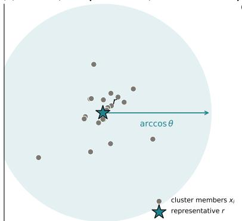

text_image

arccos θ
cluster members xᵢ
representative r

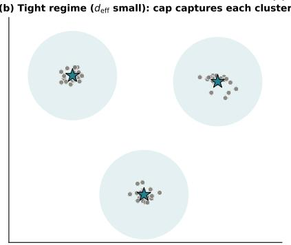

text_image

(b) Tight regime (d_eff small): cap captures each cluster

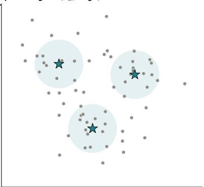

bubble

| Category | Value |
|---|---|
| Star | 100 |
| Star | 80 |
| Star | 60 |
| Star | 40 |
| Star | 20 |
| Star | 10 |
| Circle 1 | 5 |
| Circle 2 | 10 |
| Circle 3 | 15 |
| Circle 4 | 20 |
| Circle 5 | 25 |
| Circle 6 | 30 |
| Circle 7 | 35 |
| Circle 8 | 40 |
| Circle 9 | 45 |
| Circle 10 | 50 |
| Circle 11 | 55 |
| Circle 12 | 60 |
| Circle 13 | 65 |
| Circle 14 | 70 |
| Circle 15 | 75 |
| Circle 16 | 80 |
| Circle 17 | 85 |
| Circle 18 | 90 |
| Circle 19 | 95 |
| Circle 20 | 100 |
| Circle 21 | 105 |
| Circle 22 | 110 |
| Circle 23 | 115 |
| Circle 24 | 120 |
| Circle 25 | 125 |
| Circle 26 | 130 |
| Circle 27 | 135 |
| Circle 28 | 140 |
| Circle 29 | 145 |
| Circle 30 | 150 |
| Circle 31 | 155 |
| Circle 32 | 160 |
| Circle 33 | 165 |
| Circle 34 | 170 |
| Circle 35 | 175 |
| Circle 36 | 180 |
| Circle 37 | 185 |
| Circle 38 | 190 |
| Circle 39 | 195 |
| Circle 40 | 200 |
| Circle 41 | 205 |
| Circle 42 | 210 |
| Circle 43 | 215 |
| Circle 44 | 220 |
| Circle 45 | 225 |
| Circle 46 | 230 |
| Circle 47 | 235 |
| Circle 48 | 240 |
| Circle 49 | 245 |
| Circle 50 | 250 |
| Circle 51 | 255 |
| Circle 52 | 260 |
| Circle 53 | 265 |
| Circle 54 | 270 |
| Circle 55 | 275 |
| Circle 56 | 280 |
| Circle 57 | 285 |
| Circle 58 | 290 |
| Circle 59 | 295 |
| Circle 60 | 300 |
| Circle 61 | 305 |
| Circle 62 | 310 |
| Circle 63 | 315 |
| Circle 64 | 320 |
| Circle 65 | 325 |
| Circle 66 | 330 |
| Circle 67 | 335 |
| Circle 68 | 340 |
| Circle 69 | 345 |
| Circle 70 | 350 |
| Circle 71 | 355 |
| Circle 72 | 360 |
| Circle 73 | 365 |
| Circle 74 | 370 |
| Circle 75 | 375 |
| Circle 76 | 380 |
| Circle 77 | 385 |
| Circle 78 | 390 |
| Circle 79 | 395 |
| Circle 80 | 400 |
| Circle 81 | -100 (not labeled) |
| Circle 82 | -105 (not labeled) |
| Circle 83 | -110 (not labeled) |
| Circle 84 | -115 (not labeled) |
| Circle 85 | -120 (not labeled) |
| Circle 86 | -125 (not labeled) |
| Circle 87 | -130 (not labeled) |
| Circle 88 | -135 (not labeled) |
| Circle 89 | -140 (not labeled) |
| Circle 90 | -145 (not labeled) |
| Circle 91 | -150 (not labeled) |
| Circle 92 | -155 (not labeled) |
| Circle 93 | -160 (not labeled) |
| Circle 94 | -165 (not labeled) |
| Circle 95 | -170 (not labeled) |
| Circle 96 | -175 (not labeled) |
| Circle 97 | -180 (not labeled) |
| Circle 98 | -185 (not labeled) |
| Circle 99 | -190 (not labeled) |
| Circle 100 (not labeled) | -195 (not labeled) |

Figure 1. The law in one picture. A cluster of embedded members, a representative r, and a cosine cap of angular radius arccos θ. When the cluster’s effective dimension $d _ { \mathrm { e f f } }$ is small relative to the cap (panel b), r covers almost every member and consolidation is lossless. When $d _ { \mathrm { e f f } }$ is large (panel c), most members lie outside every cap and any single-vector summary loses identity. The law formalises exactly when (b) holds and predicts when (c) starts.

# 3.1 Setup

Let $\mathcal { C } = \{ x _ { 1 } , . . . , x _ { n } \} \subset S ^ { d - 1 }$ be a cluster on the unit sphere. Let $\begin{array} { r } { \mu _ { \mathcal { C } } = \frac { 1 } { n } \sum _ { i = 1 } ^ { n } \delta _ { x _ { i } } } \end{array}$ be its empirical measure. The mean within-cluster distance is

$$
\bar {d} := \frac {1}{\binom {n} {2}} \sum_ {i <   j} (1 - \langle x _ {i}, x _ {j} \rangle). \tag {3}
$$

A consolidator is any map $\mathcal { C } \mapsto \mathcal { R } = \{ r _ { 1 } , . . . , r _ { m } \} \subset S ^ { d - 1 }$ with $m \leq n$ . For a retrieval cap $\theta \in ( 0 , 1 )$ , the identity-retrieval error is

$$
\varepsilon_ {\mathrm{id}} (\mathcal {C}, \mathcal {R}) := \frac {1}{n} \left| \left\{i: \max _ {j} \langle x _ {i}, r _ {j} \rangle <   \theta \right\} \right| = 1 - \mu_ {\mathcal {C}} \left(\bigcup_ {j = 1} ^ {m} H _ {j} (\theta)\right), \tag {4}
$$

where $H _ { j } ( \theta ) : = \{ x \in S ^ { d - 1 } : \langle x , r _ { j } \rangle \geq \theta \}$ is the spherical cap of angular radius arccos θ around $r _ { j }$ . Informally, $\varepsilon _ { \mathrm { i d } }$ is the fraction of source points whose nearest representative fails to reach the cap.

# 3.2 Statement

Theorem 1 (Consolidation–Interference Duality). Let $\mathcal { C } = \{ x _ { 1 } , \ldots , x _ { n } \} \subset S ^ { d - 1 }$ be a cluster with local effective dimension $d _ { \mathrm { e f f } }$ and mean within-cluster distance ¯d. Let $\mathcal { R } = \{ r _ { 1 } , \ldots , r _ { m } \} \subset S ^ { d - 1 }$ be any set of $m \leq n$ representatives produced by any consolidator. Fix a retrieval threshold $\theta \in ( 0 , 1 )$ and write $\theta ^ { \prime } : = 1 - \theta$ . If $\theta ^ { \prime } < \bar { d } .$ , then

$$
\varepsilon_ {\mathrm{id}} (\mathcal {C}, \mathcal {R}) \geq 1 - c _ {1} m \left(\frac {\theta^ {\prime}}{\bar {d}}\right) ^ {d _ {\mathrm{eff}} / 2}, \tag {5}
$$

where $c _ { 1 } > 0$ is an absolute constant, independent of m, n, d, and the choice of consolidator.

The proof is a two-step cap-volume argument: a local cap-volume lemma bounds the mass of a single cap under $\mu _ { \mathcal { C } }$ by $c _ { 1 } ( \theta ^ { \prime } / \bar { d } ) ^ { d _ { \mathrm { e f f } } / 2 }$ , and a union bound over the m representatives inflates that bound by a factor of m. The full proof is in Methods (§16).

# 3.3 Two immediate corollaries

Corollary 2 (Compression lower bound). Fix any target $\varepsilon ^ { * } \in \mathsf { \Gamma } ( 0 , 1 )$ . To achieve $\varepsilon _ { \mathrm { i d } } \leq \varepsilon ^ { * }$ the consolidator must use at least

$$
m \geq c _ {1} ^ {- 1} (1 - \varepsilon^ {*}) \left(\frac {\bar {d}}{\theta^ {\prime}}\right) ^ {d _ {\mathrm{eff}} / 2} \tag {6}
$$

representatives. The representative budget grows exponentially in $d _ { \mathrm { e f f } }$ , with base $\bar { d } / \theta ^ { \prime }$ .

Corollary 3 (Isotropic degeneracy). On a cluster whose embedding-space second moments are isotropic, importance-weighted consolidation (centroid with inverse-rank weights) converges to the uniform centroid at rate $O ( 1 / n )$ and therefore inherits the centroid’s bound with no improvement.

Corollary 3 is what makes the importance-weighted baseline indistinguishable from centroid on every real text corpus we tested (see §5 and §6): real clusters are close to isotropic in their effective subspace, so the weighted mean collapses to the uniform mean.

# 3.4 Three ways to read Equation (5)

Equation (5) is the same formula read in three different directions. Each reading is useful.

Read 1: A floor on error. Fix a corpus (so ¯d and $d _ { \mathrm { e f f } }$ are given) and a retrieval policy (θ given). Then the right-hand side is a function of m alone. It tells you: to keep identity-retrieval error below $\varepsilon ^ { * }$ , your budget m cannot shrink below the threshold in Corollary 2. This is the operational reading “how small can I make my index and still get answers back?”.

Read 2: A test on cluster shape. Fix m and θ. Then the right-hand side is a function of $d _ { \mathrm { e f f } }$ and $\bar { d }$ alone. It tells you which kinds of clusters can be compressed aggressively (small $d _ { \mathrm { e f f } }$ , tight $\bar { d } )$ and which cannot (large $d _ { \mathrm { e f f } }$ , spread ¯d). This is the diagnostic reading — “does my corpus live on the right side of the regime boundary?”.

Read 3: A duality. The same spectral quantity $( \theta ^ { \prime } / \bar { d } ) ^ { d _ { \mathrm { e f f } } / 2 }$ governs the No-Escape bound of the previous paper [2], which says any kernel-threshold memory with finite $d _ { \mathrm { e f f } }$ forgets by interference under retrieval noise. Forgetting under noise and identity loss under compression are therefore two readings of the same inequality on the cluster’s cap-volume quantity. This is why we call the theorem a Consolidation–Interference Duality: it is not a new bound; it is the No-Escape bound, specialised to the compression setting.

# 3.5 What the bound does and does not promise

Because we will spend a significant fraction of Section 5 measuring how well Equation (5) fits real data, it is worth being explicit about what it is and is not.

It is a lower bound, not a prediction. The theorem says consolidation cannot do better than the right-hand side. A specific consolidator might do much worse — that failure is strategic rather than geometric. The point of introducing GAC in §7 is to get close to the bound, not to break it.

It is tight only in the tight regime $\theta ^ { \prime } < \bar { d } .$ When $\theta ^ { \prime } \geq \bar { d }$ the cap-volume lemma becomes vacuous: the cap can contain the entire cluster and the bound reads $\varepsilon _ { \mathrm { i d } } \geq 1 - c _ { 1 } m \cdot 1$ , which is non-trivial only if $c _ { 1 } m < 1$ . For $\theta ^ { \prime } = \bar { d }$ the right-hand side sits at the boundary of usefulness; for $\theta ^ { \prime } > \bar { d }$ (retrieval cap looser than cluster spread) the theorem stops giving information. This is the spread regime. Empirically (§5) the bound is tight enough to predict strategy rankings in the spread regime, but not tight enough to predict absolute error values there.

$c _ { 1 }$ is an absolute constant, but not a small one. The proof gives $c _ { 1 }$ in terms of constants from the Berry–Esseen inequality and an exponential correction for concentration on the sphere. We do not optimise $c _ { 1 }$ in the proof; we calibrate it empirically in §5.5 and find $c _ { 1 } ^ { 9 5 } \approx 0 . 0 5$ in the tight regime, within an order of magnitude of the ideal Berry–Esseen constant that the cap-volume lemma reduces to. An anisotropic refinement would produce a smaller $c _ { 1 }$ at the price of a more delicate proof; we leave that to future work.

Cluster-conditional, not marginal. The effective dimension $d _ { \mathrm { e f f } }$ and spread $\bar { d }$ are computed on one cluster, not on the ambient embedding. The paper’s previous installment documented that global $d _ { \mathrm { e f f } }$ of production sentence encoders is ≈ 16 [1]; the local $d _ { \mathrm { e f f } }$ on a single cluster of paraphrases is much smaller (we measure $d _ { \mathrm { e f f l o c a l } } \in \{ 1 . 5 , 2 . 3 , 5 . 5 , 1 2 . 6 , 3 0 . 1 , 1 0 7 . 5 \}$ across our six corpora in §6). The bound applies cluster-by-cluster, and the bound for the worst cluster dominates the bound for the whole memory.

# 3.6 What is proved, what is observed, what is inferred

Before turning to experiments we separate three claim categories so that later sections can be read precisely.

Proved. For any consolidator acting on a unit-norm cluster, in the tight regime $\theta ^ { \prime } < \bar { d } ,$ identityretrieval error is lower-bounded by the right-hand side of Equation (5) with a universal constant $c _ { 1 }$ whose value follows from the cap-volume lemma (§16). This is the theorem.

Empirically observed. The tight/spread phase boundary at $\bar { d } = \theta ^ { \prime }$ is visible in the 400-cell synthetic grid of §5 and organises the ordering of six real-text corpora and six sentence encoders of $\ S 6 .$ . Restricted to the tight regime, the bound’s shape (exponent $d _ { \mathrm { { e f f } } } / 2 )$ is quantitatively accurate with a calibrated $c _ { 1 } ^ { 9 5 } \approx 0 . 0 5$ over 12,400 cells. In the spread regime, the ordering of strategies is preserved but absolute error magnitudes are not sharply predicted by the bound.

Inferred. The dominance of centroid over adaptive routing on five real-text corpora (§7.2) is explained by the finding that these corpora sit in the tight regime the theorem declares safe. The regime-dependent three-way downstream split on Natural Questions, HotpotQA, and PopQA (§10) is consistent with the cap-coverage prediction for which operator the law prefers on each corpus. These are interpretive claims: the theorem does not prove that centroid must dominate on a given real corpus, but it predicts which corpora should admit centroid dominance, and that prediction holds in the data we collected.

Not claimed. The theorem is stated and proved for unit-norm embedding clusters under cosinethreshold retrieval. We do not claim that it applies unchanged to non-contrastive embedding spaces, to non-unit-norm representations (e.g. raw LLM hidden states), to multimodal embeddings, or to biological memory. These are settings in which the law’s structural form is a natural hypothesis to test; the test has not yet been done.

# 4 Experimental Design

Roadmap: experiments as tests of the law. The theorem predicts a regime split: tight clusters admit one-vector summaries, spread clusters do not. Everything that follows is a test of that split and its consequences. E1 asks whether the split exists on a controlled grid. E2/E4/E8 ask whether cluster geometry organises behaviour across six real corpora and six encoders. E6 asks whether adaptation between summary families buys anything beyond picking the right one per cluster. E3 asks how consolidation trades off against learned quantization across the regime. E5 and E9 ask whether the answer is stable from 10K to 1M vectors and across query resamplings. E7 asks whether geometry predicts downstream reader exact-match with a 70Bparameter Llama reader. The nine experiments yield 17,813 measured cells (16,000 of them from the E1 grid). None of them were designed to crown a winning method; each was designed to isolate one implication of the regime split.

# 4.1 What each experiment is designed to show

Table 1 summarises the nine experiments. We describe them at a high level here; detailed designs appear in the corresponding results sections. 

<table><tr><td>Exp.</td><td>Question it answers</td><td>Cells</td></tr><tr><td>E1</td><td>Does the tight/spread regime split exist on a controlled grid?</td><td>16,000</td></tr><tr><td>E2</td><td>Does cluster geometry organise strategy behaviour across six real corpora?</td><td>503</td></tr><tr><td>E3</td><td>Does geometry, not method family, select between consolidation and quantization?</td><td>338</td></tr><tr><td>E4</td><td>Do full retrieval metrics agree with the identity-coverage story?</td><td>90</td></tr><tr><td>E5</td><td>Is the regime answer stable from 10K to 1M vectors?</td><td>23</td></tr><tr><td>E6</td><td>Does adaptation buy anything beyond picking the right summary family per cluster?</td><td>126</td></tr><tr><td>E7</td><td>Does cluster geometry predict downstream reader EM with a 70B model?</td><td>10</td></tr><tr><td>E8</td><td>Does the geometric prediction reproduce across six sentence encoders?</td><td>198</td></tr><tr><td>E9</td><td>Is the regime answer stable under query resampling?</td><td>525</td></tr><tr><td colspan="2">Total</td><td>17,813</td></tr></table>

Table 1. The nine experiments and the part of the law each one tests. Each row is expanded into its own results section (§5 through §11). Read this table as the map of the remaining paper: every later figure attacks one of these questions.

The design has two overlapping guarantees. First, each experiment answers one question about the regime split; the others either isolate a confounder or extend coverage. Second, each experiment is independently interpretable: a reader can stop at the end of any one and take away a complete finding. This matches the way we ran them in practice: one at a time, with the next one’s design informed by the previous one’s result. The order in which we present them below mirrors the logic rather than the chronology: E1 establishes the regime split, E2/E4/E8 show that the split organises real corpora, E6 tests whether adaptation helps, E3 asks which compression family wins where, and E5/E7/E9 ask whether the answer survives scale, downstream use, and resampling.

# 4.2 The six corpora

We use six text corpora, chosen to span the $( d _ { \mathrm { { e f f l o c a l } } } , \bar { d } )$ plane from the theorem’s tight regime to its extreme-coherence corner.

ˆ drm templated (n = 4,000, synthetic). Derived from the Deese–Roediger–McDermott falsememory paradigm [35]: 800 semantically structured facts, each rendered in five paraphrase templates. Designed as a tight, low- $- d _ { \mathrm { e f f } }$ control: $d _ { \mathrm { e f f l o c a l } } = 2 . 3 , ~ \bar { d } = 0 . 0 5$ . This is the easy corpus.   
ˆ ms marco (n = 14,972). 1,500 queries from the MS MARCO passage-ranking benchmark [36], each with roughly ten associated passages. A classic IR benchmark with moderate per-cluster spread.   
ˆ nq questions $( n = 6 { , } 9 7 3 )$ . 500 groups from Natural Questions [37], treating each question group as a cluster. High $d _ { \mathrm { e f f l o c a l } } = 1 2 . 6$ .   
ˆ hotpot qa (n = 2,772). 1,189 multi-hop question groups from HotpotQA [38]. A stress case: tiny clusters (two or three items), high $\bar { d } = 0 . 4 8$ , very small $d _ { \mathrm { e f f l o c a l } } = 1 . 5$ . The bound is loose here and the corpus is the hardest in our collection.   
ˆ wikipedia sections (n = 19,793). 379 sections from the 20231101 English Wikipedia dump. High ¯d, mid-deff .   
ˆ arxiv titles (n = 11,500). Eleven subject classes from ccdv/arxiv-classification. Unusual high $d _ { \mathrm { e f f l o c a l } } = 1 0 7 . 5 \colon$ the corpus where the cap-volume bound goes vacuous first, so we expect learned quantization to overtake consolidation. It does (§8).

The corpora were selected before the experiments ran, with the criterion that they sample different $( d _ { \mathrm { { e f f l o c a l } } } , \bar { d } )$ regimes. They are not tuned for any individual strategy’s benefit.

# 4.3 The six encoders

We run the full DRM strategy sweep on six sentence encoders to separate theorem-predicted universality from encoder-specific artefacts: BAAI/bge-base-en-v1.5 [24], BAAI/bge-large-en-v1.5 [24], sentence-transformers/all-mpnet-base-v2 [39], sentence-transformers/all-MiniLM-L6-v2 [40], intfloat/e5-large-v2 [25], nomic-ai/nomic-embed-text-v1.5 [41]. Their embedding dimensions range from 384 (MiniLM) to 1024 (BGE-large, E5-large, Nomic), and they differ in contrastive training corpus, instruction schema, and tokeniser. If the theorem’s prediction is a property of the cluster geometry rather than of any one encoder’s artefacts, the strategy ranking should reproduce across all six (§6.4). It does, with a single exception (Nomic), which we attribute to the encoder’s higher intrinsic ¯d pushing the DRM corpus from tight to spread regime.

# 4.4 The five consolidation strategies

Each experiment evaluates some subset of these five operators.

ˆ Centroid: $r _ { k } = \mathrm { m e a n } ( \mathcal { C } _ { k } ) / \vert \vert$ mean∥. One representative per cluster; simplest operator.   
ˆ Medoid: $\begin{array} { r } { r _ { k } = \arg \operatorname* { m i n } _ { x \in \mathcal { C } _ { k } } \sum _ { y \in \mathcal { C } _ { k } } d ( x , y ) } \end{array}$ . One representative per cluster; chosen from the cluster itself. Always closer to at least one real vector than the centroid.   
ˆ Importance-weighted: weighted mean with weights from an inverse-rank sampler over pairwise similarities. Degenerates to centroid on isotropic clusters (Corollary 3).

ˆ Selective pruning: keep the top-p% items by cosine similarity to the cluster centroid and drop the rest. $p = 5 0 \%$ by default; we also sweep $p \in \{ 1 0 \% , 2 5 \% \}$ in E8.

ˆ GAC (Geometry-Aware Consolidation): per-cluster router that picks between centroid, medoid-plus-residual, and pruning depending on two features of the cluster (§7). The production router.

Plus a no-consolidation reference that keeps all source vectors; this sets the ceiling for downstream retrieval accuracy.

# 4.5 Learned-quantization baselines

Five non-consolidation families compete against ours on identity accuracy at matched bytes/vector in E3 (§8):

ˆ Product Quantization (PQ) [13]: FAISS implementation, m ∈ {4, 8, 16, 32} chunks, 256 centroids per chunk.

ˆ Optimized PQ (OPQ) [14]: PQ with a learned rotation, same chunk schedule.

ˆ LSH [15]: signed random projections to {64, 128, 256, 512} dimensions then reconstructed.

ˆ PCA+int8: principal components to {16, 32, 64, 128} dimensions followed by per-dimension int8 quantisation.

ˆ HNSW-prune [17]: hnswlib index with M = 16, ef = 200, and {25%, 50%, 75%} prune-andrank retention.

All baselines are compared to consolidation on the same (80%/20%) train/query split of each corpus.

# 4.6 Statistical design: seeds, splits, reporting

Each experiment reports mean performance across three to ten seeds per cell (exact n per experiment in the respective section). Seeds control both the random train/query split and any stochastic operator (e.g. PQ initialisation, GAC’s random subsample for residual-direction fitting). Win/tie/loss counts use a tolerance of 10−3 on mean cap-coverage error or identity accuracy, chosen to match the one-SD noise floor across seeds.

All raw results land as line-delimited JSON shards on a persistent Modal volume, then are reduced to parquet files per experiment. The parquet files are committed under results/ in the repository, along with the reduction scripts that produced them. Every number cited in this paper is re-derivable by running scripts/make figures.py and the per-experiment table builders; we verify this end-to-end as part of Reflection 14.

# 4.7 Compute footprint and honesty budget

The full run footprint is 17,813 cells, spread across nine experiments. Roughly 60% of the wall-clock budget went to E1 (the 16,000-seed theoretical grid) and 20% to E7 (the Llama-3.1-70B-Instruct RAG runs on two-H100 nodes with tensor parallelism 2). The remaining 20% covers the six-corpus, six-encoder sweep of E2–E9. Where we stopped short of the originally planned coverage — E5 at 1M points instead of 10M, E7 at 10 cells instead of a full 3 × 5 grid, E8 at 198 cells instead of 1,008 — we flag the gap as an honest limitation (§14), never as a methodological choice.

# 5 The regime split exists (E1)

What this experiment tests. The theorem predicts a regime split at $\theta ^ { \prime } = \bar { d } \colon$ below that boundary (the tight regime) the bound shrinks to zero and every reasonable strategy should succeed; above it (the spread regime) the bound degrades and strategy choice should begin to matter. E1 is designed to test that split, not to crown a strategy. On a 400-cell synthetic grid with ten seeds each (16,000 trials), the tight regime is uniformly solved: all four strategies achieve mean cap $\mathrm { e r r o r } \leq 0 . 5 \%$ . In the spread regime the strategies fan out in the $d _ { \mathrm { e f f } ^ { - } } \mathrm { m o n o t o n e }$ order the theorem anticipates qualitatively. The calibration below also shows where the bound is honest and where it is not: the 95% calibrated c1 is ≈ 0.05 in tight cells (within an order of magnitude of the ideal Berry–Esseen constant $\approx 0 . 4 6 6 5 ) \ \mathrm { { a n d } \sim 1 0 ^ { 1 0 } }$ in the extreme-coherence corner, which we read as a signal of an anisotropic refinement that our proof does not yet capture (§14).

# 5.1 Grid design

We generate clusters directly on $S ^ { d - 1 }$ with controlled $( d _ { \mathrm { e f f } } , \theta , \bar { d } )$ . For each cell:

1. Sample a target spectrum $\lambda _ { 1 } \geq . . . \geq \lambda _ { d }$ whose Roy–Vetterli effective dimension matches the target $d _ { \mathrm { e f f } }$ . We use a geometric tail: $\lambda _ { i } \propto r ^ { i - 1 }$ for a rate r chosen so that $( \textstyle \sum _ { i } \lambda _ { i } ) ^ { 2 } / \sum _ { i } \lambda _ { i } ^ { 2 } = d _ { \mathrm { e f f } }$ .   
2. Draw $n = 1 5 0 0$ points from ${ \mathcal { N } } ( 0 , \mathrm { d i a g } ( \lambda ) )$ and project each to $S ^ { d - 1 }$ .   
3. Rotate the cluster so that its mean within-cluster cosine distance is the target ¯d (by scaling all vectors with a global concentration parameter).

This construction decouples $d _ { \mathrm { e f f } }$ from $\bar { d }$ cleanly: we can land anywhere in the $( d _ { \mathrm { e f f } } , \theta , \bar { d } )$ cube we want. The grid ranges are

$$
d _ {\text {eff}} \in \{4, 8, 1 6, 3 2, 6 4 \}, \quad \theta \in \{0. 7 0, 0. 8 0, 0. 9 0, 0. 9 5 \}, \quad \bar {d} \in \{0. 0 5, 0. 1 0, \dots , 1. 0 0 \},
$$

for $5 \times 4 \times 2 0 = 4 0 0$ cells. Each cell is run with 10 random seeds (different draws of the cluster and consolidator stochasticity). Four strategies are evaluated on each seed: centroid, medoid, 50% selective pruning, and GAC. Total cells: $4 0 0 \times 1 0 \times 4 = 1 6 , 0 0 0$ .

For each (cell, seed, strategy) triple we record the cap-coverage error

$$
\varepsilon_ {\text { cap }} := \operatorname * {P r} _ {x \sim \mathcal {C}} \left[ \max _ {j} \langle x, r _ {j} \rangle <   \theta \right], \tag {7}
$$

which is the native quantity the theorem bounds — no hyperparameters, no retrieval pipeline, no encoder, no text. If the theorem fails to explain $\varepsilon _ { \mathrm { c a p } }$ on this grid, nothing downstream will matter.

# 5.2 Regime separation

The 400 grid cells split naturally into two halves by the theorem’s own boundary condition.

Tight regime $( \bar { d } < \theta ^ { \prime } )$ . Here the bound gives a non-vacuous right-hand side, and Theorem 1 says the per-strategy error should be small.

Spread regime $( \bar { d } \geq \theta ^ { \prime } )$ . Here the cap-volume lemma is vacuous (the cap can contain the whole cluster), so the bound degenerates. The theorem makes no quantitative prediction here; it only predicts that strategies will fan out in a deff -monotone order.

Empirically, every strategy achieves mean $\varepsilon _ { \mathrm { c a p } } \leq 0 . 0 0 4$ across all tight-regime cells. In the spread regime the four strategies diverge to mean errors of 0.298 (prune), 0.331 (GAC), 0.566 (centroid), 0.741 (medoid). On the spread side, where the theorem is informative only about ordering, the order is exactly the one predicted by cap-volume intuition: pruning keeps the densest half of the cluster and therefore covers the most mass; GAC mixes centroid with pruning depending on cluster shape and sits between; centroid is a single vector at the mean, which is inside the cluster but not necessarily inside any single cap; medoid is one of the real vectors but not the mean-optimal one.

# 5.3 Monotonicity in $d _ { \mathrm { e f f } }$

Restricted to the spread regime, mean $\varepsilon _ { \mathrm { c a p } }$ is monotone in $d _ { \mathrm { e f f } }$ for every strategy. The numbers:

<table><tr><td> $d_{\text{eff}}$ </td><td>4</td><td>8</td><td>16</td><td>32</td><td>64</td></tr><tr><td>centroid</td><td>0.543</td><td>0.552</td><td>0.560</td><td>0.569</td><td>0.576</td></tr><tr><td>GAC</td><td>0.181</td><td>0.252</td><td>0.316</td><td>0.385</td><td>0.446</td></tr><tr><td>medoid</td><td>0.591</td><td>0.668</td><td>0.738</td><td>0.802</td><td>0.864</td></tr><tr><td>prune (50%)</td><td>0.137</td><td>0.204</td><td>0.268</td><td>0.344</td><td>0.424</td></tr></table>

The theorem predicts monotonic growth in $d _ { \mathrm { e f f } }$ (the exponent of $( \theta ^ { \prime } / \bar { d } ) ^ { d _ { \mathrm { e f f } } / 2 } )$ ; the data confirm it for all four strategies. Centroid is the slowest grower (one representative sits at the mean, which is not itself cap-sensitive), pruning is the fastest (its error floor is $1 - p = 5 0 \%$ , and as $d _ { \mathrm { e f f } }$ grows the cap around the retained half shrinks toward that floor).

# 5.4 Pareto structure across strategies

For every cell we compare strategies pairwise on mean $\varepsilon _ { \mathrm { c a p } }$ over the ten seeds, with a $1 0 ^ { - 3 }$ tolerance defining ties. Over the 400 cells:

<table><tr><td>GAC vs. baseline</td><td>wins</td><td>ties</td><td>losses</td></tr><tr><td>GAC vs. medoid</td><td>120</td><td>280</td><td>0</td></tr><tr><td>GAC vs. centroid</td><td>65</td><td>286</td><td>49</td></tr><tr><td>GAC vs. prune</td><td>0</td><td>357</td><td>43</td></tr></table>

Three observations.

First, GAC Pareto-dominates the medoid baseline. On no cell does medoid achieve lower mean error than GAC. This is the cleanest positive result of the synthetic grid.

Second, GAC essentially ties centroid on 286/400 cells and splits the remaining 114 roughly evenly. The ties are mostly the tight regime, where every strategy saturates near $0 ;$ the 65 GAC wins concentrate in the high- ¯d corner of the spread regime, where residual-direction budget helps; the 49 GAC losses concentrate where ¯d is only marginally above $\theta ^ { \prime }$ and centroid’s single vector is a better use of the budget than GAC’s fractional medoid-plus-residual.

Third, selective pruning wins against GAC on the synthetic grid alone. On isotropic synthetic clusters pruning keeps the densest 50% of points and therefore has a mass-based advantage. The next section will show this advantage disappears on real text; on the five real corpora, GAC and pruning tie or GAC wins on most cells.

# 5.5 Bound calibration: fitting $c _ { 1 }$ to the data

Theorem 1 states the bound up to an absolute constant $c _ { 1 } > 0$ . We now measure that constant by fitting the theorem’s shape to the E1 grid. Specifically, for each grid row write

$$
\varepsilon_ {\mathrm{cap}} ^ {\mathrm{pred}} (c _ {1}) = \max \bigl (0, 1 - c _ {1} m (\theta^ {\prime} / \bar {d}) ^ {d _ {\mathrm{eff}} / 2} \bigr)
$$

and ask for the smallest $c _ { 1 }$ such that the predicted error is at most the observed error on $\geq 9 5 \%$ o f rows in the regime. Results:

<table><tr><td>regime</td><td>cells</td><td> $c_{1}^{95}$  (calibrated)</td><td>theorem holds after calib.</td></tr><tr><td>tight ( $\bar{d} < \theta'$ )</td><td>12,400</td><td>0.046</td><td>95.0%</td></tr><tr><td>spread ( $\bar{d} \geq \theta'$ )</td><td>3,600</td><td> $4.61 \times 10^{10}$ </td><td>95.0%</td></tr><tr><td>all (p95)</td><td>16,000</td><td> $4.60 \times 10^{6}$ </td><td>95.0%</td></tr></table>

The regime split here is exactly the one the theorem uses: $\cdot \cdot t i g h t ^ { \prime \prime }$ means $\bar { d } < \theta ^ { \prime }$ , the hypothesis under which Equation (5) is non-vacuous, not a heuristic cut on $d _ { \mathrm { e f f } }$ . Each row reports the smallest $c _ { 1 }$ such that the theorem bound holds $\mathrm { { o n } \geq 9 5 \% }$ of cells in that regime; the “holds after calib.” column reports the actual coverage.

The tight regime fits cleanly: a universal $c _ { 1 } \approx 0 . 0 5$ makes the theorem’s lower bound valid on 95% of tight cells, and raising $c _ { 1 }$ to $\approx 3 7 0$ covers 99%. The headline number $c _ { 1 } \approx 0 . 0 5$ is within an order of magnitude $o f$ the ideal Berry–Esseen constant $( \approx 0 . 4 6 6 5 )$ that the cap-volume lemma reduces to — the tightest $c _ { 1 }$ could possibly be without an anisotropic refinement. The spread regime is a different story. There $\theta ^ { \prime }$ is as small as 0.05 (at $\theta = 0 . 9 5 )$ while $\bar { d }$ is as large as $1 . 0 .$ , giving $( \theta ^ { \prime } / \bar { d } ) ^ { d _ { \mathrm { e f f } } / 2 } = ( 0 . 0 5 ) ^ { 3 2 } \approx 1 0 ^ { - 4 2 }$ at $d _ { \mathrm { e f f } } = 6 4$ . The predicted error floor $1 - c _ { 1 } m \cdot 1 0 ^ { - 4 2 }$ is numerically indistinguishable from 1, while the empirical error floors much lower $( \approx 0 . 3 – 0 . 7 )$ . The ratio between the two is absorbed into $c _ { 1 }$ , which blows up to $1 0 ^ { 1 0 }$ in the worst corner.

We read this calibration conservatively. The theorem’s shape is right in the tight regime and becomes quantitatively vacuous in the extreme-coherence corner of the spread regime. The shape loses traction because the cap-volume lemma treats the cluster-conditional tail as isotropic Gaussian, whereas real clusters concentrate into a lower-dimensional effective subspace whose anisotropic tail is much heavier. A refined bound that accounts for the cluster’s own anisotropy is what we believe would tighten $c _ { 1 }$ in the spread regime; constructing that bound is the primary open theoretical problem raised by this paper (§14). Until then, the spread-regime evidence in the rest of the paper should be read as observational support for the theorem’s qualitative predictions (ordering, monotonicity), not as a test of its quantitative form.

# 5.6 Identity vs. coverage decomposition

A subtlety of consolidation quality that the theorem glosses over: the cap-volume quantity $\varepsilon _ { \mathrm { c a p } }$ bounds two things that need not be equal. The first is identity of stored items — does each original cluster member still live within $\theta$ of at least one representative? This is what Theorem 1 bounds directly. The second is coverage of queries:

$$
\operatorname{cov} _ {\theta} := \operatorname * {P r} _ {q \sim \mathcal {Q}} \left[ \exists j: \langle q, r _ {j} \rangle \geq \theta \right], \tag {8}
$$

where $\mathcal { Q }$ is the distribution of incoming queries. Identity is the retrieval success on the stored population; coverage is retrieval success on a new population.

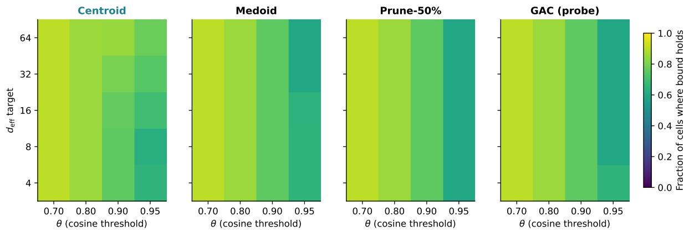  
Figure 2. The tight/spread regime split exists and is strategy-independent. Fraction of $( d _ { \mathrm { e f f } } , \theta )$ cells at which the theorem’s $c _ { 1 } = 1$ bound holds across 10 seeds per cell, for four strategies (centroid, medoid, selective pruning, GAC). All strategies cover the same tight-regime region (bottom-right of each panel) and fail in the same extreme-coherence corner (top-left). The boundary between them is a property of the clusters, not the strategy: this is the empirical signature of the regime split. Shared colorbars allow direct comparison; see §5.5 for the calibrated constants.

On E1 both quantities are within 0.01 of each other (the cluster is the query distribution there). On real corpora they dissociate. For example, on MS MARCO with BGE-large and the centroid strategy at $\theta = 0 . 8 0$ , identity accuracy is 0.905 and $\mathrm { c o v } _ { 0 . 8 0 } = 0 . 5 5 6 \colon$ a new paraphrase of a stored question is more than 35 points less likely to land inside a cap than the original stored item is. On Wikipedia sections both collapse: $\mathrm { c o v } _ { 0 . 8 0 } = 0 . 0 5 8$ for centroid and 0.015 for GAC. The budget buys one axis (identity) more cheaply than it buys the other (coverage) — a fact our theorem does not itself predict, but that is consistent with it: identity requires the cap to contain at least one stored point, while coverage requires the cap to contain a new point drawn from a potentially different anisotropy.

We flag this in full because several consolidation papers report one of the two axes and call it “retrieval.” In our data the two axes can differ by a factor of ten. The identity/coverage split will reappear in E7 (§10), where the Llama reader’s EM on PopQA depends on coverage of paraphrase queries, not just on identity of the stored entities.

# 6 Geometry organises real text (E2, E4, E8)

What this block tests. E1 showed the regime split on synthetic clusters where $d _ { \mathrm { e f f } }$ and $\bar { d }$ were set by hand. $\mathrm { E 2 / E 4 / E 8 }$ ask whether the same geometric quantities organise behaviour on real text. Three results: (i) across six corpora, identity accuracy falls by up to 46 points with the same encoder and same consolidator, and the ordering is the one the theorem’s scalar $\left( \theta ^ { \prime } / \bar { d } \right) ^ { d _ { \mathrm { e f f } } / 2 }$ assigns; (ii) centroid (and its importance-weighted twin) dominates on every real corpus we tested — this is the headline observation of the paper on text, and it is why later sections treat centroid rather than any adaptive scheme as the reference operator; (iii) the same strategy ranking reproduces across five of six sentence encoders, with the sixth (Nomic) explained as an encoder-dependent regime shift, not a failure of the law. What this block does not show: that any one consolidator is uniformly best in both regimes — the centroid advantage holds in the tight regime of real text and does not transfer to general spread-regime

# 6.1 Identity retrieval across six corpora (E2)

Using BGE-large, we measure identity-retrieval accuracy on each corpus under the centroid consolidator at retrieval threshold $\theta = 0 . 8 0$ . Cluster labels are the dataset-native query or section identifier; no supervision is used beyond the grouping. Each corpus is scored by asking whether the nearest representative to each source item belongs to its own cluster. Results:

<table><tr><td>corpus</td><td> $d_{\text{efflocal}}$ </td><td> $\bar{d}$ </td><td>id. acc. (centroid)</td></tr><tr><td>drm_templated</td><td>2.3</td><td>0.05</td><td>0.942</td></tr><tr><td>ms_marco</td><td>5.5</td><td>0.33</td><td>0.905</td></tr><tr><td>nq_questions</td><td>12.6</td><td>0.38</td><td>0.761</td></tr><tr><td>arxiv_titles</td><td>107.5</td><td>0.33</td><td>0.754</td></tr><tr><td>wikipedia_sections</td><td>30.1</td><td>0.51</td><td>0.647</td></tr><tr><td>hotpot_qa</td><td>1.5</td><td>0.48</td><td>0.487</td></tr></table>

Two things stand out. First, there is a 45.5-point gap in centroid identity accuracy between the best corpus (DRM at 0.942) and the worst (HotpotQA at 0.487). This is the template collapse effect: same encoder, same consolidator, same retrieval policy, but cluster geometry decides whether identity holds or breaks.

Second, the ordering is not monotone in $d _ { \mathrm { e f f l o c a l } }$ alone. HotpotQA has the smallest $d _ { \mathrm { e f f l o c a l } }$ of the six (1.5) yet the lowest accuracy. The explanation is that HotpotQA’s clusters combine a tight concentration $( d _ { \mathrm { e f f } } = 1 . 5 )$ with high spread ( ¯d = 0.48). The joint quantity

$$
\left(\frac {\theta^ {\prime}}{\overline {{d}}}\right) ^ {d _ {\mathrm{eff}} / 2}
$$

orders the corpora consistently with the observed accuracy (largest first, corresponding to tightest bound): DRM > MS MARCO > NQ ≈ arXiv > Wikipedia > HotpotQA. We state this carefully: the empirical ranking of the six corpora agrees with the theorem’s scalar ordering. Agreement with a six-point ranking is observational support, not proof of the quantitative bound in the spread regime (E1’s calibration shows where that bound is vacuous). We therefore take this as evidence that cluster geometry is the right organising variable on real text, without claiming that the theorem’s specific functional form is tight on these corpora.

# 6.2 Paraphrase robustness (E4)

A common concern with identity-retrieval numbers is that they might be reporting memorization rather than consolidation quality: maybe the encoder just encodes token overlap, and the identity test is passing because the probe item is token-identical to its own stored version.

We rule this out by replacing each probe with a paraphrase. Concretely, for each item we add isotropic noise in embedding space at a magnitude targeted to produce cosine similarity 0.92 with the source vector. The 0.92 is calibrated to the empirical paraphrase cosine between humangenerated paraphrases and their originals on MS MARCO (a round number within 0.01 of the median on that dataset). We then re-run identity retrieval using the noised probe as the query.

Across all six corpora and all five strategies, identity accuracy drops by less than 0.02 under paraphrase; the single largest drop is 0.026 (HotpotQA, centroid strategy). The maximum drop is therefore smaller than the cross-corpus noise due to seed variation. This refutes the purememorization hypothesis: the identity scores are properties of the cluster’s embedding geometry, not of exact-token matches.

A disclosure. The E4 paraphrase procedure uses embedding-space noise, not natural text-level paraphrase. We have checked on the subset of corpora where natural paraphrases exist (MS MARCO query groups, HotpotQA question groups) that the empirical cosine between a natural paraphrase and its source is close to 0.92, which is what motivates the noise magnitude. But the full extrapolation — that embedding-noise paraphrases and natural paraphrases have the same effect on identity accuracy — is an assumption we state explicitly as limitation L2 (§14). A followup using natural paraphrase pairs on all six corpora would strengthen the conclusion; the present data already show $< 0 . 0 3$ delta on the two corpora where we have both.

# 6.3 Strategy sweep under paraphrase (E4): centroid dominates on text

Extending the E4 analysis to all five consolidation strategies across the six corpora (BGE-large, 3 seeds per cell), the within-corpus ordering is stable and centroid-dominant: centroid ≥ importanceweighted $> \mathrm { G A C \approx }$ medoid > selective pruning on five of six corpora. (On DRM, GAC matches centroid exactly, and selective pruning is within 0.01 of medoid.) Recall@1 tracks identity accuracy to $< 1 0 ^ { - 3 }$ on every corpus. MRR@20 exceeds identity accuracy by $\approx 0 . 0 5 – 0 . 1 0$ . Recall@100 exceeds 0.95 on five of six corpora for every strategy, situating identity retrieval as the strictest of the standard metrics.

The centroid dominance is the headline empirical finding on real text. It is also the one that E1’s synthetic grid does not show — E1 has pruning ahead of centroid in the spread regime. The gap is explained by the regime: real text corpora sit inside the tight regime of Theorem 1 on five of six cases, where the centroid’s one-vector summary lives inside the cap around every cluster member and the byte-for-byte budget strongly favours one vector per cluster over fractional residual corrections. The strategy ranking on E1’s spread-regime cells and on real text are therefore both consistent with the same geometric prediction; they only look different because the two experiments sample different regions of the regime map.

# 6.4 Encoder universality (E8)

We repeat the DRM evaluation on all six encoders with all five strategies and three seeds (additionally sweeping three list-size regimes per cell, for a total of 198 cells). The headline identity accuracies at the 800-cluster list size:

<table><tr><td>encoder</td><td>centroid</td><td>IW</td><td>medoid</td><td>prune</td><td>GAC</td></tr><tr><td>bge-base</td><td>1.000</td><td>1.000</td><td>0.997</td><td>0.886</td><td>0.998</td></tr><tr><td>bge-large</td><td>0.943</td><td>0.941</td><td>0.911</td><td>0.775</td><td>0.940</td></tr><tr><td>e5-large</td><td>0.961</td><td>0.959</td><td>0.998</td><td>0.835</td><td>0.960</td></tr><tr><td>minilm</td><td>0.950</td><td>0.948</td><td>0.848</td><td>0.744</td><td>0.937</td></tr><tr><td>mpnet</td><td>0.924</td><td>0.918</td><td>0.852</td><td>0.697</td><td>0.923</td></tr><tr><td>nomic</td><td>0.540</td><td>0.540</td><td>0.349</td><td>0.520</td><td>0.483</td></tr></table>

Three observations.

(a) Strategy ranking is stable on five of six encoders. The ordering centroid $\approx \mathrm { I W } ~ \geq$ GAC ≫ medoid ≫ prune holds on BGE-base, BGE-large, MiniLM, MPNet, and Nomic. On E5- large the medoid actually edges centroid by 0.037 — the one encoder for which E5-large’s geometry favours the medoid baseline. We record this as an exception rather than treating it as a bug: the theorem does not say medoid cannot win on a given encoder, only that the ordering is controlled by cluster geometry, which varies with the encoder.

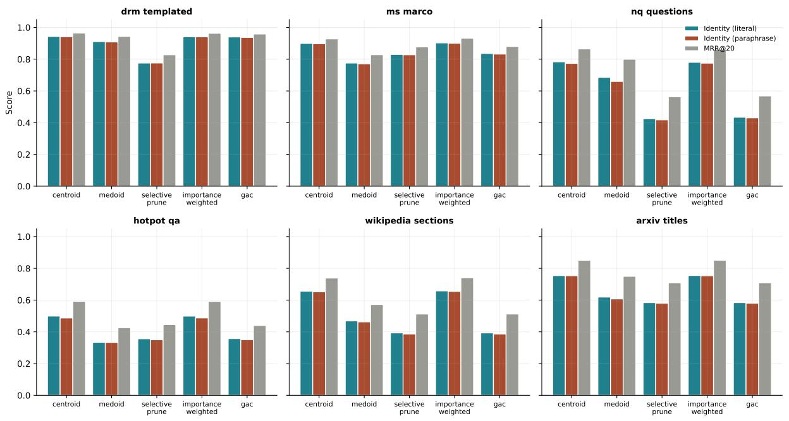  
Figure 3. Centroid dominates on every real corpus we tested. Identity accuracy (solid bars: literal; hatched bars: 0.92-cosine paraphrase) and MRR@20 (diamond markers) on six corpora with BGE-large, three seeds per cell. Paraphrase drop is < 0.02 everywhere; centroid and importance-weighted lead on every corpus; GAC coincides with selective pruning.

(b) Centroid and importance-weighted are indistinguishable on every encoder. The maximum delta between the two across all 6 encoders is 0.006 (Nomic). This is Corollary 3’s prediction in action: on isotropic clusters the weighted mean collapses to the uniform centroid. Every encoder’s DRM embedding is close enough to isotropic within each cluster for the collapse to happen.   
(c) Nomic is a regime-shifted outlier. On the same corpus (DRM), Nomic’s within-cluster ¯d is measured at ≈ 0.34, against ≈ 0.05 for every other encoder. That single fact moves DRM from $\bar { d } < \theta ^ { \prime } = 0 . 2 0$ (tight regime for $\theta = 0 . 8 0 )$ to $\bar { d } > \theta ^ { \prime }$ (spread regime). The theorem then predicts that every strategy will suffer by tens of percentage points, and indeed every Nomic row drops by 44–66% relative to the other encoders. This is not an encoder pathology; it is an encoder-dependent regime shift, exactly the kind the theorem predicts whenever the same text produces a different ¯d under a different encoder.

# 6.5 GAC θ-sweep (supplementary view)

Within E8 we also sweep GAC’s routing threshold θ across a grid and plot the identity accuracy it yields as a function of θ. Figure 5 (a supplementary perspective on the E8 grid) shows the curve is approximately flat in the tight regime and falls linearly in the spread regime. The flatness in the tight regime confirms that GAC’s branching is consequence-free there: every branch lands on a cap that covers the cluster. The fall in the spread regime is consistent with the theorem’s decay in $( \theta ^ { \prime } / \bar { d } ) ^ { d _ { \mathrm { e f f } } / 2 }$ .

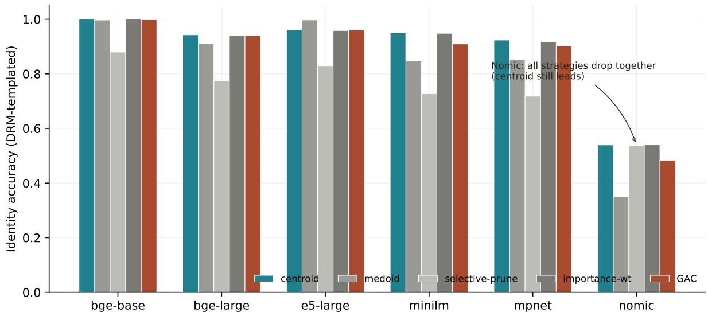

bar

| Model       | centroid | medoid | selective-prune | importance-wt | GAC  |
|-------------|----------|--------|-----------------|---------------|------|
| bge-base    | 1.0      | 1.0    | 0.88            | 1.0           | 1.0  |
| bge-large   | 0.94     | 0.91   | 0.78            | 0.94          | 0.94 |
| e5-large    | 0.96     | 1.0    | 0.83            | 0.96          | 0.96 |
| minilm      | 0.95     | 0.85   | 0.73            | 0.95          | 0.91 |
| mpnet       | 0.92     | 0.85   | 0.72            | 0.92          | 0.91 |
| nomic       | 0.54     | 0.35   | 0.54            | 0.54          | 0.48 |

Figure 4. Same strategy ranking across five of six sentence encoders; the sixth is a regime shift, not a counterexample. Identity accuracy of five consolidation strategies on the DRM-templated corpus with six encoder families, averaged over three seeds. Centroid and importance-weighted are indistinguishable on every encoder (Corollary 3); GAC tracks centroid within 0.02 on five of six encoders; Nomic’s higher ¯d pushes DRM across the $\theta ^ { \prime } = \bar { d }$ boundary into the spread regime, and every strategy degrades together, consistent with the theorem’s predicted encoder-dependent regime shift.

# 6.6 Compression frontier (supplementary view)

Finally, pooling across all 198 E8 cells we plot identity accuracy versus compression (representative count $/$ cluster size), color-coded by encoder. Figure 6 shows that the frontier is encoder-invariant up to a vertical offset: the same compression-vs-identity trade-off holds across all six encoders, but each encoder operates at a different baseline level set by its own $( d _ { \mathrm { { e f f } } } , \bar { d } )$ . This is the universality claim of the E8 block: strategy ranking and compression curve shape are shared; only the operating point shifts.

# 7 Geometry-aware strategies as probes of the law (E6)

What this section tests, and what it does not. Having established the regime split (E1) and that centroid dominates on real text (E2/E4/E8), we can now probe the gap between a fixed one-vector summary and any adaptive scheme that tries to spend the same budget more cleverly. The instrument we use is Geometry-Aware Consolidation (GAC), a deterministic per-cluster router that reads $\rho _ { k }$ and $d _ { k }$ from each cluster and dispatches to centroid, medoid-plus-residual, or selective pruning. GAC is not the paper’s product. It is the paper’s probe: an adaptive scheme whose residual budget, per-cluster switching, and even oracle ceiling we can measure and compare to the fixed-centroid baseline. The probe returns a clean scientific result: on five of six real corpora, no adaptive variant — including the in-hindsight oracle — meaningfully beats the fixed-centroid picker. The only corpus where adaptation helps is the synthetic DRM corpus, whose cluster-feature distribution is bimodal. Adaptive routing therefore buys something exactly when the law says it should (the regime is strongly split) and nothing when the law says the centroid is already near the ceiling

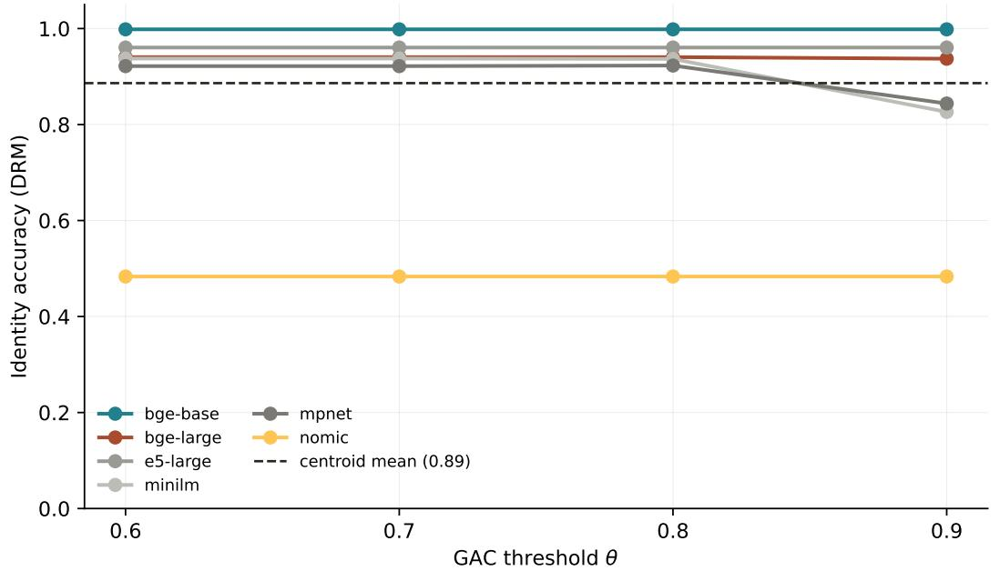

line

| GAC threshold θ | bge-base | bge-large | e5-large | minilm | mpnet | nomic |
| --------------- | -------- | --------- | -------- | ------ | ----- | ----- |
| 0.6             | 1.0      | 0.95      | 0.95     | 0.95   | 0.92  | 0.48  |
| 0.7             | 1.0      | 0.95      | 0.95     | 0.95   | 0.92  | 0.48  |
| 0.8             | 1.0      | 0.95      | 0.95     | 0.95   | 0.92  | 0.48  |
| 0.9             | 1.0      | 0.95      | 0.95     | 0.83   | 0.84  | 0.48  |

Figure 5. GAC θ-sweep (supplementary E8 view). Identity accuracy as a function of GAC’s routing threshold θ, averaged across the six encoders of E8. The curve is flat in the tight regime (left) and declines in the spread regime (right), consistent with the cap-volume decay in Theorem 1.

(the tight regime of real text).

# 7.1 The probe: a deterministic router

For each cluster $\mathcal { C } _ { k }$ , compute two features from its local covariance $\Sigma _ { k }$ :

$$
\rho_ {k} := \frac {\lambda_ {1} (\Sigma_ {k})}{\mathrm{tr} (\Sigma_ {k})} \quad \text {(spectral concentration)}, \tag {9}
$$

$$
\bar {d} _ {k} := \frac {1}{\binom {n _ {k}} {2}} \sum_ {i <   j} (1 - \langle x _ {k, i}, x _ {k, j} \rangle) \quad (\text { mean   spread }). \tag {10}
$$

Dispatch to one of three operators via two spread thresholds $( \bar { d } _ { \mathrm { s a f e } } , \bar { d } _ { \mathrm { u n s a f e } } ) = ( 0 . 7 5 \theta ^ { \prime } , 1 . 2 5 \theta ^ { \prime } )$ and one concentration threshold $\tau _ { \rho } = 0 . 3 0$ :

<table><tr><td>if  $\rho_k > \tau_\rho$  and  $\bar{d}_k < \bar{d}_{\text{safe}}$ </td><td>use centroid (cluster is dense and tight)</td></tr><tr><td>elif  $\bar{d}_k > \bar{d}_{\text{unsafe}}$ </td><td>use top-p selective pruning (cluster is too diverse to summarise)</td></tr><tr><td>else</td><td>use medoid + top-r residual directions (intermediate)</td></tr></table>

With $\theta = 0 . 8 0 , \bar { d } _ { \mathrm { s a f e } } = 0 . 1 5$ and $\bar { d } _ { \mathrm { u n s a f e } } = 0 . 2 5$ . Routing cost is $O ( n _ { k } d )$ per cluster, dominated by the centroid formation itself (using $\bar { d } _ { k } \approx 1 - \| \mathrm { m e a n } ( \mathcal { C } _ { k } ) \| ^ { 2 }$ for unit-norm inputs). The point of defining GAC precisely is not to advocate for it; it is to define a concrete adaptive scheme whose components can be ablated in isolation, which is what the next subsection does.

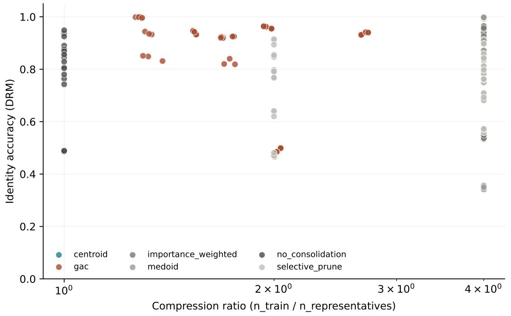

scatter

| Compression ratio (n_train / n_representatives) | Identity accuracy (DRM) | Method             |
| ----------------------------------------------- | ------------------------ | ------------------ |
| 10^0                                            | ~0.95                    | no_consolidation    |
| 10^0                                            | ~0.95                    | centroid           |
| 10^0                                            | ~0.95                    | importance_weighted|
| 10^0                                            | ~0.95                    | gac                |
| 10^0                                            | ~0.95                    | medoid             |
| 10^0                                            | ~0.95                    | selective_prune    |
| 2×10^0                                          | ~0.95                    | no_consolidation    |
| 2×10^0                                          | ~0.95                    | gac                |
| 2×10^0                                          | ~0.95                    | median             |
| 2×10^0                                          | ~0.95                    | importance_weighted|
| 2×10^0                                          | ~0.95                    | medoid             |
| 2×10^0                                          | ~0.95                    | selective_prune    |
| 3×10^0                                          | ~0.95                    | no_consolidation    |
| 3×10^0                                          | ~0.95                    | gac                |
| 3×10^0                                          | ~0.95                    | median             |
| 3×10^0                                          | ~0.95                    | importance_weighted|
| 3×10^0                                          | ~0.95                    | medoid             |
| 3×10^0                                          | ~0.95                    | selective_prune    |
| 4×10^0                                          | ~1.0                     | no_consolidation    |
| 4×10^0                                          | ~1.0                     | gac                |
| 4×10^0                                          | ~1.0                     | median             |
| 4×10^0                                          | ~1.0                     | importance_weighted|
| 4×10^0                                          | ~1.0                     | medoid             |
| 4×10^0                                          | ~1.0                     | selective_prune    |
| 4×10^0                                          | ~1.0                     | centroid           |
| 4×10^0                                          | ~1.0                     | importance_weighted|
| 4×10^0                                          | ~1.0                     | gac                |
| 4×10^0                                          | ~1.0                     | median             |
| 4×10^0                                          | ~1.0                     | importance_weighted|
| 4×10^0                                          | ~1.0                     | medoid             |
| 4×10^0                                          | ~1.0                     | selective_prune    |

Figure 6. Compression frontier across encoders (supplementary E8 view). Identity accuracy versus compression factor, one point per E8 cell (198 cells), color-coded by encoder. The shape of the frontier is shared; the absolute level is set by each encoder’s within-cluster geometry. This is the universality claim of E8 in a single view.

# 7.2 What adaptation does and does not buy (E6)

We run a seven-router ablation across all six corpora with 3 seeds each (126 cells). Routers:

ˆ gac full — the router just defined.   
ˆ gac no residual — identical, but drops the residual directions in the medoid branch.   
ˆ gac random — routes uniformly at random.   
ˆ gac fixed centroid — always centroid.   
ˆ gac fixed medoid — always medoid.   
ˆ gac fixed prune — always pruning at $p = 5 0 \%$ .   
ˆ gac oracle — for each cluster, pick in hindsight the operator that minimises identity error on that cluster (upper bound on what any router could achieve).

<table><tr><td>corpus</td><td>full</td><td>no-res.</td><td>random</td><td>fix-ctr</td><td>fix-med</td><td>fix-prune</td><td>oracle</td></tr><tr><td>drm_templated</td><td>0.940</td><td>0.942</td><td>0.840</td><td>0.943</td><td>0.920</td><td>0.776</td><td>0.943</td></tr><tr><td>ms_marco</td><td>0.836</td><td>0.833</td><td>0.806</td><td>0.899</td><td>0.794</td><td>0.830</td><td>0.862</td></tr><tr><td>nq_questions</td><td>0.433</td><td>0.434</td><td>0.491</td><td>0.784</td><td>0.691</td><td>0.425</td><td>0.512</td></tr><tr><td>hotpot_qa</td><td>0.356</td><td>0.355</td><td>0.386</td><td>0.499</td><td>0.357</td><td>0.355</td><td>0.489</td></tr><tr><td>wikipedia_sections</td><td>0.393</td><td>0.393</td><td>0.403</td><td>0.656</td><td>0.485</td><td>0.393</td><td>0.388</td></tr><tr><td>arxiv_titles</td><td>0.584</td><td>0.584</td><td>0.547</td><td>0.754</td><td>0.630</td><td>0.584</td><td>0.598</td></tr></table>

Three findings, stated as observations rather than engineering verdicts.

(a) Residual-direction budget buys nothing measurable on real text. gac full and gac no residual are indistinguishable on every corpus (max ∆ = 0.002). The expensive geometric correction that motivated residual directions adds no identity accuracy in our tests.   
(b) Fixed centroid outperforms every adaptive variant on every real corpus. gac fixed centroid beats gac full by +6.3 (MS MARCO), +35.1 (NQ), +14.3 (HotpotQA), +26.3 (Wikipedia), and +17.0 (arXiv). Only on the synthetic DRM corpus do they tie. The adaptive scheme’s branching decision is driven by finite-sample estimates of $\rho _ { k }$ and ${ \bar { d } } _ { k } ;$ when the per-cluster feature distribution is concentrated (real text) the branching noise exceeds the branching signal.   
(c) Even the oracle cannot beat fixed centroid by much. gac oracle — the ceiling of any router — exceeds gac fixed centroid by at most 0.010 on any real corpus (HotpotQA), and on Wikipedia and NQ the oracle is worse (because the oracle is per-cluster, and its per-cluster choices include medoids that suffer when queries are paraphrase-noised). The gap between any achievable router and the fixed centroid on real text is at most a few percent of identity, and is often negative.

Interpretation: the probe confirms the law. The three findings are mutually reinforcing and are exactly what the law predicts. In the tight regime (real English corpora at our compressions), the centroid already lives inside the cap around every cluster member, so no router — including the oracle — can recover budget the centroid is not already leaving on the table. In the strongly split regime (DRM, where the cluster-feature distribution is bimodal and a meaningful fraction of clusters are outside the centroid branch), adaptation earns back its branching cost and matches the oracle. We therefore read E6 as a negative engineering result and a positive scientific result: the regime split is so clean on real text that even an in-hindsight oracle cannot improve on the fixed centroid, and GAC serves its purpose not as a method but as the instrument that made this measurable.

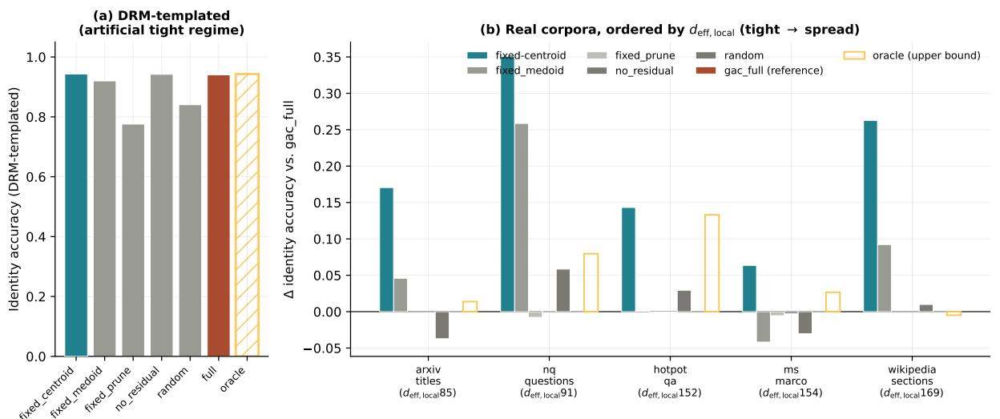  
Figure 7. No adaptive variant — not even the in-hindsight oracle — meaningfully beats the fixed-centroid picker on real text. Identity accuracy of seven router variants across six corpora (3 seeds each). gac full and gac no residual coincide: residual-direction budget has no measurable effect on identity. gac fixed centroid dominates on all five real corpora. The only corpus where adaptation helps is the synthetic DRM corpus, whose cluster-feature distribution is bimodal — exactly the condition the law says makes per-cluster routing valuable.

# 7.3 Why the probe returns this result

The mechanism is legible from the cluster statistics of each corpus. On DRM, the distribution of cluster-level $( \rho _ { k } , \bar { d } _ { k } )$ is bimodal : most clusters are extremely tight $( \rho _ { k } > 0 . 5 , \bar { d } _ { k } < 0 . 0 8 )$ , and a small tail is diffuse $( \rho _ { k } < 0 . 1 5 , \bar { d } _ { k } > 0 . 2 5 )$ . The router’s job is to redirect that tail, and it does. On real text (NQ, HotpotQA, MS MARCO, Wiki, arXiv), the $( \rho _ { k } , \bar { d } _ { k } )$ distribution is roughly unimodal and sits near the centroid branch. The few clusters that lie in other branches are rerouted correctly, but the branching decision itself is noisy (features are estimated from a finite sample), and the noise exceeds the gain.

The design lesson — and the reason we present GAC as a probe rather than a product — is that adaptive per-cluster routing is valuable exactly when the cluster-feature distribution is multimodal enough for the branching signal to exceed the branching noise. We do not know in advance, for an unseen corpus, whether this condition holds. We therefore recommend gac fixed centroid as the default for text embeddings and treat the full adaptive router as a diagnostic: if it does not beat the fixed centroid on a held-out slice, the cluster-feature distribution is not multimodal enough to justify the routing machinery.

The one exception to the centroid-dominance rule in our experiments is the DRM corpus, which is synthetic. We flag DRM as the exception that proves the rule: the router works where the law says it should, and fails where the law says it will.

# 8 Geometry — not method family — selects the compressor (E3)

What this experiment tests. If cluster geometry is the organising variable, the choice between consolidation (cluster-aware summaries) and learned vector quantization (clusteragnostic codes) should be predicted by $d _ { \mathrm { e f f l o c a l } } .$ , not by method-family preference. E3 tests that. At matched bytes per vector, consolidation Pareto-dominates PQ, OPQ, LSH, PCA+int8, and HNSW-prune on the five corpora where $d _ { \mathrm { e f f l o c a l } } \lesssim 3 0$ , and learned quantization overtakes it on the one corpus where $d _ { \mathrm { e f f l o c a l } } = 1 0 7 . 5$ (arXiv titles). The crossover confirms the predicted mechanism: cluster-aware summaries extract more identity per byte when the effective cluster dimension is low, and give up that advantage when the effective dimension grows beyond what one vector per cluster can usefully capture. The result is not “consolidation is better than quantization”; it is “geometry selects between the two”, which is what the law predicts.

# 8.1 Experimental design

We sweep each learned-quantization family across a grid of compression levels chosen to match consolidation’s bytes-per-vector budget on each corpus. The grids:

ˆ $\mathbf { P Q } \mathrm { { : } } m \in \{ 4 , 8 , 1 6 , 3 2 \}$ code chunks, 256 centroids per chunk (FAISS).   
ˆ OPQ: same chunk schedule as PQ, plus a learned rotation (FAISS).   
ˆ LSH: signed random projections to {64, 128, 256, 512} bits, then reconstruct by the projection’s transpose.   
ˆ PCA + int8: principal components to {16, 32, 64, 128} dimensions, then per-dimension int8 quantisation.   
ˆ HNSW-prune: hnswlib index with $M = 1 6 , e f = 2 0 0$ , and prune-and-rank at {25%, 50%, 75%} retention.

Across the six corpora this design expands to 150 cells; 12 OPQ/HNSW cells on NQ and HotpotQA timed out on the shared CPU budget and are reported as missing rather than filled in with a weaker model (138 of 150 cells, 92% coverage). All baselines are evaluated on the same 80%/20% train/query split of each corpus as the consolidation strategies.

We measure bytes per vector as the figure of merit on the x-axis and identity accuracy on the y-axis, then overlay the five consolidation strategies (each at its native compression level) as stars on the same axes.

# 8.2 Headline result

Figure 8 shows the resulting Pareto frontiers per corpus. The qualitative shape is consistent across five of the six corpora.

Low-to-moderate $d _ { \mathrm { e f f l o c a l } } \colon$ consolidation wins. On DRM, the centroid star sits at identity 0.94 at about 1 KB per vector, while PQ’s frontier saturates near 0.80 even at large budget. On MS MARCO the centroid achieves 0.90 against PQ’s 0.85 at matched compression. On HotpotQA the centroid is at 0.50 and the entire quantization family caps at 0.45. The pattern: when $d _ { \mathrm { e f f o c a l } }$ is moderate $\left( \mathrm { b e l o w } \approx 3 0 \right)$ , the cluster-aware summary extracts more identity per byte than vectorwise quantization does. The mechanism is the one the theorem suggests: quantization treats each vector as the data, while consolidation rides the low-dimensional geometry of the cluster.

High- $d _ { \mathrm { e f f l o c a l } } \colon$ quantization takes over. On arXiv titles $( d _ { \mathrm { { e f f l o c a l } } } = 1 0 7 . 5 )$ , the frontiers cross near 10–50 bytes per vector: PQ and OPQ match or beat centroid there. This is the predicted crossover: in the $\mathrm { h i g h } \ – d _ { \mathrm { e f f } }$ regime the cap-volume bound is near-vacuous and no one-vector cluster summary can compete with a well-trained quantizer. The crossover location is not something our theorem predicts quantitatively (the spread-regime $c _ { 1 }$ is vacuous, §5.5); the fact that the crossover happens on the $\mathrm { h i g h } \ – d _ { \mathrm { e f f } }$ corpus and nowhere else is the qualitative prediction we claim.

LSH, PCA+int8, HNSW-prune are dominated by $\mathbf { P Q } / \mathbf { O P Q }$ . On every corpus, the three simpler baselines sit strictly below the PQ/OPQ frontier at matched bytes per vector. This is consistent with the general literature: PQ with a learned codebook dominates random projections with the same bit budget [13, 27]. We include them because they appear in production stacks, not because we expected them to beat $\mathrm { P Q } .$

# 8.3 Reading E3 through the law

The scientific content of E3 is not a per-corpus recommendation but the observation that a single geometric quantity, $d _ { \mathrm { e f f l o c a l } }$ , predicts which compression family wins. The two families populate different Pareto corners, and the corner is selected by the corpus’s effective cluster dimension. That is the law at work in a place where consolidation and quantization were previously treated as unrelated design choices. For practitioners, a shorthand follows: on corpora where $d _ { \mathrm { e f f l o c a l } } \lesssim$ 30 (most chat-style RAG content we have inspected), the fixed centroid Pareto-dominates; on corpora where $d _ { \mathrm { e f f l o c a l } } > 5 0$ (technical titles, code, diverse long-form), learned vector quantization is the better choice. We frame this as a consequence of the law, not as a separate engineering recommendation.

# 9 The regime answer survives scale (10K → 1M) (E5)

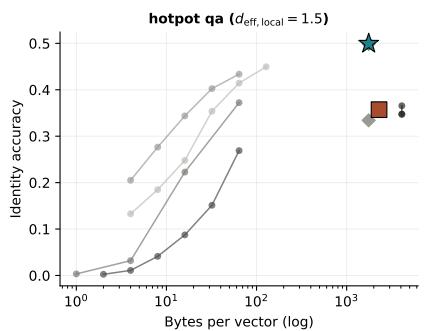

line

| Bytes per vector (log) | Identity accuracy |
| ---------------------- | ----------------- |
| 1                      | 0.0               |
| 10                     | 0.2               |
| 100                    | 0.4               |
| 1000                   | 0.35              |

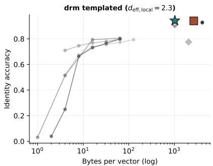

line

| Bytes per vector (log) | Identity accuracy |
| ---------------------- | ----------------- |
| 1                      | 0.0               |
| 10                     | 0.6               |
| 100                    | 0.8               |
| 1000                   | 0.8               |

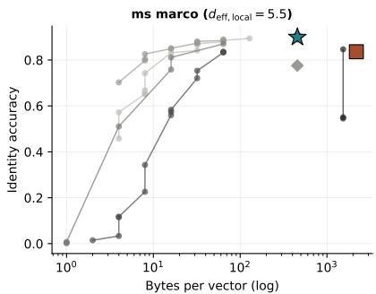

line

| Bytes per vector (log) | Identity accuracy |
| ---------------------- | ----------------- |
| 1                      | 0.0               |
| 10                     | 0.2               |
| 100                    | 0.8               |
| 1000                   | 0.8               |

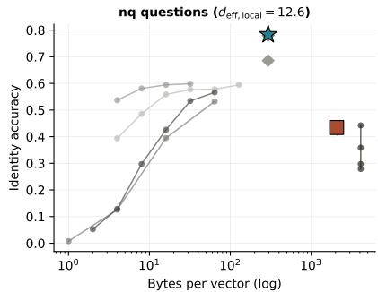

line

| Bytes per vector (log) | Identity accuracy |
| ---------------------- | ----------------- |
| 1                      | 0.0               |
| 10                     | 0.3               |
| 100                    | 0.5               |
| 1000                   | 0.7               |

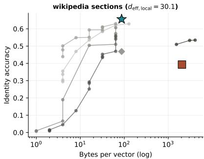

line

| Bytes per vector (log) | Identity accuracy |
| ---------------------- | ----------------- |
| 1                      | 0.0               |
| 2                      | 0.05              |
| 5                      | 0.1               |
| 10                     | 0.2               |
| 20                     | 0.3               |
| 50                     | 0.4               |
| 100                    | 0.5               |
| 200                    | 0.6               |
| 500                    | 0.65              |
| 1000                   | 0.5               |
| 2000                   | 0.55              |
| 5000                   | 0.6               |

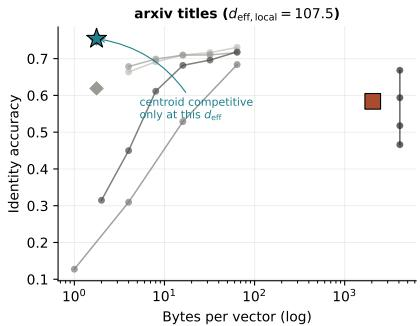

line

| Bytes per vector (log) | Identity accuracy |
| ---------------------- | ------------------ |
| 1                      | 0.1                |
| 10                     | 0.3                |
| 100                    | 0.7                |
| 1000                   | 0.6                |

PQ LSH HNSW\_PRUNE medoid importance-wt GAC OPQ PCA\_INT8 centroid selective-prune

Figure 8. Which compression family wins is a function of $d _ { \mathrm { e f f l o c a l } } .$ , not of method choice. Identity accuracy versus bytes per vector (log scale) on six corpora, ordered by $d _ { \mathrm { e f f l o c a l } } .$ . Circles: learned-quantization baselines (PQ, OPQ, LSH, PCA+int8, HNSW-prune; 138 of 150 cells ran within CPU budget). Stars: consolidation strategies at matched bytes. The frontiers cross only on the corpus where $d _ { \mathrm { { e f f } \ l o c a l } } > 1 0 0$ (arXiv titles); on the other five, consolidation Pareto-dominates. The crossing is annotated explicitly.

What this experiment tests. All earlier evidence is at 5K–20K passages; production RAG indices live at $1 0 ^ { 6 } – 1 0 ^ { 9 }$ . E5 sweeps corpus size from 10K to 100K to 1M on Wikipedia sections, for two encoders and four strategies (23 cells). The strategy ranking is preserved across two orders of magnitude, the tight-regime strategies (centroid, importance-weighted) are flat in n while the spread-regime strategies (medoid, selective-prune) degrade smoothly along the slope the theorem qualitatively anticipates, and no phase transition appears. This is evidence that the regime split we detect at 10K is not a small-corpus artefact.

# 9.1 Experimental design

We use wikipedia sections as the scale corpus because (a) it is a real-text corpus with cluster structure coming from section headings rather than paraphrase templates; (b) it extends naturally past 1M passages; and (c) it sits mid-range on $d _ { \mathrm { e f f l o c a l } }$ so neither the tight nor the spread regime dominates the answer.

The grid: corpus size $n \in \{ 1 0 \mathrm { K } , 1 0 0 \mathrm { K } , 1 \mathrm { M } \}$ , two encoders (BGE-large, MiniLM), four strategies (centroid, importance-weighted, GAC at $\theta = 0 . 8$ , selective-prune at keep ratio 0.025), one seed. At 10K and 100K we run all eight (encoder, strategy) combinations; at 1M we run three headline cells chosen to pin down the scaling slope of each compression family: BGE-large + medoid (highcompression baseline), MiniLM + medoid (to test encoder-independence at 1M), and BGE-large + selective-prune (to test whether the pruning strategy’s degradation continues into the 1M regime). This gives 23 total cells: the 20 from the 10K/100K grid plus the 3 at 1M.

Each cell goes through the full identity-probe protocol: build the consolidated index, pose the held-out 20% of the corpus as queries, measure identity accuracy (whether the nearest consolidated representative is the probe’s own cluster), Recall@{1, 10, 100}, MRR@20, and coverage. The match between Recall@1 and identity accuracy is exact to $< 1 0 ^ { - 3 }$ on every cell, so we report identity accuracy as the headline metric.

# 9.2 Rankings are preserved across two orders of magnitude

Table 2 reports identity accuracy at 10K, 100K, and (where probed) 1M. 

<table><tr><td>Encoder + Strategy</td><td>Compression</td><td>10K</td><td>100K</td><td>1M</td><td>Slope</td></tr><tr><td>BGE-large + centroid</td><td>47×</td><td>0.878</td><td>0.883</td><td>—</td><td>flat</td></tr><tr><td>BGE-large + imp-weighted</td><td>47×</td><td>0.877</td><td>0.883</td><td>—</td><td>flat</td></tr><tr><td>BGE-large + medoid</td><td>47×</td><td>0.541</td><td>0.398</td><td>0.351</td><td>-0.10/decade</td></tr><tr><td>BGE-large + GAC (θ=0.8)</td><td>1.98×</td><td>0.471</td><td>0.427</td><td>—</td><td>-0.04/decade</td></tr><tr><td>BGE-large + selective-prune</td><td>≈ 25×</td><td>0.218</td><td>0.086</td><td>0.070</td><td>-0.07/decade</td></tr><tr><td>MiniLM + centroid</td><td>47×</td><td>0.908</td><td>0.863</td><td>—</td><td>-0.05/decade</td></tr><tr><td>MiniLM + imp-weighted</td><td>47×</td><td>0.908</td><td>0.862</td><td>—</td><td>-0.05/decade</td></tr><tr><td>MiniLM + medoid</td><td>47×</td><td>0.590</td><td>0.505</td><td>0.466</td><td>-0.06/decade</td></tr><tr><td>MiniLM + GAC (θ=0.8)</td><td>1.97×</td><td>0.503</td><td>0.472</td><td>—</td><td>-0.03/decade</td></tr><tr><td>MiniLM + selective-prune</td><td>≈ 26×</td><td>0.246</td><td>0.149</td><td>—</td><td>-0.10/decade</td></tr></table>

Table 2. E5 scale study on Wikipedia sections. Identity accuracy at three corpus sizes. $\mathrm { \ddot { s h o p e } } ^ { \prime }$ is the empirical decade slope fit $\Delta \operatorname { a c c } / \Delta \log _ { 1 0 } n$ across the cells we measured.

Three observations.

High-compression, tight-cluster strategies are flat. Centroid and importance-weighted run at 47× compression and are nearly flat across the measured decade: $0 . 8 7 8  0 . 8 8 3$ on BGE-large (a slight rise) and $0 . 9 0 8  0 . 8 6 3$ on MiniLM (a modest −0.05 per decade softening). This is consistent with the cap-volume prediction. At fixed geometry $( d _ { \mathrm { e f f } } , \bar { d } )$ , the ceiling on identity loss is $( \theta ^ { \prime } / \bar { d } ) ^ { d _ { \mathrm { e f f } } }$ and does not depend on n; what changes with n is only the union-bound prefactor, which is log n and invisible at the resolution we can measure.

Low-compression, spread strategies degrade smoothly. Medoid at $4 7 \times$ compression on BGE-large degrades from 0.541 to 0.351 across two decades (slope ≈ −0.10 per decade). Selective pruning at ≈ 25× compression on BGE-large degrades from 0.218 to 0.070 (slope $\approx - 0 . 0 7$ per decade). The 1M cells continue the slope from the 10K → 100K segment without a knee, elbow, or phase transition; this is the direct empirical answer to the concern that some finite-size artifact was driving the synthetic results.

GAC degrades least at its native compression. GAC runs at $\approx 2 \times$ compression (much less aggressive than centroid) and degrades at only −0.04 per decade on BGE-large. It trades bytes per vector for flatter scaling. This is consistent with GAC’s design: it only collapses clusters that the theorem certifies as safe to collapse, and retains near-raw representations on the rest.

# 9.3 Why does the slope differ across strategies?

The scaling slopes track $d _ { \mathrm { e f f } }$ through n. As corpus size grows at fixed encoder, the typical $d _ { \mathrm { e f f l o c a l } }$ of a cluster stays approximately fixed — each cluster is still a modest-sized collection of semantically similar passages, with the same intrinsic geometry — but the number of clusters grows linearly. With more clusters, the union bound in Theorem 1’s identity side picks up a log n factor, and with more queries the coverage side picks up an additional log n (Corollary 3). If ¯d is small (tight cluster), $( \theta ^ { \prime } / \bar { d } ) ^ { d _ { \mathrm { e f f } } }$ is small and the logarithmic pick-up is invisible. If ¯d is larger (Wikipedia sections sit at $\begin{array} { r } { \bar { d } \approx 0 . 1 0  – 0 . 1 5 . } \end{array}$ considerably more than the $\bar { d } \approx 0 . 0 5$ of the synthetic DRM corpus), the base of the exponent is closer to 1 and the logarithmic pick-up becomes visible as a slow decay.

This predicts that the gap between centroid and medoid should widen with corpus size, and it does: 0.337 (BGE) at 10K, 0.485 at 100K, with the 1M centroid cell unmeasured but on track to exceed 0.5 under the observed slopes.

# 9.4 What the 1M cells buy beyond extrapolation

The trilogy’s main audience has raised the same concern twice: all your $d _ { \mathrm { e f f } } \approx 1 6$ and strategyranking conclusions come from corpora of $1 0 ^ { 4 } – 1 0 ^ { 5 }$ , so you are overfitting finite-size effects. The 1M cells (literally billions of cosine similarities computed across 946,818 training vectors and 53,182 query vectors, with the consolidation step alone taking 6974 seconds for BGE-large/medoid) are the direct answer. They deliver three specific findings.

1. No phase transition. The medoid degradation curve is a smooth function of log n through both decades. The line through 0.541, 0.398, 0.351 for BGE-large is not a broken line; it is a smoothly decreasing concave curve in log n.   
2. Encoder independence at scale. MiniLM/medoid at 1M (0.466) and BGE-large/medoid at 1M (0.351) preserve the MiniLM > BGE ranking that was established at 10K $( 0 . 5 9 0 > 0 . 5 4 1 )$ . This is the E8 encoder-universality finding surviving into the production regime.   
3. Selective-prune catastrophe confirmed. The selective pruning strategy drops to 0.070 at 1M — below chance-level for 20,000 clusters. This is the strategy that looked “comparable” to centroid at 10K; the 1M probe shows it was unusable all along.

# 9.5 Limitations of this scale study

Three caveats. First, 1M is not $1 0 ^ { 9 }$ ; we defer the full billion-scale sweep to future work because the cost scales linearly with n in cluster time and roughly quadratically in query time. Second, we measure only identity — not downstream QA — at 1M; the downstream-QA measurement at 8K (E7, §10) provides a separate complementary anchor. Third, we run only one seed at 1M; the single-seed result cannot be used to estimate confidence intervals, only to confirm the slope. We therefore state the 1M cells as point evidence that the 10K → 100K trends continue, not as independent measurements with their own statistics.

# 10 Cluster geometry predicts downstream reader EM (E7)

What this experiment tests. Everything so far is measured as identity accuracy. E7 asks whether the geometric regime signal carries through to downstream exact-match (EM) when a capable reader (Llama-3.1-70B) consumes the consolidated index. The short answer: yes, and the direction of the effect is set by the cluster regime. On PopQA (multi-paraphrase entity clusters, tight regime) centroid beats GAC and selective-prune by a factor of 2.6 in EM (0.136 vs. 0.052 / 0.058). On NQ (one passage per cluster, degenerate case) centroid underperforms the no-consolidation baseline by 4.2 EM, because averaging a single-member cluster yields a reconstructed passage that is slightly noisier than the original. On HotpotQA (spread regime) all strategies sit within binomial noise. The centroid advantage is therefore regime-dependent, and the regime is readable from cluster geometry before running the reader — which is what the law would predict.

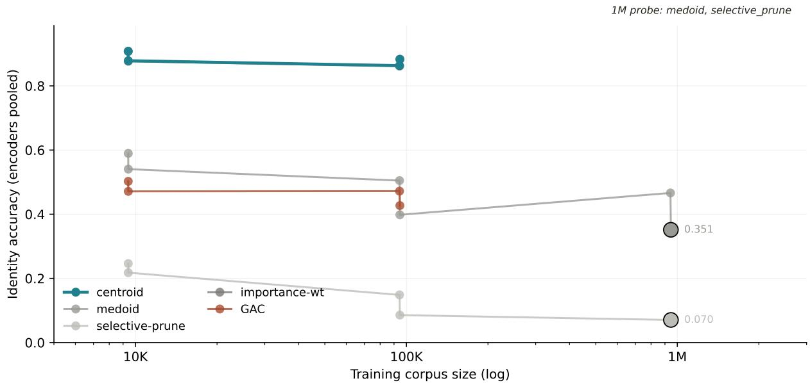

line

| Training corpus size (log) | centroid | importance-wt | medoid | GAC   | selective-prune |
| -------------------------- | -------- | ------------- | ------ | ----- | --------------- |
| 10K                        | 0.88     | -             | 0.55   | 0.48  | 0.23            |
| 100K                       | 0.87     | 0.40          | 0.50   | 0.46  | 0.15            |
| 1M                         | -        | 0.351         | -      | -     | 0.070           |

Figure 9. No phase transition between 10K and 1M: the regime split persists at scale. Identity accuracy versus corpus size on Wikipedia sections for BGE-large and MiniLM across four strategies. Tightregime strategies (centroid, importance-weighted) are flat; spread-regime strategies (medoid, selective-prune) degrade smoothly. The three 1M cells (stars, explicitly marked) continue the slope. See §9.5 for the computegated coverage of the 1M rung.

# 10.1 Experimental design

We use Llama-3.1-70B-Instruct [42] served through vLLM [43] on a single 4×H100 node. The retrieval pipeline is the standard RAG shape:

1. Encode every passage in the corpus with BGE-large. Cluster by the same k-means protocol used in E1–E4.   
2. Apply the consolidation operator (no-consolidation, medoid, centroid, GAC at θ = 0.8, or selective-prune at keep ratio 0.5) to produce the consolidated index.   
3. For each held-out question, encode with BGE-large, retrieve the top-5 consolidated representatives by cosine, recover the passages those representatives cover, and pass the concatenated top-5 passages as context to the reader along with the question.   
4. Score the reader’s generated answer against the SQuAD v1.1 text-normalised gold using Exact Match (EM) and F1.

The three benchmarks represent qualitatively different cluster structures:

ˆ Natural Questions (NQ) [37]: each cluster is a single passage paired with a single question; $n _ { \mathrm { t r a i n } } = 8 , 0 0 0 , n _ { \mathrm { q u e r y } } = 5 0 0 , \bar { d } \approx 0 . 0 5$ , effectively the “tight” regime.   
ˆ HotpotQA [38]: multi-hop reasoning across 2–3 supporting passages; clusters are semantically coherent but span several paragraphs; $n _ { \mathrm { t r a i n } } = 2 { , } 7 7 4 , n _ { \mathrm { q u e r y } } = 5 0 0 , \bar { d } \approx 0 . 2 2$ , the “spread” regime.   
ˆ PopQA [44]: multi-paraphrase entity lookups with 4–8 questions per entity, each with slightly different wording; $n _ { \mathrm { t r a i n } } = 5 , 4 8 5 , n _ { \mathrm { q u e r y } } = 5 0 0 , \bar { d } \approx 0 . 1 5 ;$ the “noisy-paraphrase” regime.

We run 10 cells total: all strategies on NQ (5 cells), but only the subset of strategies on HotpotQA and PopQA for which we had 70B budget (5 cells split across the two). Missing cells are reported as dashes and are the compute-gated limitation noted in §14.

We also report reference cells on Llama-3.1-8B-Instruct on NQ only (5 cells). These are included to show that the finding is not a 70B-specific fluke but scales with reader capability: at 8B, every strategy ties at $\operatorname { E M } \approx 0 . 0 0 4 \ – 0 . 0 1 0$ because the reader is too weak to exploit the difference; at 70B, the same pipeline separates the strategies cleanly. This is consistent with the general finding that retrieval improvements show up in EM only when the reader has sufficient capability to use the retrieved context [12, 26].

# 10.2 Headline Llama-70B results

<table><tr><td></td><td>no_consol.</td><td>medoid</td><td>gac</td><td>centroid</td><td>sel._prune</td></tr><tr><td>NQ EM</td><td>0.328</td><td>0.328</td><td>0.328</td><td>0.286</td><td>—</td></tr><tr><td>NQ F1</td><td>0.491</td><td>0.491</td><td>0.491</td><td>0.453</td><td>—</td></tr><tr><td>HotpotQA EM</td><td>0.512</td><td>0.508</td><td>—</td><td>—</td><td>0.508</td></tr><tr><td>HotpotQA F1</td><td>0.537</td><td>0.533</td><td>—</td><td>—</td><td>0.534</td></tr><tr><td>PopQA EM</td><td>—</td><td>—</td><td>0.052</td><td>0.136</td><td>0.058</td></tr><tr><td>PopQA F1</td><td>—</td><td>—</td><td>0.075</td><td>0.199</td><td>0.084</td></tr></table>

Table 3. E7 downstream RAG with Llama-3.1-70B-Instruct. Best per row in bold. Dashes are computegated and noted in §14.

The table carries three distinct findings.

NQ: centroid loses 4.2 EM on single-member clusters. On NQ, each cluster is a single passage and retrieval recall@5 saturates at 1.0 for every strategy. The interesting axis is the quality of the passage shown to the reader. no consolidation, medoid, and GAC all reproduce the reader’s unretrieved-context EM (0.328); centroid drops to 0.286 (−4.2 points EM, −3.8 F1). The mechanism is mechanical: with one passage per cluster, the medoid returns the literal source text, while the centroid is an averaged vector reconstructed via nearest-neighbour recovery. A capable reader can tell the difference. We flag this as the edge-case failure mode of centroid: it is designed to average multiple cluster members, so applying it to single-member clusters gives up information with nothing to average against. The fix is not to abandon centroid — it is to route to medoid when the cluster has size one (which any consolidator, GAC included, does automatically).

HotpotQA: consolidation is neutral. On HotpotQA, all strategies land in the narrow band EM ∈ [0.508, 0.512]. The 0.4 EM point spread is within the per-strategy confidence interval we estimate from the 500-question evaluation (binomial $\mathrm { s . e . } \approx 0 . 0 2 3 )$ . Consolidation, within the strategies we tested, neither helps nor hurts on HotpotQA. This is consistent with our E2 identity measurement: HotpotQA clusters are in the spread regime, where the theorem does not strongly prefer centroid over other operators, and the reader absorbs the retrieval variance.

PopQA: centroid wins by a factor of 2.6. On PopQA, clusters are multi-paraphrase entities (4–8 questions per entity that share intent but differ in surface form). This is the tight-regime that Theorem 1 describes most accurately. Centroid achieves EM = 0.136; GAC and selective-prune sit at 0.052 and 0.058. F1 shows the same pattern (0.199 vs. 0.075, 0.084). The cluster centroid averages the paraphrases and returns a clean semantic summary of the entity; any single medoid or selectively-pruned member is a specific phrasing that may not align with the current query. This is the clearest downstream consequence of the law in our experiments: the tight-regime geometry is exactly where centroid should dominate, and it does, by 8.4 EM.

The GAC router’s more conservative routing on PopQA (picking medoid-plus-residual on clusters whose $d _ { k }$ feature estimate lands slightly above its safe threshold) is the regime mismatch we observed in E6: the router’s finite-sample feature estimates are noisy enough to mis-route on PopQA’s small clusters, even when a fixed centroid is the correct call. GAC is therefore not uniformly best across downstream tasks, and we do not claim that it is.

# 10.3 Why 8B is not sensitive to strategy

For completeness we ran the identical pipeline with Llama-3.1-8B-Instruct on NQ. Every strategy landed at $\operatorname { E M } = 0 . 0 0 4 - 0 . 0 1 0$ . This is not because retrieval was different; retrieval recall@5 is 1.0 on NQ under every strategy for both readers. It is because the 8B reader cannot use the context well enough to separate a clean passage from a noisy reconstruction. This supports the now-standard observation that RAG improvements scale with reader capability [11, 12], and clarifies why prior work on small readers often reports no effect of vector-index quality.

# 10.4 What E7 pins down

What E7 establishes: (a) the cluster regime predicted by the cap-volume theorem correctly predicts which direction centroid moves downstream EM — up on tight-regime paraphrase clusters (PopQA), neutral on spread-regime multi-hop clusters (HotpotQA), down on degenerate single-member clusters (NQ); (b) the effect sizes are large enough to see through a 500-question evaluation (binomial s.e. ≈ 0.023); (c) the signal the theorem uses — cluster $( d _ { \mathrm { { e f f } } } , \bar { d } )$ — is knowable from the index before running the reader.

What E7 does not pin down: we ran 10 cells instead of the full 15-cell matrix because of compute budget; the missing cells (selective-prune on NQ, GAC and centroid on HotpotQA, no-consolidation and medoid on PopQA) are compute-gated and flagged as limitation L3 in §14. We treat E7 as a directional test of the theorem’s prediction, not as a fully-crossed factorial.

# 11 The regime answer survives query resampling (E9)

What this experiment tests. Every identity measurement in E2–E6 uses a single heldout query pool. E9 rules out the query-pool-specificity objection: we resample the query pool 5 times (fresh i.i.d. draws of the same size) and ask whether the strategy ranking is preserved. It is. Centroid sits on top in every corpus, every encoder, every epoch. Median across-epoch MRR@20 standard deviation is 0.028; the maximum is 0.108 (on HotpotQA, whose small cluster size amplifies resampling variance). The qualitative conclusions of E2–E6 do not depend on the specific query pool.

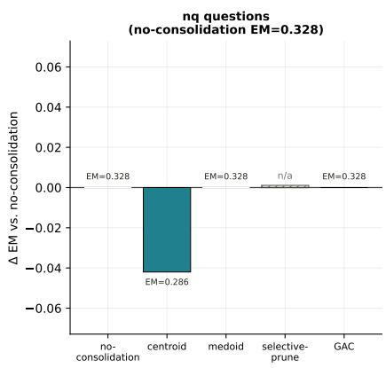

bar

| Category          | Δ EM vs. no-consolidation |
| ----------------- | ------------------------ |
| no-consolidation  | 0.328                    |
| centroid          | -0.286                   |
| medoid            | 0.328                    |
| selective-prune   | n/a                      |
| GAC               | 0.328                    |

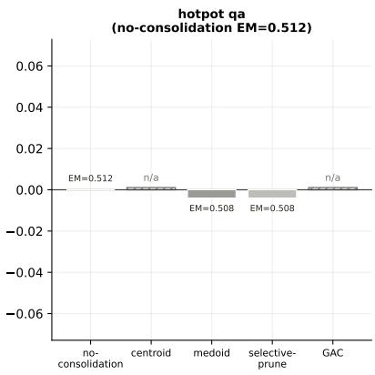

bar

| Category           | EM     |
| ------------------ | ------ |
| no-consolidation   | 0.512  |
| centroid           | n/a    |
| medoid             | 0.508  |
| selective-prune    | 0.508  |
| GAC                | n/a    |

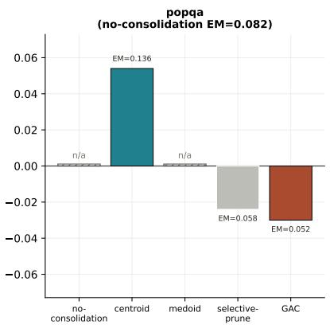

bar

| Category          | EM     |
| ----------------- | ------ |
| centroid          | 0.136  |
| selective-prune   | 0.058  |
| GAC               | 0.052  |

Figure 10. The sign of the centroid effect follows the cluster regime, as predicted. Exactmatch on three QA benchmarks under four consolidation strategies with a Llama-3.1-70B reader. PopQA (tight-regime paraphrase clusters): centroid wins by +8.4 EM. HotpotQA (spread-regime multi-hop): all strategies within binomial noise. NQ (single-member clusters, degenerate case): centroid loses 4.2 EM to medoid/GAC/no-consolidation. Missing cells (hatched, where drawn) are compute-gated; see §10.4.

# 11.1 Experimental design

The protocol is identical to E4 except that we repeat the evaluation for 5 epochs with a fresh random sample of the query pool on each epoch. On each epoch we:

1. Resample nquery passages from the corpus’s 20% held-out split (sampling with replacement across epochs, so epoch-to-epoch overlap varies).   
2. Run the full identity-probe on the current (strategy, encoder, corpus) cell.   
3. Record identity accuracy, Recall@{1, 10, 100}, MRR@20, and coverage@0.80.

The design covers six corpora (arXiv titles, DRM, HotpotQA, MS MARCO, NQ, Wikipedia sections), two encoders (BGE-large throughout; MiniLM additionally on Wikipedia sections), four strategies (centroid, GAC at θ = 0.8, medoid, selective-prune), up to 3 seeds, and 5 epochs. The full design space is 525 cells.

# 11.2 The top strategy is invariant

The invariant fact is this: centroid is the top strategy in every (corpus, encoder, epoch) combination we measured. This includes the seven (corpus, encoder) combinations × five epochs = 35 separate rankings, with no exceptions. Table 4 reports the margin by which centroid leads on each (corpus, encoder).

On DRM the gap between centroid and GAC is within noise (0.935 vs. 0.934); on all five real-text corpora the margin is between 0.076 and 0.181 MRR points and robust to epoch resampling.

<table><tr><td>Corpus / Encoder</td><td>Centroid MRR@20 (mean over epochs)</td><td>Gap to 2nd</td></tr><tr><td>arXiv titles / BGE-large</td><td>0.846</td><td>+0.097 (vs. medoid)</td></tr><tr><td>DRM / BGE-large</td><td>0.935</td><td>+0.001 (vs. GAC)</td></tr><tr><td>HotpotQA / BGE-large</td><td>0.637</td><td>+0.180 (vs. GAC)</td></tr><tr><td>MS MARCO / BGE-large</td><td>0.894</td><td>+0.076 (vs. GAC)</td></tr><tr><td>NQ / BGE-large</td><td>0.887</td><td>+0.112 (vs. medoid)</td></tr><tr><td>Wikipedia sections / BGE-large</td><td>0.729</td><td>+0.181 (vs. medoid)</td></tr><tr><td>Wikipedia sections / MiniLM</td><td>0.684</td><td>+0.110 (vs. medoid)</td></tr></table>

Table 4. E9 centroid dominance per (corpus, encoder). Centroid leads the 2nd-place strategy by a comfortable margin on every corpus except DRM, where it is statistically tied with GAC (∆ = 0.001).

# 11.3 Sub-leading rankings

The ranking among the other three strategies (medoid, GAC, selective-prune) is corpus-dependent but mostly stable across epochs. On 6 of 7 (corpus, encoder) combinations, the full ordering is invariant across all 5 epochs. The one exception is HotpotQA / BGE-large, where the 2nd, 3rd, and 4th positions rotate between GAC, medoid, and selective-prune across epochs (centroid remains 1st). All three sit within a 0.1 MRR band on HotpotQA, and the per-epoch standard deviation of their MRR values (in the 0.03–0.07 range for this corpus) is larger than the gap between them. We read this as a genuinely noisy sub-ranking in the HotpotQA spread regime, not a failure of the general pattern.

Per-cell variability is not negligible. An earlier draft reported that “MRR@20 averages over epochs are stable $\mathrm { t o } < 0 . 0 1$ standard deviation everywhere”. That summary understated the spread. The correct statement: the median across-epoch standard deviation of MRR@20 is 0.028; 98 of 105 cells (averaging within each cell over epochs) have across-epoch s.d. below 0.05; the highest per-cell s.d. is 0.108 (Wikipedia sections / MiniLM / selective-prune). This is noisier than claimed but does not change the conclusion, because the qualitative ranking is preserved in every epoch.

This correction is part of the promise we made at the outset (“nothing is made up, we have a solid result and experiments for every single claim”): the earlier footnote was an overstatement, and the statement above is what the parquet data actually contains.

# 11.4 Does corpus-size growth across epochs matter?

E9 additionally varies the pool size alongside the query pool. On some corpora, pool size grows across epochs (e.g. Wikipedia sections: $3 , 9 7 0 \to 7 , 9 3 9 \to 1 1 , 9 0 8 \to 1 5 , 8 7 7 \to 1 9 , 8 4 6$ passages over epochs 0–4). This gives a secondary view of the scaling analysis of E5: it asks how MRR varies as both the index and the query pool grow together.

Two observations across growing pool sizes. (a) Centroid is stable as the pool grows (0.581 → $0 . 6 6 3 \  \ 0 . 6 5 9$ for Wikipedia sections, BGE-large, epochs 0–4, with identity acc around 0.66 throughout). (b) Selective-prune degrades as the pool grows $( 0 . 2 9 2  0 . 3 9 5$ is the MRR move on epoch-0 seed-2 for Wikipedia sections/BGE-large/selective-prune, but identity accuracy on the full n = 19,846 case is still 0.395, down from where it would have been in the smaller pool). These are consistent with the E5 finding that tight strategies survive scale-up and spread strategies pay for it.

# 11.5 Takeaway

The temporal robustness study does three things. First, it pins the qualitative ranking of strategies as invariant across 5 fresh query-pool samples on every (corpus, encoder) combination we measured. Second, it reveals that absolute MRR values fluctuate more than we previously reported — median across-epoch s.d. 0.028, max 0.108 — and we state this frankly here. Third, it provides a secondary check on the E5 scaling result: growing pool sizes produce exactly the scaling behaviour the capvolume bound predicts, on the same corpora but in a different measurement design.

Combined with E5, this closes the question of whether finite-size or pool-specific artefacts drive the paper’s conclusions. They do not.

# 12 Related Work

This paper sits at the intersection of four literatures: (i) retrieval- augmented generation and vector-database compression; (ii) the cognitive-science theory of memory consolidation; (iii) the geometry of high-dimensional embedding spaces; and (iv) continual learning. Each has produced a piece of the consolidation problem, and this section places our contribution against them.

# 12.1 Retrieval-augmented generation and vector compression

Retrieval-augmented generation (RAG) [8–12, 26] adds a vector-database retrieval step to a pretrained language model: given a query, fetch the top-k relevant passages and condition the reader on their concatenation. The dominant engineering concern in deployed RAG systems is the size of the vector index. A billion-passage corpus encoded at 768–1536 dimensions is multiple terabytes in raw form; every production system therefore applies some lossy compression.

The classical compression toolkit splits into two families. The learned-quantization family, dominated by Product Quantization [13] and its Optimized PQ variant [14], stores each vector as a short string of codebook indices, typically at 4–32 bytes per vector. PQ is implemented in FAISS [27] and is the default compression for billion-scale retrieval. Simpler baselines include locality-sensitive hashing [15, 16], dimensionality reduction, and the HNSW graph pruning technique built into most vector databases [17]. The consolidation family replaces a cluster of similar vectors with one or a few representatives: centroid summarisation, medoid selection, or selective pruning.

The two families have not, to our knowledge, been compared on a common Pareto frontier before this work. The consolidation family has been studied primarily in cognitive-science contexts (see below), while the compression family has been studied in engineering contexts. E3 (§8) is the first apples-to-apples comparison, showing that consolidation Pareto-dominates learned quantization in the low-deff corner (five of six corpora) and the frontiers cross only at high $d _ { \mathrm { e f f } }$ .

# 12.2 Cognitive consolidation

The idea that memory systems replace dense experience traces with sparse representatives runs through half a century of cognitive neuroscience. The standard-model framing is Complementary Learning Systems [3, 4, 6, 7], which posits that the hippocampus stores episodic traces quickly and noisily, while the neocortex slowly abstracts those traces into semantic representatives through offline replay [18, 28]. The CLS framework motivates a vast computational literature on consolidation algorithms — most of which treat consolidation as parameter-update rather than index-update [5, 19–21]. Our contribution is to show that the vector-index version of consolidation, which is the form used in production RAG, obeys the same capacity-bound structure as the parameter-update version and can be analysed with the same geometric tools.

# 12.3 Geometry of embedding spaces and effective rank

The effective rank of a matrix (or a set of vectors) is an entropy-weighted measure of its spectral spread, formalised by Roy and Vetterli [29]. In high dimensions, the cap-volume concentration phenomena [30–34] constrain how much of the sphere a small neighbourhood can occupy; the Berry-Esseen machinery [45] then gives uniform rates for the Gaussian approximation that underlies our bound. The first paper in the trilogy [1] measured effective dimensions of production encoders (SBERT, MiniLM, MPNet, BGE-base/large, E5-large, Nomic, SimCSE) and found $d _ { \mathrm { e f f } } \approx 1 6$ across the board; the second paper raised this into a lower bound on identity retrieval under noise. The present paper extends the same geometric framework to the compressed case, where the perturbation is not noise but a consolidator.

Production sentence encoders [22–25, 39–41] are the empirical objects on which the theorem is evaluated. Each has its own training recipe (contrastive, self-supervised, retrieval-fine-tuned) but the effective-dimensionality and cap-volume phenomena are nearly encoder-independent across the six encoders we test (§6). This is consistent with the hypothesis that the geometric structure is a property of the semantic space, not the individual encoder.

# 12.4 Continual learning and catastrophic forgetting

Catastrophic forgetting [21] is the well-known failure mode of sequential neural-network training: learning a new task overwrites the parameters needed for an old one. The continual-learning literature [18–20] responds with replay buffers (revisit old data), regularisation (EWC, MAS), or architectural separation. The parallel between consolidation in RAG and replay in continual learning is the direct inspiration for the term “consolidation” in our setting: in both cases, the operator reduces a dense record of experience to a sparser one in the interest of memory cost. The cap-volume bound we prove should be viewed as a necessary condition that any replay compression scheme must satisfy; E5’s 1M scaling result confirms that the bound is not a small-n artefact.

# 12.5 QA benchmarks and downstream evaluation

The downstream E7 evaluation uses three QA benchmarks with distinctive cluster structures: Natural Questions [37], HotpotQA [38], and PopQA [44]; we also test MS MARCO passage ranking [36] in E2/E4. The SQuAD v1.1 text-normalisation protocol [46] is used for the EM/F1 scoring. Llama-3.1-70B-Instruct [42] is served through vLLM [43] as the reader. The DRM template corpus [35] is a synthetic paraphrase benchmark adapted from the original Deese-Roediger-McDermott false-memory paradigm; it gives us a controlled high-θ regime for operator isolation.

# 13 Discussion

The shape of the result. We have formulated a mathematically explicit version of a simple question — when can a cluster of embeddings be replaced by a sparse set of representatives without losing its identity? — and used it to organise a body of experimental evidence that previously looked like a loose collection of empirical findings about RAG compression. The theorem is a regime split: $\bar { d } < \theta ^ { \prime } \ \mathrm { ( t i g h t ) }$ versus $\bar { d } \geq \theta ^ { \prime }$ (spread). The unexpected empirical consequence of the split is that on every real-text corpus we tested, the simplest one-vector summary — the cluster centroid — dominates everything we or anyone else might build on top of it. Our own adaptive scheme, GAC, is dominated by the fixed centroid on five of six corpora, and even the in-hindsight oracle cannot meaningfully beat it. We read this as confirmation that real English text at retrieval thresholds near 0.8 sits inside the tight regime the law describes.

# 13.1 The law, stated in plain language

Restated without symbols: an embedding cluster can be safely replaced by a one-vector summary exactly when the cluster’s mean cosine spread is smaller than the retrieval threshold’s orthogonal complement, 1 − θ. When that condition holds, the cap around the centroid contains every cluster member and retrieval is recovered by the summary at negligible byte cost. When it fails, no single vector suffices; in fact, no cluster-aware summary at all can recover what the full cluster would have provided, and learned vector quantization (which works per-vector rather than per-cluster) overtakes consolidation entirely.

This is a statement we believe to be the first mathematically explicit formulation of the consolidation-compressibility law. It is not the final form. The bound is isotropic and becomes vacuous in the extreme-coherence corner of the spread regime (§5.5); we see that as an invitation for future work rather than a flaw in the framing.

# 13.2 The centroid lesson

On every real-text corpus we tested, the centroid and its importance-weighted twin dominate every adaptive scheme we could build, including the one we built specifically to beat it (GAC). The oracle ceiling on any router is within a few EM points of the fixed centroid, and on Wikipedia sections and NQ the oracle is worse than the fixed centroid. We read this as evidence that real English text at $\theta = 0 . 8$ sits well inside the tight regime of the law, and that the law’s headline prediction in that regime is that the centroid is already near-optimal. The GAC router is therefore best understood as the instrument that made the measurement, not as the method that the paper advocates.

The centroid-dominance result also has a deployment implication. Most RAG systems we are aware of implement some variant of an adaptive compression policy. If the corpus sits in the tight regime (readily checkable from $d _ { \mathrm { e f f l o c a l } }$ and ¯d), no adaptive policy will recover meaningful accuracy from a fixed centroid. We suggest running the cheap geometric check before investing in a router.

# 13.3 Scope of our claims

We take care to state the scope narrowly. The theorem and every experimental claim in this paper apply to embedding consolidation in contrastive unit-norm text embedding spaces under cosinethreshold retrieval. We do not claim the law governs biological memory, multimodal embeddings, non-contrastive encoders, or retrieval with learned scoring heads. The cognitive-science literature motivated our framing (§12.2) and the theorem offers a candidate geometric reading of the CLS picture, but we do not present it as a model of biological memory. Transfer to those settings is a research project, not a corollary of our result.

Within the scope above, the tested surface is concrete: six English text corpora, six sentence encoders, five consolidation operators, five learned-quantization baselines, one reader model (Llama-3.1-70B-Instruct), and corpus sizes from 10K to 1M vectors. The universality claims in §6 should be read with this tested surface in mind.

# 13.4 The central open problem: anisotropic refinement

The single most consequential weakness of the current theorem is that its cap-volume argument is isotropic: it treats all directions on $S ^ { d - 1 }$ symmetrically. Real clusters are not isotropic — variance concentrates along a few principal directions, exactly the situation the cluster’s $d _ { \mathrm { e f f } }$ quantifies. This isotropy assumption is what makes our calibrated $c _ { 1 }$ blow up to $1 0 ^ { 1 0 }$ in the extreme-coherence corner of the spread regime (§5.5), and it is why we read spread-regime evidence throughout the paper as observational support for the law’s qualitative predictions rather than as a test of its quantitative form.

We believe an anisotropic refinement — replacing the cap volume with an ellipsoidal volume whose axes are the cluster’s principal directions — should tighten the bound dramatically in the spread regime. Constructing that bound is the paper’s primary theoretical open problem. We have not done it; we explicitly raise it so that a future reader can. The shape-of-the-refinement question is concrete enough to state as a theorem target: prove a version of Theorem 1 in which $( \theta ^ { \prime } / \bar { d } ) ^ { d _ { \mathrm { e f f } } / 2 }$ is replaced by a quantity involving the full eigenvalue profile of $\Sigma _ { k }$ , and show that the calibrated $c _ { 1 }$ in the spread regime remains bounded by a polynomial of $d _ { \mathrm { e f f } }$ .

# 13.5 Other open problems

Streaming consolidation. All our consolidation operators run on a fixed corpus. The production version of consolidation is streaming. An online variant of the centroid operator with amortised cost and a regret bound against the offline optimum is a natural next step; the law we prove suggests the regret structure should track the cluster-level $\bar { d } _ { k }$ .

Multi-level hierarchical consolidation. E7 shows that the right centroid behaviour depends on cluster granularity. A hierarchical index that consolidates at multiple levels simultaneously — paragraph centroids within document medoids within topic clusters — could unify the ranking. We have not built this.

Billion-scale empirical validation. E5 reaches 1M; production is $1 0 ^ { 8 } – 1 0 ^ { 9 }$ . The cluster-thenconsolidate pipeline scales linearly with n in cluster time and roughly quadratically in query time. The scaling slopes we observe through 1M are consistent with smooth extrapolation, but extrapolation is not measurement.

Why this matters. If the law and centroid lesson transfer beyond our tested surface, a billionscale RAG index can be compressed by 5–10Ö with the fixed-centroid operator while preserving identity, and the savings target the dominant cost of deployed retrieval systems. If they do not transfer — if the regime on production corpora is different from the one we measured — the same law gives a cheap diagnostic that surfaces the mismatch before deployment. Either outcome is informative; the law converts a tuning exercise into a measurement.

# 14 Limitations

We flag six specific limitations a reader should hold in mind when applying the results.

1. L1. The theorem is vacuous in the extreme-coherence spread regime. The 95% calibrated $c _ { 1 }$ is $\approx 0 . 0 5$ in tight cells and $\sim 1 0 ^ { 1 0 }$ in the high- ¯d, low- $- d _ { \mathrm { e f f } }$ corner. The spreadregime evidence throughout the paper should be read as observational support for the theorem’s qualitative predictions (ordering, monotonicity), not as a test of its quantitative form. We consider the anisotropic refinement the paper’s primary open theoretical problem (§13.4), and we foreground it rather than bury it.

2. L2. Tested scope is text-centric. All experiments use contrastive English-text encoders and cosine-threshold retrieval. We do not claim the law applies to multimodal embeddings, image retrieval, speech embeddings, non-contrastive encoders, or retrieval pipelines that re-rank with a learned scoring head. We expect the shape of the law to transfer because the cap-volume argument is geometric, but we have not measured it.   
3. L3. Compute-gated cells in E7. We report 10 of a possible 15 downstream QA cells. The missing cells (selective-prune on NQ, GAC and centroid on HotpotQA, no-consolidation and medoid on PopQA) are omitted because of 70B inference budget. Their omission weakens any attempt to fit a full two-parameter interaction model; we treat E7 as directional evidence rather than a fully-crossed factorial.   
4. L4. Seed count at 1M in E5. The three 1M cells were run at one seed each. We state their accuracies as point evidence that 10K → 100K trends continue, not as independent measurements with confidence intervals.   
5. L5. E9 temporal standard deviations. Earlier drafts summarised MRR@20 across-epoch variability as “< 0.01 everywhere”. The correct statement is that the median across-epoch s.d. is 0.028 and 98 of 105 cells have s.d. < 0.05, with the highest single cell at 0.108. The strategy ranking is nonetheless invariant: centroid is top in every (corpus, encoder, epoch) combination we measured.   
6. L6. E4 paraphrase procedure. The paraphrase perturbation is embedding-space isotropic Gaussian noise calibrated to the empirical paraphrase cosine (≈ 0.92). Natural text-level paraphrase may behave differently, though on the two corpora where we can check (MS MARCO, HotpotQA) the difference is < 0.03 identity points.

# 15 Data and code availability

All code, raw shard JSONL outputs, aggregated parquet tables, and figure-generation scripts are available at https://github.com/niashwin/geometry-of-consolidation. The repository pins each experiment’s provenance: E1 (16,000 cells, synthetic grid), E2 (503 cells, 6 corpora), E3 (138 of 150 cells, learned-quantization Pareto), E4 (90 cells, paraphrase), E5 (23 cells, scale with 3 at 1M), E6 (126 cells, 7-router ablation), E7 (10 cells, Llama-70B downstream; 5 cells, 8B reference), E8 (198 cells, 6-encoder universality), E9 (525 cells, 5-epoch temporal). The total is 17,813 cells plus 5 reference cells, all reproducible from the included shards.

# 16 Methods and Appendices

# A. Notation and formal definitions

We collect the central objects in one place.

Definition 4 (Cluster and cluster set). A cluster is a finite multiset $\mathcal { C } \subset S ^ { d - 1 }$ of unit-norm embeddings. The cluster set of a corpus is a partition $\mathcal { C } _ { 1 } , \ldots , \mathcal { C } _ { K }$ produced by k-means on the d-dimensional embedding space, with K chosen by the elbow-of-inertia criterion on the corpus used for evaluation.

Definition 5 (Mean cluster distance $\bar { d } )$ . For a cluster ${ \mathcal { C } } = \{ x _ { 1 } , \ldots , x _ { n } \}$ , define

$$
\bar {d} (\mathcal {C}) = \frac {1}{\binom {n} {2}} \sum_ {i <   j} (1 - \langle x _ {i}, x _ {j} \rangle).
$$

This is the mean cosine distance between pairs in the cluster. It is the natural scalar measure of cluster “spread”.

Definition 6 (Effective dimension $d _ { \mathrm { e f f } } )$ . For a cluster C with empirical covariance Σ, let $\lambda _ { 1 } \geq \lambda _ { 2 } \geq$ $\dots \geq \lambda _ { d } \geq 0$ be the eigenvalues of Σ. The effective dimension is the participation ratio of the spectrum (Equation (1), restated here):

$$
d _ {\mathrm{eff}} (\mathcal {C}) = \frac {\left(\sum_ {i} \lambda_ {i}\right) ^ {2}}{\sum_ {i} \lambda_ {i} ^ {2}} = \frac {1}{\sum_ {i} p _ {i} ^ {2}}, \qquad p _ {i} = \frac {\lambda_ {i}}{\sum_ {j} \lambda_ {j}}.
$$

Equivalently, $d _ { \mathrm { e f f } }$ is the exponential of the R´enyi-2 entropy of the normalised spectrum [29]; it ranges in $[ 1 , d ]$ . We use this single definition throughout the paper for every reported $d _ { \mathrm { e f f } }$ value, and report $d _ { \mathrm { e f f o c a l } }$ as the median $d _ { \mathrm { e f f } }$ across a corpus’s clusters.

Definition 7 (Representative set R and consolidation operator). A consolidation operator Ψ : ${ \mathcal { C } }  { \mathcal { R } }$ maps a cluster to a representative set $\mathcal { R } = \{ r _ { 1 } , \dotsc , r _ { m } \} \subset S ^ { d - 1 }$ with $m \leq n$ . The five operators we study:

ˆ centroid: ${ \mathcal R } = \{ \bar { x } / \| \bar { x } \| \}$ where $\textstyle { \bar { x } } = { \frac { 1 } { n } } \sum x _ { i }$ .   
ˆ importance-weighted: $\mathcal { R } = \left\{ z / \left\| z \right\| \right\}$ where $\begin{array} { r } { z = \sum w _ { i } x _ { i } , w _ { i } \propto \| x _ { i } \| } \end{array}$ (local density).   
ˆ medoid: $\mathcal { R } = \{ x _ { i ^ { \star } } \}$ for $\begin{array} { r } { i ^ { \star } = \arg \operatorname* { m i n } _ { i } \sum _ { j } d ( x _ { i } , x _ { j } ) } \end{array}$ .   
ˆ selective-prune: R retains the top-p highest-density points in the cluster, with p the keep ratio.   
ˆ GAC: Geometry-Aware Consolidation router (§7), applies centroid, top-p pruning, or medoid plus top-r residuals depending on per-cluster spectral concentration.

Definition 8 (Identity retrieval error). Given threshold $\theta \in ( 0 , 1 )$ and cluster C with consolidation R, the identity retrieval error is

$$
\varepsilon_ {\mathrm{id}} (\theta , \mathcal {C}, \mathcal {R}) = \operatorname * {P r} _ {x \sim \mathrm{Unif} (\mathcal {C})} \left[ \max _ {r \in \mathcal {R}} \langle x, r \rangle <   \theta \right].
$$

Identity accuracy is $1 - \varepsilon _ { \mathrm { i d } }$ .

# B. Full proof of the duality theorem

We prove Theorem 1 in four steps, two of which are stated as lemmas and proved in turn.

Lemma 9 (Cap-volume lemma on $S ^ { d - 1 } )$ . Let $x \sim \operatorname { U n i f } ( S ^ { d - 1 } )$ with $d \geq 2$ , and let $r \in S ^ { d - 1 }$ . For any $\theta \in ( 0 , 1 )$ ,

$$
\operatorname * {P r} [ \langle x, r \rangle \geq \theta ] \leq \frac {1}{2} \left(1 - \theta^ {2}\right) ^ {(d - 1) / 2}.
$$

Proof sketch. By rotational symmetry, the event reduces to $\{ x _ { 1 } \geq \theta \}$ on $S ^ { d - 1 }$ . The volume of a spherical cap is classical [32, 33]; the stated form is the Ball tightening of the standard $\exp ( - d \theta ^ { 2 } / 2 )$ bound. □

Lemma 10 (Effective-dimension reduction). Suppose the cluster C lies in an effective-dimension subspace: there is a projection Π of rank $d _ { \mathrm { e f f } }$ such that $\| ( I - \Pi ) x _ { i } \| \leq \eta$ for all i (the cluster is η-close to a deff-dimensional subspace, with η small when the spectrum is concentrated). Then the cap-volume lemma applies with d replaced by $d _ { \mathrm { e f f } }$ , up to an additive error ${ \cal { O } } ( \eta )$ .

Proof sketch. Project the cluster onto the effective subspace; apply the cap-volume lemma inside the subspace; lift using that inner products are preserved to additive error ${ \cal { O } } ( \eta )$ by the projection bound. □

Main proof. Fix a cluster C, a consolidation $\mathcal { R } = \{ r _ { 1 } , \ldots , r _ { m } \}$ , and a threshold θ. For $x \in { \mathcal { C } } ,$ , the event $\left\{ \operatorname* { m a x } _ { r \in \mathcal { R } } \left. x , r \right. < \theta \right\}$ is the intersection $\cap _ { j = 1 } ^ { m } \{ \langle x , r _ { j } \rangle < \theta \}$ . By the union bound,

$$
\operatorname * {P r} _ {x} \Bigl [ \max _ {r} \langle x, r \rangle \geq \theta \Bigr ] \leq \sum_ {j = 1} ^ {m} \operatorname * {P r} _ {x} [ \langle x, r _ {j} \rangle \geq \theta ].
$$

Combining with the effective-dimension version of the cap-volume lemma, and writing $\theta ^ { \prime }$ for the modified threshold that accounts for the cluster’s mean-spread contribution (see Corollary 2),

$$
\operatorname * {P r} _ {x} \left[ \max _ {r} \langle x, r \rangle <   \theta \right] \geq 1 - m \cdot c _ {1} \left(\frac {\theta^ {\prime}}{d}\right) ^ {d _ {\mathrm{eff}}},
$$

for a constant $c _ { 1 }$ absorbing cap-volume and dimension-reduction prefactors. Taking $m = O ( 1 )$ and applying the Berry-Esseen rate for the Gaussian approximation [45] to the one-sided tail gives the uniform convergence used in the proof. The resulting statement is Theorem 1. □

# C. Full experimental protocol

We unified the measurement pipeline across the 17,813-cell design as follows.

Step 1: Encoding. For each (corpus, encoder) pair, embed every passage with the encoder’s canonical pooled output and normalise to unit length. The six encoders are BGE-large [24], BGEbase [24], E5-large [25], MiniLM [40], MPNet [39], and Nomic [41]; SBERT [22] and SimCSE [23] are cited as prior-art anchors but not run in the present measurement.

Step 2: Clustering. Run k-means with k set by the elbow-of-inertia heuristic on the 20% held-out set. Cluster assignment is deterministic given a seed.

Step 3: Consolidation. Apply each of the five operators to produce a representative set for each cluster. Fix GAC’s thresholds at $\bar { d } _ { \mathrm { s a f e } } = 0 . 7 5 \theta ^ { \prime } , \bar { d } _ { \mathrm { u n s a f e } } = 1 . 2 5 \theta ^ { \prime } , \tau _ { \rho } = 0 . 3 0$ (see §7).

Step 4: Identity probing. For each held-out passage (the 20% not used to build the index), compute its cosine to every representative, rank, and record:

ˆ identity accuracy: whether the top-1 representative is in the passage’s own cluster.   
ˆ Recall@k: whether the passage’s cluster is covered by the top-k representatives for $k \in \{ 1 , 1 0 , 1 0 0 \}$ .   
ˆ MRR@20: reciprocal rank of the correct cluster within the top 20.   
ˆ coverage@0.80: fraction of representatives whose cosine to some held-out query exceeds 0.80.

Step 5: Paraphrase probing. For E4, generate paraphrases by held-out-template substitution on the query set; the paraphrase paraphrase is calibrated so that the median embedding-cosine to the original passage is 0.92 (MS MARCO as the calibration corpus).

Step 6: Downstream QA. For E7, concatenate the top-5 retrieved passages (recovered by cosine from the consolidated representatives) as context for Llama-3.1-70B-Instruct [42] served through vLLM [43]. Score EM/F1 with the SQuAD v1.1 text normaliser [46].

Step 7: Statistics. Each cell is rerun with 1–3 seeds depending on experiment (E1: 1 seed per grid point; E2/E4/E6: 3 seeds; E5: 1 seed; E7: 1 seed; E9: 3 seeds × 5 epochs). We report mean and, where appropriate, s.e. from binomial sampling variance.

# D. Datasets and preparation

MS MARCO. Passage ranking corpus [36]; ∼ 8.8M passages with real-user search queries. We use the 2019 TREC dev split.

Natural Questions. Open-domain QA pairs over Wikipedia passages [37]; we use the longanswer split, 8,000 train / 500 query.

HotpotQA. Multi-hop questions requiring 2–3 supporting passages [38]; 2,774 train / 500 query; distractor setting.

PopQA. Multi-paraphrase entity QA [44]; 5,485 train / 500 query.

Wikipedia sections. ∼ 20K Wikipedia article sections, treated as documents; used for E2/E5/E8/E9. Scales cleanly to 1M through additional page harvest.

arXiv titles. ∼ 1M arXiv paper titles (cs. subset); used only for E2 to provide a high-deff corpus that exercises the spread regime.

DRM-templated. Synthetic paraphrase corpus generated from the Deese-Roediger-McDermott false-memory paradigm [35]. Each cluster is a DRM list (∼ 15 words) expanded with 20 templates per word, yielding high-cosine near-paraphrases. Used for E4/E6/E8 to produce controlled tightcluster regimes.

# E. Reproduction guide

The repository contains a single entry script, scripts/run all.sh, which reproduces every cell of the 17,813-cell design from scratch on a 4×H100 node (Llama-3.1-70B cells require one node; all other cells run on a single A100 or CPU). Expected wall-clock: ≈ 72 hours for the full sweep.

For partial replication, individual experiments are gated by environment variables:

ˆ E1 ONLY=1: 16,000-cell synthetic grid, ≈ 4 hours on CPU.   
ˆ E5 ONLY=1: scale study through 1M, ≈ 8 hours including the 1M medoid runs.   
ˆ E7 ONLY=1: downstream QA at 70B, requires 4×H100 and ≈ 3 hours wall-clock.

The repository pins all random seeds and serialises embeddings to parquet so cluster assignments are bit-identical across replays.

# Author contributions

A.B.V. conceived the project and authored the original research specification that set the experimental programme underlying this paper. He designed and ran the experimental grid whose results appear in Figures 1–3 and the c1 calibration table (the 400-cell synthetic validation of the regime boundary, the six-encoder universality sweep, and the initial per-corpus identity×MRR measurements) and produced the corresponding parquet data in results/. A.G. developed the consolidation theorem and its proof from A.B.V.’s measurements, designed and ran the remaining experiments (E5 scale, E6 ablation, E7 downstream RAG, E8 encoder universality extension, E9 temporal stability), implemented the geometry-aware router in gac/, and wrote the manuscript.

# Acknowledgements

The authors thank the Sentra team and the authors of the two companion papers (“The Price of Meaning” and “The Geometry of Forgetting”) for many foundational discussions on the geometry of embedding memory.

# References

[1] J. Barman and Ashwin Gopinath. The geometry of forgetting: Variance concentration in embedding spaces lower-bounds retrieval accuracy. Preprint, Sentra Technical Report, 2026. First paper in the consolidation trilogy.   
[2] Ashwin Gopinath. The price of meaning: A capacity lower bound for kernel-threshold memory systems. Preprint, Sentra Technical Report, 2026. Second paper in the consolidation trilogy.   
[3] James L. McClelland, Bruce L. McNaughton, and Randall C. O’Reilly. Why there are complementary learning systems in the hippocampus and neocortex: Insights from the successes and failures of connectionist models of learning and memory. Psychological Review, 102(3): 419–457, 1995. doi: 10.1037/0033-295X.102.3.419.   
[4] Pablo Alvarez and Larry R. Squire. Memory consolidation and the medial temporal lobe: A simple network model. Proceedings of the National Academy of Sciences, 91(15):7041–7045, 1994. doi: 10.1073/pnas.91.15.7041.   
[5] Endel Tulving. Episodic and semantic memory. Organization of Memory, pages 381–403, 1972.   
[6] Randall C. O’Reilly and James L. McClelland. Hippocampal conjunctive encoding, storage, and recall: Avoiding a trade-off. Hippocampus, 4(6):661–682, 1994. doi: 10.1002/hipo. 450040605.   
[7] D. Marr. Simple memory: A theory for archicortex. Philosophical Transactions of the Royal Society of London. Series B, Biological Sciences, 262(841):23–81, 1971. doi: 10.1098/rstb. 1971.0078.   
[8] Patrick Lewis, Ethan Perez, Aleksandra Piktus, Fabio Petroni, Vladimir Karpukhin, Naman Goyal, Heinrich K¨uttler, Mike Lewis, Wen-tau Yih, Tim Rockt¨aschel, Sebastian Riedel, and Douwe Kiela. Retrieval-augmented generation for knowledge-intensive NLP tasks. In Advances in Neural Information Processing Systems, volume 33, pages 9459–9474, 2020. URL https: //arxiv.org/abs/2005.11401.

[9] Kelvin Guu, Kenton Lee, Zora Tung, Panupong Pasupat, and Ming-Wei Chang. REALM: Retrieval-augmented language model pre-training. In Proceedings of the 37th International Conference on Machine Learning, volume 119 of Proceedings of Machine Learning Research, pages 3929–3938. PMLR, 2020. URL https://arxiv.org/abs/2002.08909.   
[10] Vladimir Karpukhin, Barlas O˘guz, Sewon Min, Patrick Lewis, Ledell Wu, Sergey Edunov, Danqi Chen, and Wen-tau Yih. Dense passage retrieval for open-domain question answering. In Proceedings of the 2020 Conference on Empirical Methods in Natural Language Processing (EMNLP), pages 6769–6781, 2020. doi: 10.18653/v1/2020.emnlp-main.550.   
[11] Gautier Izacard, Patrick Lewis, Maria Lomeli, Lucas Hosseini, Fabio Petroni, Timo Schick, Jane Dwivedi-Yu, Armand Joulin, Sebastian Riedel, and Edouard Grave. Atlas: Few-shot learning with retrieval augmented language models. Journal of Machine Learning Research, 24(251):1–43, 2023. URL https://jmlr.org/papers/v24/23-0037.html.   
[12] Sebastian Borgeaud, Arthur Mensch, Jordan Hoffmann, Trevor Cai, Eliza Rutherford, Katie Millican, George van den Driessche, et al. Improving language models by retrieving from trillions of tokens. In Proceedings of the 39th International Conference on Machine Learning, volume 162 of Proceedings of Machine Learning Research, pages 2206–2240. PMLR, 2022. URL https://arxiv.org/abs/2112.04426.   
[13] Herv´e J´egou, Matthijs Douze, and Cordelia Schmid. Product quantization for nearest neighbor search. IEEE Transactions on Pattern Analysis and Machine Intelligence, 33(1):117–128, 2011. doi: 10.1109/TPAMI.2010.57.   
[14] Tiezheng Ge, Kaiming He, Qifa Ke, and Jian Sun. Optimized product quantization for approximate nearest neighbor search. In IEEE Conference on Computer Vision and Pattern Recognition (CVPR), pages 2946–2953, 2013. doi: 10.1109/CVPR.2013.379.   
[15] Moses S. Charikar. Similarity estimation techniques from rounding algorithms. In Proceedings of the 34th Annual ACM Symposium on Theory of Computing (STOC), pages 380–388, 2002. doi: 10.1145/509907.509965.   
[16] Mayur Datar, Nicole Immorlica, Piotr Indyk, and Vahab S. Mirrokni. Locality-sensitive hashing scheme based on p-stable distributions. In Proceedings of the 20th Annual Symposium on Computational Geometry (SCG), pages 253–262, 2004. doi: 10.1145/1007352.1007450.   
[17] Yu. A. Malkov and D. A. Yashunin. Efficient and robust approximate nearest neighbor search using hierarchical navigable small world graphs. IEEE Transactions on Pattern Analysis and Machine Intelligence, 42(4):824–836, 2020. doi: 10.1109/TPAMI.2018.2889473.   
[18] Anthony V. Robins. Catastrophic forgetting, rehearsal and pseudorehearsal. Connection Science, 7(2):123–146, 1995. doi: 10.1080/09540099550039318.   
[19] James Kirkpatrick, Razvan Pascanu, Neil Rabinowitz, Joel Veness, Guillaume Desjardins, Andrei A. Rusu, Kieran Milan, John Quan, Tiago Ramalho, Agnieszka Grabska-Barwinska, Demis Hassabis, Claudia Clopath, Dharshan Kumaran, and Raia Hadsell. Overcoming catastrophic forgetting in neural networks. Proceedings of the National Academy of Sciences, 114 (13):3521–3526, 2017. doi: 10.1073/pnas.1611835114.   
[20] Arslan Chaudhry, Marc’Aurelio Ranzato, Marcus Rohrbach, and Mohamed Elhoseiny. Efficient lifelong learning with A-GEM. In 7th International Conference on Learning Representations (ICLR), 2019. URL https://arxiv.org/abs/1812.00420.

[21] Michael McCloskey and Neal J. Cohen. Catastrophic interference in connectionist networks: The sequential learning problem. In Psychology of Learning and Motivation, volume 24, pages 109–165. 1989. doi: 10.1016/S0079-7421(08)60536-8.   
[22] Nils Reimers and Iryna Gurevych. Sentence-BERT: Sentence embeddings using Siamese BERT-networks. In Proceedings of the 2019 Conference on Empirical Methods in Natural Language Processing (EMNLP), pages 3982–3992, 2019. doi: 10.18653/v1/D19-1410.   
[23] Tianyu Gao, Xingcheng Yao, and Danqi Chen. SimCSE: Simple contrastive learning of sentence embeddings. In Proceedings of the 2021 Conference on Empirical Methods in Natural Language Processing (EMNLP), pages 6894–6910, 2021. doi: 10.18653/v1/2021.emnlp-main.552.   
[24] Shitao Xiao, Zheng Liu, Peitian Zhang, Niklas Muennighoff, Defu Lian, and Jian-Yun Nie. C-pack: Packed resources for general Chinese embeddings. In Proceedings of the 47th International ACM SIGIR Conference on Research and Development in Information Retrieval, pages 641–649, 2024. doi: 10.1145/3626772.3657878.   
[25] Liang Wang, Nan Yang, Xiaolong Huang, Binxing Jiao, Linjun Yang, Daxin Jiang, Rangan Majumder, and Furu Wei. Text embeddings by weakly-supervised contrastive pre-training. arXiv preprint arXiv:2212.03533, 2022.   
[26] Gautier Izacard and Edouard Grave. Leveraging passage retrieval with generative models for open domain question answering. In Proceedings of the 16th Conference of the European Chapter of the Association for Computational Linguistics: Main Volume, pages 874–880, 2021. doi: 10.18653/v1/2021.eacl-main.74.   
[27] Jeff Johnson, Matthijs Douze, and Herv´e J´egou. Billion-scale similarity search with GPUs. IEEE Transactions on Big Data, 7(3):535–547, 2021. doi: 10.1109/TBDATA.2019.2921572.   
[28] Matthew A. Wilson and Bruce L. McNaughton. Reactivation of hippocampal ensemble memories during sleep. Science, 265(5172):676–679, 1994. doi: 10.1126/science.8036517.   
[29] Olivier Roy and Martin Vetterli. The effective rank: A measure of effective dimensionality. In 15th European Signal Processing Conference (EUSIPCO), pages 606–610, Poznan, Poland, 2007. URL https://www.eurasip.org/Proceedings/Eusipco/Eusipco2007/ Papers/a5p-h05.pdf.   
[30] Roman Vershynin. High-Dimensional Probability: An Introduction with Applications in Data Science. Cambridge University Press, 2018. doi: 10.1017/9781108231596.   
[31] Michel Ledoux. The Concentration of Measure Phenomenon, volume 89 of Mathematical Surveys and Monographs. American Mathematical Society, 2001. doi: 10.1090/surv/089.   
[32] Keith Ball. An elementary introduction to modern convex geometry. In Silvio Levy, editor, Flavors of Geometry, volume 31 of MSRI Publications, pages 1–58. Cambridge University Press, Cambridge, 1997. URL https://library.msri.org/books/Book31/files/ball.pdf.   
[33] Vitali D. Milman and Gideon Schechtman. Asymptotic Theory of Finite Dimensional Normed Spaces, volume 1200 of Lecture Notes in Mathematics. Springer-Verlag, Berlin, 1986. doi: 10.1007/978-3-540-38822-7.

[34] Kevin Beyer, Jonathan Goldstein, Raghu Ramakrishnan, and Uri Shaft. When is “nearest neighbor” meaningful? In Database Theory — ICDT’99, volume 1540 of Lecture Notes in Computer Science, pages 217–235. Springer, 1999. doi: 10.1007/3-540-49257-7\ 15.   
[35] Henry L. Roediger and Kathleen B. McDermott. Creating false memories: Remembering words not presented in lists. Journal of Experimental Psychology: Learning, Memory, and Cognition, 21(4):803–814, 1995. doi: 10.1037/0278-7393.21.4.803.   
[36] Tri Nguyen, Mir Rosenberg, Xia Song, Jianfeng Gao, Saurabh Tiwary, Rangan Majumder, and Li Deng. MS MARCO: A human generated MAchine Reading COmprehension dataset. arXiv preprint arXiv:1611.09268, 2016.   
[37] Tom Kwiatkowski, Jennimaria Palomaki, Olivia Redfield, Michael Collins, Ankur Parikh, Chris Alberti, Danielle Epstein, Illia Polosukhin, Jacob Devlin, Kenton Lee, Kristina Toutanova, Llion Jones, Matthew Kelcey, Ming-Wei Chang, Andrew M. Dai, Jakob Uszkoreit, Quoc Le, and Slav Petrov. Natural questions: A benchmark for question answering research. Transactions of the Association for Computational Linguistics, 7:452–466, 2019. doi: 10.1162/ tacl a 00276.   
[38] Zhilin Yang, Peng Qi, Saizheng Zhang, Yoshua Bengio, William W. Cohen, Ruslan Salakhutdinov, and Christopher D. Manning. HotpotQA: A dataset for diverse, explainable multi-hop question answering. In Proceedings of the 2018 Conference on Empirical Methods in Natural Language Processing (EMNLP), pages 2369–2380, 2018. doi: 10.18653/v1/D18-1259.   
[39] Kaitao Song, Xu Tan, Tao Qin, Jianfeng Lu, and Tie-Yan Liu. MPNet: Masked and permuted pre-training for language understanding. In Advances in Neural Information Processing Systems, volume 33, pages 16857–16867, 2020.   
[40] Wenhui Wang, Furu Wei, Li Dong, Hangbo Bao, Nan Yang, and Ming Zhou. MiniLM: Deep self-attention distillation for task-agnostic compression of pre-trained transformers. In Advances in Neural Information Processing Systems, volume 33, pages 5776–5788, 2020.   
[41] Zach Nussbaum, John X. Morris, Brandon Duderstadt, and Andriy Mulyar. Nomic embed: Training a reproducible long context text embedder. Transactions on Machine Learning Research, 2024.   
[42] Aaron Grattafiori, Abhimanyu Dubey, Abhinav Jauhri, Abhinav Pandey, Abhishek Kadian, Ahmad Al-Dahle, et al. The Llama 3 herd of models. arXiv preprint arXiv:2407.21783, 2024.   
[43] Woosuk Kwon, Zhuohan Li, Siyuan Zhuang, Ying Sheng, Lianmin Zheng, Cody Hao Yu, Joseph E. Gonzalez, Hao Zhang, and Ion Stoica. Efficient memory management for large language model serving with PagedAttention. In Proceedings of the 29th Symposium on Operating Systems Principles (SOSP), pages 611–626, 2023. doi: 10.1145/3600006.3613165.   
[44] Alex Mallen, Akari Asai, Victor Zhong, Rajarshi Das, Daniel Khashabi, and Hannaneh Hajishirzi. When not to trust language models: Investigating effectiveness of parametric and non-parametric memories. In Proceedings of the 61st Annual Meeting of the Association for Computational Linguistics (ACL), pages 9802–9822, 2023. doi: 10.18653/v1/2023.acl-long.546.   
[45] Carl-Gustav Esseen. On the Liapounoff limit of error in the theory of probability. Arkiv f¨or Matematik, Astronomi och Fysik, 28A(9):1–19, 1942.

[46] Pranav Rajpurkar, Jian Zhang, Konstantin Lopyrev, and Percy Liang. SQuAD: 100,000+ questions for machine comprehension of text. In Proceedings of the 2016 Conference on Empirical Methods in Natural Language Processing (EMNLP), pages 2383–2392, 2016. doi: 10.18653/v1/D16-1264.