# Orca: A Distributed Serving System for Transformer-Based Generative Models

Gyeong-In Yu and Joo Seong Jeong, Seoul National University; Geon-Woo Kim, FriendliAI and Seoul National University; Soojeong Kim, FriendliAI; Byung-Gon Chun, FriendliAI and Seoul National University

https://www.usenix.org/conference/osdi22/presentation/yu

This paper is included in the Proceedings of the 16th USENIX Symposium on Operating Systems Design and Implementation.

July 11–13, 2022 • Carlsbad, CA, USA

978-1-939133-28-1

Open access to the Proceedings of the 16th USENIX Symposium on Operating Systems Design and Implementation is sponsored by

NetApp

# ORCA: A Distributed Serving System for Transformer-Based Generative Models

Gyeong-In Yu Seoul National University

Joo Seong Jeong Seoul National University

Geon-Woo Kim FriendliAI Seoul National University

Soojeong Kim FriendliAI

Byung-Gon Chun FriendliAI Seoul National University

# Abstract

Large-scale Transformer-based models trained for generation tasks (e.g., GPT-3) have recently attracted huge interest, emphasizing the need for system support for serving models in this family. Since these models generate a next token in an autoregressive manner, one has to run the model multiple times to process an inference request where each iteration of the model generates a single output token for the request. However, existing systems for inference serving do not perform well on this type of workload that has a multi-iteration characteristic, due to their inflexible scheduling mechanism that cannot change the current batch of requests being processed; requests that have finished earlier than other requests in a batch cannot return to the client, while newly arrived requests have to wait until the current batch completely finishes.

In this paper, we propose iteration-level scheduling, a new scheduling mechanism that schedules execution at the granularity of iteration (instead of request) where the scheduler invokes the execution engine to run only a single iteration of the model on the batch. In addition, to apply batching and iteration-level scheduling to a Transformer model at the same time, we suggest selective batching, which applies batching only to a selected set of operations. Based on these two techniques, we have implemented a distributed serving system called ORCA, with additional designs for scalability to models with hundreds of billions of parameters. Our evaluation on a GPT-3 175B model shows that ORCA can significantly outperform NVIDIA FasterTransformer in terms of both latency and throughput: $3 6 . 9 \times$ throughput improvement at the same level of latency.

# 1 Introduction

Language generation tasks are becoming increasingly paramount to many types of applications, such as chatbot [9, 52], summarization [41,45,54], code generation [13], and caption generation [65,66]. Moreover, recent works published by

AI21 Labs [37], DeepMind [26,48], Google [15,21,63], Meta Platforms [10,67], Microsoft [50], Microsoft & NVIDIA [59], and OpenAI [12] have reported that every language processing task, including translation [11, 17], classification [20, 53], question-answering [32, 33, 40] and more, can be cast as a language generation problem and have shown great improvements along this direction. The rise of generative models is not limited to the language domain; the AI community has also given growing interest to generation problems in other domains such as image, video, speech, or a mixture of multiple domains [19,38,51,62]. At the heart of generative models lies the Transformer architecture [60] and its variants [15, 47–49]. By relying on the attention mechanism [60], Transformer models can learn better representations where each element of the sequence may have a direct connection with every other element, which was not possible in recurrent models [25].

To use generative models in real-world applications, we often delegate the inference procedure to a separate service responsible for ML inference serving. The growing demands for this service, which should provide inference results for client requests at low latency and high throughput, have facilitated the development of inference serving systems such as Triton Inference Server [7] and TensorFlow Serving [42]. These systems can use a separately-developed DNN execution engine to perform the actual tensor operations. For example, we can deploy a service for language generation tasks by using a combination of Triton and FasterTransformer [4], an execution engine optimized for the inference of Transformerbased models. In this case, Triton is mainly responsible for grouping multiple client requests into a batch, while Faster-Transformer receives the batch from Triton and conducts the inference procedure in the batched manner.

Unfortunately, we notice that the existing inference systems, including both the serving system layer and the execution engine layer, have limitations in handling requests for Transformer-based generative models. Since these models are trained to generate a next token in an autoregressive manner, one should run the model as many times as the number of tokens to generate, while for other models like ResNet [24] and

BERT [18] a request can be processed by running the model once. That is, in order to process a request to the generative model, we have to run multiple iterations of the model; each iteration generates a single output token, which is used as an input in the following iteration. Such multi-iteration characteristic calls into question the current design of inference systems, where the serving system schedules the execution of the engine at the granularity of request. Under this design, when the serving system dispatches a batch of requests to the engine, the engine returns inference results for the entire batch at once after processing all requests within the batch. As different client requests may require different numbers of iterations for processing, requests that have finished earlier than others in the batch cannot return to the client, resulting in an increased latency. Requests arrived after dispatching the batch also should wait for processing the batch, which can significantly increase the requests’ queueing time.

In this paper, we propose to schedule the execution of the engine at the granularity of iteration instead of request. In particular, the serving system invokes the engine to run only a single iteration of the model on the batch. As a result, a newly arrived request can be considered for processing after waiting for only a single iteration of the model. The serving system checks whether a request has finished processing after every return from the engine – hence the finished requests can also be returned to the clients immediately.

Nevertheless, a noticeable challenge arises when we attempt to apply batching and the iteration-level scheduling at the same time. Unlike the canonical request-level scheduling, the proposed scheduling can issue a batch of requests where each request has so far processed a different number of tokens. In such a case, the requests to the Transformer model cannot be processed in the batched manner because the attention mechanism calls for non-batchable tensor operations whose input tensors have variable shapes depending on the number of processed tokens.

To address this challenge, we suggest to apply batching only to a selected set of operations, which we call selective batching. By taking different characteristics of operations into account, selective batching splits the batch and processes each request individually for the Attention1 operation while applying batching to other operations of the Transformer model. We observe that the decision not to batch the executions of the Attention operation has only a small impact on efficiency. Since the Attention operation is not associated with any model parameters, applying batching to Attention has no benefit of reducing the amount of GPU memory reads by reusing the loaded parameters across multiple requests.

Based on these techniques, we design and implement ORCA, a distributed serving system for Transformer-based generative models. In order to handle large-scale models,

ORCA adopts parallelization strategies including intra-layer and inter-layer model parallelism, which were originally developed by training systems [55, 58] for Transformer models. We also devise a new scheduling algorithm for the proposed iteration-level scheduling, with additional considerations for memory management and pipelined execution across workers.

We evaluate ORCA using OpenAI GPT-3 [12] models with various configurations, scaling up to 341B of parameters. The results show that ORCA significantly outperforms FasterTransformer [4], showing $3 6 . 9 \times$ throughput improvement at the same level of latency. While we use a language model as a driving example throughout the paper and conduct experiments only on language models, generative models in other domains can benefit from our approach as long as the models are based on the Transformer architecture and use the autoregressive generation procedure [19, 38, 51, 62].

# 2 Background

We provide background on the inference procedure of GPT [12, 47], a representative example of Transformer-based generative models that we use throughout this paper, and ML inference serving systems.

Inference procedure of GPT. GPT is an autoregressive language model based on one of architectural variants of Transformer [60]. It takes text as input and produces new text as output. In particular, the model receives a sequence of input tokens and then completes the sequence by generating subsequent output tokens. Figure 1a illustrates a simplified computation graph that represents this procedure with a three-layer GPT model, where nodes and edges indicate Transformer layers and dependencies between the layers, respectively. The Transformer layers are executed in the order denoted by the numbers on the nodes, and the nodes that use the same set of model parameters (i.e., nodes representing the same layer) are filled with the same color.

The generated output token is fed back into the model to generate the next output token, imposing a sequential, oneby-one inference procedure. This autoregressive procedure of generating a single token is done by running all the layers of the model with the input, which is either a sequence of input tokens that came from the client or a previously generated output token. We define the run of all layers as an iteration of the model. In the example shown in Figure 1a, the inference procedure comprises three iterations. The first iteration (“iter 1”) takes all the input tokens (“I think this”) at once and generates the next token (“is”). This iteration composes an initiation phase, a procedure responsible for processing the input tokens and generating the first output token. The next two iterations (“iter $2 ^ { \circ }$ and “iter 3”), which compose an increment phase, take the output token of the preceding iteration and generate

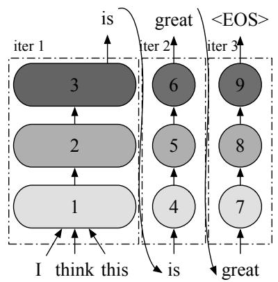  
(a) A computation graph representing an inference procedure using a GPT model. The graph does not depict layers other than Transformer layers (e.g., embedding) for simplicity.

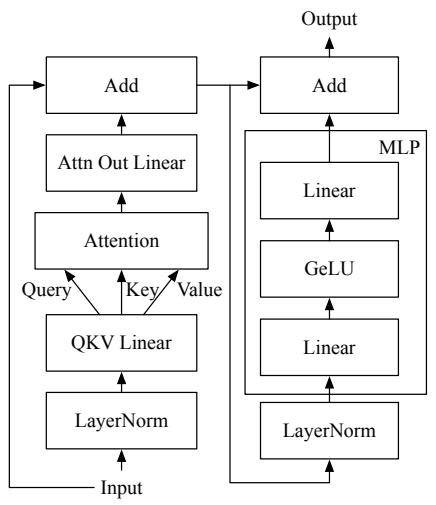  
(b) A Transformer layer used in GPT.

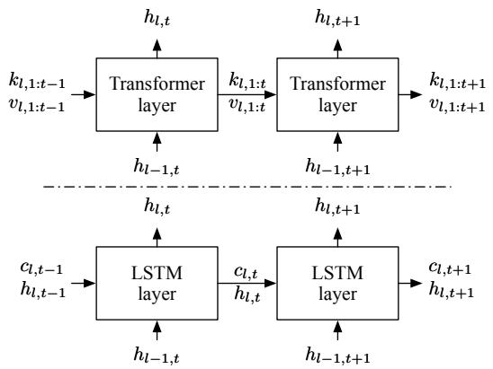  
(c) Internal state usage of Transformer. $h , k , \nu _ { \mathrm { { + } } }$ , and $c$ refer to layer input/output, Attention key, Attention value, and LSTM internal memory, respectively. l denotes layer index and t denotes token index.   
Figure 1: Illustrations for GPT’s inference procedure, Transformer layer, and internal state usage.

the next token. In this case, “iter 3” is the last iteration because it produces $\mathrm { ^ { 6 6 } { < } E O S { > } ^ { , 3 } }$ , a special end-of-sequence token that terminates output generation. Note that while the increment phase comprises multiple iterations because each iteration is only able to process a single token, the initiation phase is typically implemented as a single iteration by processing all the input tokens in parallel.

The original Transformer [60] employs two stacks of Transformer layers, while GPT’s architecture consists of a single layer stack, namely decoder. Figure 1b shows a Transformer layer used in GPT. Among the operations that compose the Transformer layer, Attention is the essence that distinguishes Transformer from other architectures. At a high level, the Attention operation computes a weighted average of the tokens of interest so that each token in the sequence is aware of the other. It takes three inputs, query, key, and value, computes dot products of the query (for the current token) with all keys (for the tokens of interest), applies Softmax on the dot products to get weights, and conducts weighted average of all values associated with the weights.

Since the Attention requires keys and values of all preceding tokens,2 we consider the keys and values as internal states that should be maintained across multiple iterations. A naïve, state-less inference procedure would take all tokens in the sequence (including both the client-provided input tokens and the output tokens generated so far) to recompute all the keys and values at every iteration. To avoid such recomputation, fairseq [43] suggests incremental decoding, which saves the keys and values for reuse in successive iterations. Other systems for Transformer such as FasterTransformer [4] and Megatron-LM [3] also do the same.

Figure 1c illustrates the state usage pattern of Transformer, along with LSTM [25] that also maintains internal states. The main difference is that the size of the states $k$ for Attention key and $\nu$ for value) in Transformer increases with iteration, whereas the size of the states ( $\stackrel { \cdot } { c }$ for LSTM internal memory and $h$ for LSTM layer’s input/output) in LSTM remains constant. When processing the token at index $t$ , the Attention operation takes all previous Attention keys $k _ { l , 1 : t - 1 }$ and values $\nu _ { l , 1 : t - 1 }$ along with the current key $k _ { l , t }$ and value $\nu _ { l , t }$ .3 Therefore, the Attention operation should perform computation on tensors of different shapes depending on the number of tokens already processed.

Prior to the Attention operation, there are the layer normalization operation (LayerNorm) and the QKV Linear (linear and split operations to get the query, key and value). Operations performed after Attention are, in order, a linear operation (Attn Out Linear), an add operation for residual connection (Add), layer normalization operation (LayerNorm), the multilayer perceptron (MLP) operations, and the other residual connection operation (Add).

ML inference serving systems. Growing demands for MLdriven applications have made ML inference serving service a critical workload in modern datacenters. Users (either the end-user or internal microservices of the application) submit requests to an inference service, and the service gives replies on the requests based on a pre-defined ML model using its provisioned resource, typically equipped with specialized accelerators such as GPUs and TPUs. In particular, the service runs a DNN model with input data to generate output for the

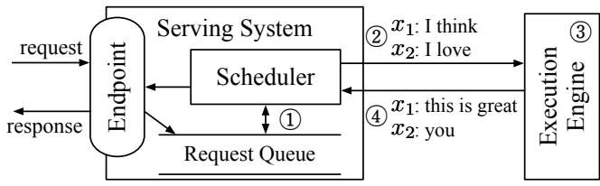  
Figure 2: Overall workflow of serving a generative language model with existing systems.

request. Just like other services operating on datacenters, a well-managed inference service should provide low latency and high throughput within a reasonable amount of cost.

To meet such constraints, service operators often use ML inference serving systems such as Triton Inference Server [7] and TensorFlow Serving [42]. These systems can be seen as an abstraction sitting atop underlying model execution engines such as TensorRT [6], TVM [14], TensorFlow [8], and many others [44, 46], being agnostic to various kinds of ML models, execution engines, and computing hardware. While delegating the role of driving the main mathematical operations to the engines, serving systems are in charge of exposing endpoints that receive inference requests, scheduling executions of the engine, and sending responses to the requests. Accordingly, these systems focus on aspects such as batching the executions [7, 16, 35, 42, 56], selecting an appropriate model from multiple model variants [16,27,30,57], deploying multiple models (each for different inference services) on the same device [7, 29, 35, 56], and so on.

Among the features and optimizations provided by serving systems, batching is a key to achieve high accelerator utilization when using accelerators like GPUs. When we run the execution engine with batching enabled, the input tensors from multiple requests coalesce into a single, large input tensor before being fed to the first operation of the model. Since the accelerators prefer large input tensors over small ones to better exploit the vast amount of parallel computation units, the engine’s throughput is highly dependent on the batch size, i.e., the number of inference requests the engine processes together. Reusing the model parameters loaded from off-chip memory is another merit in batched execution, especially when the model involves memory-intensive operations.

Figure 2 shows an overall workflow of serving a generative language model with existing serving systems and execution engines. The main component of the serving system (e.g., Triton [7]) is the scheduler, which is responsible for $\textcircled{1}$ creating a batch of requests by retrieving requests from a queue and $\textcircled{2}$ scheduling the execution engine (e.g., FasterTransformer [4]) to process the batch. The execution engine $\textcircled{3}$ processes the received batch by running multiple iterations of the model being served and $\textcircled{4}$ returns the generated text back to the serving system. In Figure 2, the serving system schedules the engine to process two requests $\scriptstyle \mathbf { \dot { \boldsymbol { x } } } _ { 1 }$ : “I think”, $x _ { 2 }$ : “I love”) in

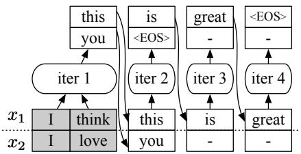  
Figure 3: An illustration for a case where the requests have the same input length but some requests finish earlier than others. Shaded tokens represent input tokens. “-” denotes inputs and outputs of extra computation imposed by the scheduling.

a batch and the engine generates “this is great” and “you” for requests $x _ { 1 }$ and $x _ { 2 }$ , respectively.

# 3 Challenges and Proposed Solutions

In this section, we describe challenges in serving Transformerbased generative models and propose two techniques: iteration-level scheduling and selective batching.

C1: Early-finished and late-joining requests. One major limitation of existing systems is that the serving system and the execution engine interact with each other only when (1) the serving system schedules the next batch on an idle engine; or (2) the engine finishes processing the current batch. In other words, these systems are designed to schedule executions at request granularity; the engine maintains a batch of requests fixed until all requests in the batch finish. This can be problematic in the serving of generative models, since each request in a batch may require different number of iterations, resulting in certain requests finishing earlier than the others. In the example shown in Figure 3, although request $x _ { 2 }$ finishes earlier than request $x _ { 1 }$ , the engine performs computation for both “active” and “inactive” requests throughout all iterations. Such extra computation for inactive requests $x _ { 2 }$ at iter 3 and 4) limits the efficiency of batched execution.

What makes it even worse is that this behavior prevents an early return of the finished request to the client, imposing a substantial amount of extra latency. This is because the engine only returns the execution results to the serving system when it finishes processing all requests in the batch. Similarly, when a new request arrives in the middle of the current batch’s execution, the aforementioned scheduling mechanism makes the newly arrived request wait until all requests in the current batch have finished. We argue that the current request-level scheduling mechanism cannot efficiently handle workloads with multi-iteration characteristic. Note that this problem of early-finished and late-joining requests does not occur in the training of language models; the training procedure finishes processing the whole batch in a single iteration by using the teacher forcing technique [64].

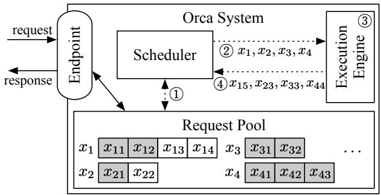  
Figure 4: System overview of ORCA. Interactions between components represented as dotted lines indicate that the interaction takes place at every iteration of the execution engine. $x _ { i j }$ is the j-th token of the i-th request. Shaded tokens represent input tokens received from the clients, while unshaded tokens are generated by ORCA. For example, request $x _ { 1 }$ initially arrived with two input tokens $( x _ { 1 1 } , x _ { 1 2 } )$ and have run two iterations so far, where the first and second iterations generated $x _ { 1 3 }$ and $x _ { 1 4 }$ , respectively. On the other hand, request $x _ { 3 }$ only contains input tokens $( x _ { 3 1 } , x _ { 3 2 } )$ because it has not run any iterations yet.

S1: Iteration-level scheduling. To address the above limitations, we propose to schedule executions at the granularity of iteration. At high level, the scheduler repeats the following procedure: (1) selects requests to run next; (2) invokes the engine to execute one iteration for the selected requests; and (3) receives execution results for the scheduled iteration. Since the scheduler receives a return on every iteration, it can detect the completion of a request and immediately return its generated tokens to the client. For a newly arrived request, the request gets a chance to start processing (i.e., the scheduler may select the new request to run next) after execution of the currently scheduled iteration, significantly reducing the queueing delay. With iteration-level scheduling, the scheduler has a full control on how many and which requests are processed in each iteration.

Figure 4 depicts the system architecture and the overall workflow of ORCA using the iteration-level scheduling. ORCA exposes an endpoint (e.g., HTTPS or gRPC) where inference requests arrive at the system and responses to the requests are sent out. The endpoint puts newly arrived requests in the request pool, a component that manages all requests in the system during their lifetime. The pool is monitored by the scheduler, which is responsible for: selecting a set of requests from the pool, scheduling the execution engine to run an iteration of the model on the set, receiving execution results (i.e., output tokens) from the engine, and updating the pool by appending each output token to the corresponding request. The engine is an abstraction for executing the actual tensor operations, which can be parallelized across multiple GPUs spread across multiple machines. In the example shown in Figure 4, the scheduler $\textcircled{1}$ interacts with the request pool to

decide which requests to run next and $\textcircled{2}$ invokes the engine to run four selected requests: $\left( x _ { 1 } , x _ { 2 } , x _ { 3 } , x _ { 4 } \right)$ . The scheduler provides the engine with input tokens of the requests scheduled for the first time. In this case, $x _ { 3 }$ and $x _ { 4 }$ have not run any iterations yet, so the scheduler hands over $\left( { { x } _ { 3 1 } } , { { x } _ { 3 2 } } \right)$ for $x _ { 3 }$ and $\left( x _ { 4 1 } , x _ { 4 2 } , x _ { 4 3 } \right)$ for $x _ { 4 }$ . The engine $\textcircled{3}$ runs an iteration of the model on the four requests and $\textcircled{4}$ returns generated output tokens $( x _ { 1 5 } , x _ { 2 3 } , x _ { 3 3 } , x _ { 4 4 } )$ , one for each scheduled request. Once a request has finished processing, the request pool removes the finished request and notifies the endpoint to send a response. Unlike the method shown in Figure 2 that should run multiple iterations on a scheduled batch until finish of all requests within the batch, ORCA’s scheduler can change which requests are going to be processed at every iteration. We describe the detailed algorithm about how to select the requests at every iteration in Section 4.2.

C2: Batching an arbitrary set of requests. When we try to use the iteration-level scheduling in practice, one major challenge that we are going to face is batching. To achieve high efficiency, the execution engine should be able to process any selected set of requests in the batched manner. Without batching, one would have to process each selected request one by one, losing out on the massively parallel computation capabilities of GPUs.

Unfortunately, there is no guarantee that even for a pair of requests $( x _ { i } , x _ { j } )$ , for the next iteration, their executions can be merged and replaced with a batched version. There are three cases for a pair of requests where the next iteration cannot be batched together: (1) both requests are in the initiation phase and each has different number of input tokens (e.g., $x _ { 3 }$ and $x _ { 4 }$ in Figure 4); (2) both are in the increment phase and each is processing a token at different index from each other $\scriptstyle \mathbf { \dot { \boldsymbol { x } } } _ { 1 }$ and $x _ { 2 }$ ); or (3) each request is in the different phase: initiation or increment $\scriptstyle \mathbf { \bar { \boldsymbol { x } } } _ { 1 }$ and $x _ { 3 }$ ). Recall that in order to batch the execution of multiple requests, the execution of each request must consist of identical operations, each consuming identically-shaped input tensors. In the first case, the two requests cannot be processed in a batch because the “length” dimension of their input tensors, which is the number of input tokens, are not equal. The requests in the second case have difference in the tensor shape of Attention keys and values because each processes token at different index, as shown in Figure 1c. For the third case, we cannot batch the iterations of different phases because they take different number of tokens as input; an iteration of the initiation phase processes all input tokens in parallel for efficiency, while in the increment phase each iteration takes a single token as its input (we assume the use of fairseq-style incremental decoding [43]).

Batching is only applicable when the two selected requests are in the same phase, with the same number of input tokens (in case of the initiation phase) or with the same token index (in case of the increment phase). This restriction significantly reduces the likelihood of batching in real-world workloads,

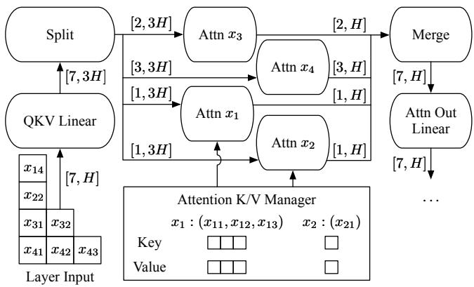  
Figure 5: An illustration of ORCA execution engine running a Transformer layer on a batch of requests with selective batching. We only depict the QKV Linear, Attention, and Attention Out Linear operations for simplicity.

because the scheduler should make a wish for the presence of two requests eligible for batching at the same time. The likelihood further decreases exponentially as the batch size increases, making it impractical to use a large batch size that can pull out better throughput without compromising latency.

S2: Selective batching. We propose selective batching, a technique for batched execution that allows high flexibility in composing requests as a batch. Instead of processing a batch of requests by “batchifying” all tensor operations composing the model, this technique selectively apply batching only to a handful of operations.

The main problem regarding batching described above is that the three aforementioned cases4 correspond to irregularly shaped input (or state) tensors, which cannot be coalesced into a single large tensor and fed into a batch operation. In the canonical batching mechanism, at each iteration, a Transformer layer takes a 3-dimensional input tensor of shape $[ B , L , H ]$ generated by concatenating multiple $[ L , H ]$ input tensors of requests in a batch, where $B$ is the batch size, $L$ is the number of tokens processed together, and $H$ is the hidden size of the model. For example, in Figure 3, “iter 1” (initiation phase) takes an input tensor of shape $[ 2 , 2 , H ]$ and “iter $2 ^ { \circ }$ (increment phase) takes a tensor of shape $[ 2 , 1 , H ]$ . However, when the scheduler decides to run an iteration on batch $\left( x _ { 1 } , x _ { 2 } , x _ { 3 } , x _ { 4 } \right)$ in Figure 4, the inputs for requests in the initiation phase $( x _ { 3 } : [ 2 , H ]$ and $x _ { 4 } : [ 3 , H ] )$ cannot coalesce into a single tensor of shape $[ B , L , H ]$ because $x _ { 3 }$ and $x _ { 4 }$ have different number of input tokens, 2 and 3.

Interestingly, not all operations are incompatible with such irregularly shaped tensors. Operations such as non-Attention matrix multiplication and layer normalization can be made to work with irregularly shaped tensors by flattening the tensors.

For instance, the aforementioned input tensors for $x _ { 3 }$ and $x _ { 4 }$ can compose a 2-dimensional tensor of shape $[ \Sigma L , H ] = [ 5 , H ]$ without an explicit batch dimension. This tensor can be fed into all non-Attention operations including Linear, Layer-Norm, Add, and GeLU operations because they do not need to distinguish tensor elements of different requests. On the other hand, the Attention operation requires a notion of requests (i.e., requires the batch dimension) to compute attention only between the tokens of the same request, typically done by applying cuBLAS routines for batch matrix multiplication.

Selective batching is aware of the different characteristics of each operation; it splits the batch and processes each request individually for the Attention operation while applying token-wise (instead of request-wise) batching to other operations without the notion of requests. Figure 5 presents the selective batching mechanism processing a batch of requests $( x _ { 1 } , x _ { 2 } , x _ { 3 } , x _ { 4 } )$ described in Figure 4. This batch has 7 input tokens to process, so we make the input tensor have a shape of $[ 7 , H ]$ and apply the non-Attention operations. Before the Attention operation, we insert a Split operation and run the Attention operation separately on the split tensor for each request. The outputs of Attention operations are merged back into a tensor of shape $[ 7 , H ]$ by a Merge operation, bringing back the batching functionality to the rest of operations.

To make the requests in the increment phase can use the Attention keys and values for the tokens processed in previous iterations, ORCA maintains the generated keys and values in the Attention K/V manager. The manager maintains these keys and values separately for each request until the scheduler explicitly asks to remove certain request’s keys and values, i.e., when the request has finished processing. The Attention operation for request in the increment phase $x _ { 1 }$ and $x _ { 2 }$ ) takes keys and values of previous tokens $( x _ { 1 1 } , x _ { 1 2 } , x _ { 1 3 }$ for $x _ { 1 } ; x _ { 2 1 }$ for $x _ { 2 } { \mathrm { . } }$ ) from the manager, along with the current token’s query, key, and value from the Split operation to compute attention between the current token and the previous ones.

# 4 ORCA Design

Based on the above techniques, we design and implement ORCA: a distributed serving system for Transformer-based generative models. We have already discussed the system components and the overall execution model of ORCA while describing Figure 4. In this section, we answer the remaining issues about how to build an efficient system that can scale to large-scale models with hundreds of billions of parameters. We also describe the scheduling algorithm for iteration-level scheduling, i.e., how to select a batch of requests from the request pool at every iteration.

# 4.1 Distributed Architecture

Recent works [12, 31] have shown that scaling language models can dramatically improve the quality of models. Hence,

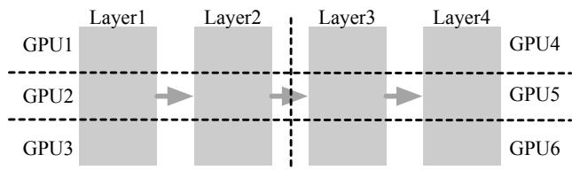  
Figure 6: An example of intra- and inter- layer parallelism. A vertical dotted line indicates partitioning between layers and a horizontal line indicates partitioning within a layer.

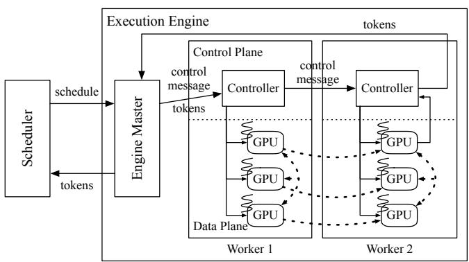  
Figure 7: An illustration of the distributed architecture of ORCA’s execution engine using the parallelization configuration shown in Figure 6. For example, the first inter-layer partition (Layer1 and Layer2) in Figure 6 is assigned to Worker1, while the second partition is assigned to Worker2.

system support for serving such large language models is getting more importance, especially when the model does not fit in a single GPU. In such a case, one should split the model parameters along with the corresponding computation and distribute them across multiple GPUs and machines.

ORCA composes known parallelization techniques for Transformer models: intra-layer parallelism and inter-layer parallelism. These two model parallelism strategies, which are also used by FasterTransformer [4], have been originally developed for distributed training. Intra-layer parallelism [55, 58] splits matrix multiplications (i.e., Linear and Attention operations) and their associated parameters over multiple GPUs. We omit the detail about how this strategy partitions each matrix multiplication. On the other hand, inter-layer parallelism splits Transformer layers over multiple GPUs. ORCA assigns the same number of Transformer layers to each GPU. Figure 6 illustrates an example application of intra- and inter- layer parallelism to a 4-layer GPT model. The 4 layers are split into 2 inter-layer partitions, and the layers in the partition are subdivided into 3 intra-layer partitions. We assign each partition to a GPU, using a total of 6 GPUs.

The ORCA execution engine supports distributed execution using the techniques described above. Figure 7 depicts the architecture of an ORCA engine. Each worker process is responsible for an inter-layer partition of the model and can be

placed on a different machine from each other. In particular, each worker manages one or more CPU threads each dedicated for controlling a GPU, the number of which depends on the degree of intra-layer parallelism.

The execution procedure of the ORCA execution engine is as follows. Once the engine is scheduled to run an iteration of the model for a batch of requests, the engine master forwards the received information about the scheduled batch to the first worker process (Worker1). The information includes tokens for the current iteration and a control message, which is composed of ids of requests within the batch, current token index (for requests in the increment phase), and number of input tokens (for requests in the initiation phase). The controller of Worker1 hands over the information received from the engine master to the GPU-controlling threads, where each thread parses the information and issues proper GPU kernels to its associated GPU. For example, the kernel for the Attention operation uses the request id and the current token index to get the GPU memory address of previous keys and values kept by the Attention K/V manager. In the meantime, the controller also forwards the control message to the controller of the next worker (Worker2), without waiting for the completion of the kernels issued on the GPUs of Worker1. Unlike Worker1, the controller of the last worker (Worker2) waits for (i.e., synchronize with) the completion of the issued GPU kernels, in order to fetch the output token for each request and send the tokens back to the engine master.

To keep GPUs busy as much as possible, we design the ORCA engine to minimize synchronization between the CPU and GPUs. We observe that current systems for distributed inference (e.g., FasterTransformer [4] and Megatron-LM [3]) have CPU-GPU synchronization whenever each process receives control messages5 because they exchange the messages through a GPU-to-GPU communication channel – NCCL [5]. The exchange of these control messages occurs at every iteration, imposing a non-negligible performance overhead. On the other hand, ORCA separates the communication channels for control messages (plus tokens) and tensor data transfer, avoiding the use of NCCL for data used by CPUs. Figure 7 shows that the ORCA engine uses NCCL exclusively for exchanging intermediate tensor data (represented by dashed arrows) as this data is produced and consumed by GPUs. Control messages, which is used by the CPU threads for issuing GPU kernels, sent between the engine master and worker controllers by a separate communication channel that does not involve GPU such as gRPC [2].

# 4.2 Scheduling Algorithm

The ORCA scheduler makes decisions on which requests should be selected and processed at every iteration. The scheduler has high flexibility in selecting a set of requests to com-

pose a batch, because of the selective batching technique that allows the engine to run any set of requests in the batched manner. Now the main question left is how to select the requests at every iteration.

We design the ORCA scheduler to use a simple algorithm that does not change the processing order of client requests; early-arrived requests are processed earlier. That is, we ensure iteration-level first-come-first-served (FCFS) property. We define the iteration-level FCFS property for workloads with multi-iteration characteristics as follows: for any pair of requests $( x _ { i } , x _ { j } )$ in the request pool, if $x _ { i }$ has arrived earlier than $x _ { j }$ , $x _ { i }$ should have run the same or more iterations than $x _ { j }$ . Note that some late-arrived requests may return earlier to clients if the late request requires a smaller number of iterations to finish.

Still, the scheduler needs to take into account additional factors: diminishing returns to increasing the batch size and GPU memory constraint. Increasing the batch size trades off increased throughput for increased latency, but as the batch size becomes larger, the amount of return (i.e., increase in throughput) diminishes. Therefore, just like other serving systems [7, 16], ORCA also has a notion of a max batch size: the largest possible number of requests within a batch. The ORCA system operator can tune this knob to maximize throughput while satisfying one’s latency budget. We will discuss this in more details with experiment results in Section 6.2.

Another factor is the GPU memory constraint. Optimizing memory usage by reusing buffers for intermediate results across multiple operations is a well-known technique used by various systems [4, 6], and ORCA also adopts this technique. However, unlike the buffers for intermediate results that can be reused immediately, buffers used by the Attention K/V manager for storing the keys and values cannot be reclaimed until the ORCA scheduler notifies that the corresponding request has finished processing. A naïve implementation can make the scheduler fall into a deadlock when the scheduler cannot issue an iteration for any requests in the pool because there is no space left for storing a new Attention key and value for the next token. This requires the ORCA scheduler to be aware of the remaining size of pre-allocated memory regions for the manager.

The ORCA scheduler takes all these factors into account: it selects at most “max batch size” requests based on the arrival time, while reserving enough space for storing keys and values to a request when the request is scheduled for the first time. We describe the scheduling process in Algorithm 1. The algorithm selects a batch of requests from the request pool (line 4) and schedules the batch (line 5). The Select function (line 17) selects at most max_bs requests from the pool based on the arrival time of the request (lines 20-22). Algorithm 1 does not depict the procedure of request arrival and return; one may think of it as there exist concurrent threads inserting newly arrived requests into request_pool and removing finished requests from request_pool.

Algorithm 1: ORCA scheduling algorithm   
Params: n_workers: number of workers, max_bs: max batch size, nSlots: number of K/V slots  
1 nscheduled $\leftarrow 0$ 2 n_rsrv $\leftarrow 0$ 3 while true do  
4 batch, n_rsrv $\leftarrow$ Select(request_pool, n_rsrv)  
5 schedule engine to run one iteration of the model for the batch  
6 foreach req in batch do  
7 req.state $\leftarrow$ RUNNING  
8 nscheduled $\leftarrow$ nscheduled + 1  
9 if nscheduled = n_workers then  
10 wait for return of a scheduled batch  
11 foreach req in the returned batch do  
12 req.state $\leftarrow$ INIncrement  
13 if finished(request) then  
14 | n_rsrv $\leftarrow$ n_rsrv - req.max_tokens  
15 nscheduled $\leftarrow$ nscheduled - 1  
16  
17 def Select(pool, n_rsrv):  
18 batch $\leftarrow \{\}$ 19 pool $\leftarrow$ {req $\in$ pool|req.state $\neq$ RUNNING}  
20 SortByArrivalTime(pool)  
21 foreach req in pool do  
22 if batch.size() = max_bs then break  
23 if req.state = INITIATION then  
24 new_n_rsrv $\leftarrow$ n_rsrv + req.max_tokens  
25 if new_n_rsrv > n-slots then break  
26 n_rsrv $\leftarrow$ new_n_rsrv  
27 batch $\leftarrow$ batch $\cup\{req\}$ 28 return batch, n_rsrv

When the scheduler considers a request in the initiation phase, meaning that the request has never been scheduled yet, the scheduler uses the request’s max_tokens6 attribute to reserve max_tokens slots of GPU memory for storing the keys and values in advance (lines 23-26). The scheduler determines whether the reservation is possible (line 25) based on n_rsrv, the number of currently reserved slots, where a slot is defined by the amount of memory required for storing an Attention key and value for a single token. Here, n_slots is a parameter tuned by the ORCA system operator indicating the size of memory region (in terms of slots) allocated to the Attention K/V manager. Since the number of tokens in a request cannot exceed max_tokens, if the reservation is possible, it is guaranteed that the manager can allocate buffers for the newly generated keys and values until the request finishes.

Unlike the tuning of max_bs that requires quantifying the trade-off between latency and throughput, the ORCA system

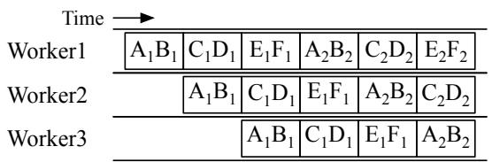

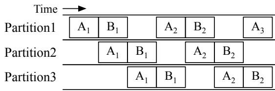  
(a) ORCA execution pipeline.   
(b) FasterTransformer execution pipeline.   
Figure 8: Comparison of the use of pipeline parallelism in ORCA and FasterTransformer where $X _ { i }$ is the i-th iteration of request $X$ .

operator can easily configure n_slots without any experiments. Given a model specification (e.g., hidden size, number of layers, etc.) and degrees of intra- and inter- layer parallelism, ORCA’s GPU memory usage mostly depends on n_slots. That is, the operator can simply use the largest possible n_slots under the memory constraint.

Pipeline parallelism. ORCA’s scheduler makes the execution of workers in the engine to be pipelined across multiple batches. The scheduler does not wait for the return of a scheduled batch until n_scheduled, the number of currently scheduled batches, reaches n_workers (line 9-10 of Algorithm 1). By doing so, the scheduler keeps the number of concurrently running batches in the engine to be n_workers, which means that every worker in the engine is processing one of the batches without being idle.

Figure 8a depicts the execution pipeline of 3 ORCA workers, using a max batch size of 2. We assume that the request A arrives before B, which arrives before C, and so on. At first, the scheduler selects requests A and B based on the arrival time and schedules the engine to process a batch of requests A and B (we call this batch AB), where Worker1, Worker2, and Worker3 process the batch in turn. The scheduler waits for the return of the batch AB only after the scheduler injects two more batches: CD and EF. Once the batch AB returns, requests A and B get selected and scheduled once again, because they are the earliest arrived requests among the requests in the pool.

In contrast, the interface between current serving systems and execution engines (e.g., a combination of Triton [7] and FasterTransformer [4]) does not allow injecting another batch before the finish of the current running batch, due to the request-level scheduling. That is, Triton cannot inject the next request C to FasterTransformer until the current

Table 1: Configurations of models used in the experiments.   

<table><tr><td># Params</td><td># Layers</td><td>Hidden size</td><td># Inter-partitions</td><td># Intra-partitions</td></tr><tr><td>13B</td><td>40</td><td>5120</td><td>1</td><td>1</td></tr><tr><td>101B</td><td>80</td><td>10240</td><td>1</td><td>8</td></tr><tr><td>175B</td><td>96</td><td>12288</td><td>2</td><td>8</td></tr><tr><td>341B</td><td>120</td><td>15360</td><td>4</td><td>8</td></tr></table>

batch AB finishes. To enable pipelined execution of multiple inter-layer partitions under such constraint, FasterTransformer splits a batch of requests into multiple microbatches [28] and pipelines the executions of partitions across the microbatches. In Figure 8b, FasterTransformer splits the batch AB into two microbatches, A and B. Since each partition processes a microbatch (which is smaller than the original batch) in the batched manner, the performance gain from batching can become smaller. Moreover, this method may insert bubbles into the pipeline when the microbatch size is too large, making the number of microbatches smaller than the number of partitions. While FasterTransformer needs to trade batching efficiency (larger microbatch size) for pipelining efficiency (fewer pipeline bubbles), ORCA is free of such a tradeoff – thanks to iteration-level scheduling – and can easily pipeline requests without dividing a batch into microbatches.

# 5 Implementation

We have implemented ORCA with 13K lines of $\mathrm { C } { + + }$ , based on the CUDA ecosystem. We use gRPC [2] for the communication in the control plane of the ORCA engine, while NCCL [5] is used in the data plane, for both inter-layer and intra-layer communication. Since we design ORCA to focus on Transformer-based generative models, ORCA provides popular Transformer layers as a building block of models including the original encoder-decoder Transformer [60], GPT [47], and other variants discussed in Raffel et al. [49].

We have also implemented fused kernels for LayerNorm, Attention, and GeLU operators, just like other systems for training or inference of Transformer models [1, 4, 58]. For example, the procedure of computing dot products between Attention query and keys, Softmax on the dot products, and weighted average of Attention values are fused into a single CUDA kernel for the Attention operator. In addition, we go one step further and fuse the kernels of the split Attention operators by simply concatenating all thread blocks of the kernels for different requests. Although this fusion makes the thread blocks within a kernel have different characteristics and lifetimes (which is often discouraged by CUDA programming practice) because they process tensors of different shapes, we find this fusion to be beneficial by improving GPU utilization and reducing the kernel launch overhead [34, 39].

# 6 Evaluation

In this section, we present evaluation results to show the efficiency of ORCA.

Environment. We run our evaluation on Azure ND96asr A100 v4 VMs, each equipped with 8 NVIDIA 40-GB A100 GPUs connected over NVLink. We use at most four VMs depending on the size of the model being tested. Each VM has 8 Mellanox 200Gbps HDR Infiniband adapters, providing an 1.6Tb/s of interconnect bandwidth between VMs.

Models. Throughout the experiments, we use GPT [12] as a representative example of Transformer-based generative models. We use GPT models with various configurations, which is listed in Table 1. The configurations for 13B and 175B models come from the GPT-3 paper [12]. Based on these two models, we change the number of layers and hidden size to make configurations for 101B and 341B models. All models have a maximum sequence length of 2048, following the setting of the original literature [12]. We use fp16-formatted model parameters and intermediate activations for the experiments. We also apply inter- and intra- layer parallelism strategies described in Section 4.1, except for the 13B model that can fit in a GPU. For example, the 175B model is partitioned over a total of 16 GPUs by using 2 inter-layer partitions subdivided into 8 intra-layer partitions, where the 8 GPUs in the same VM belongs to the same inter-layer partition.

Baseline system. We compare with FasterTransformer [4], an inference engine that supports large scale Transformer models via distributed execution. While there exist other systems with the support for distributed execution such as Megatron-LM [3] and DeepSpeed [1], these systems are primarily designed and optimized for training workloads, which makes them show relatively lower performance compared to the inference-optimized systems.

Scenarios. We use two different scenarios to drive our evaluation. First, we design a microbenchmark to solely assess the performance of the ORCA engine without being affected by the iteration-level scheduling. In particular, we do not run the ORCA scheduler in this scenario. Instead, given a batch of requests, the testing script repeats injecting the same batch into the ORCA engine until all requests in the batch finishes, mimicking the behavior of the canonical request-level scheduling. We also assume that all requests in the batch have the same number of input tokens and generate the same number of output tokens. We report the time taken for processing the batch (not individual requests) and compare the result with FasterTransformer [4].

The second scenario tests the end-to-end performance of ORCA by emulating a workload. We synthesize a trace of

client requests because there is no publicly-available request trace for generative language models. Each request in the synthesized trace is randomly generated by sampling the number of input tokens and a max_gen_tokens attribute, where the number of input tokens plus max_gen_tokens equals to the max_tokens attribute described in Section 4.2. We assume that all requests continue generation until the number of generated tokens reaches max_gen_tokens. In other words, we make the model never emit the $\mathrm { \ddot { \Sigma } } < \mathrm { E O S } > ^ { , , }$ token. This is because we have neither the actual model checkpoint nor the actual input text so we do not have any information to guess the right timing of the $\mathrm { ^ { 6 6 } { < } E O S { > } ^ { , 5 } }$ token generation. Once the requests are generated, we synthesize the trace by setting the request arrival time based on the Poisson process. To assess ORCA’s behavior under varying load, we change the Poisson parameter (i.e., arrival rate) and adjust the request arrival time accordingly. We report latency and throughput using multiple traces generated from different distributions for better comparison and understanding of the behavior of ORCA and FasterTransformer.

# 6.1 Engine Microbenchmark

We first compare the performance of FasterTransformer and the ORCA engine using the first scenario. We set all requests in the batch to have the same number of input tokens (32 or 128) and generate 32 tokens. That is, in this set of experiments, all requests within the batch start and finish processing at the same time. We conduct experiments using three different models: 13B, 101B, and 175B. For each model, we use the corresponding parallelization strategy shown in Table 1.

Figure 9 shows the performance of FasterTransformer and the ORCA engine for processing a batch composed of the same requests. In Figure 9a, the ORCA engine shows a similar (or slightly worse) performance compared to FasterTransformer across all configurations. This is because ORCA does not apply batching to the Attention operations, while FasterTransformer apply batching to all operations. Still, the performance difference is relatively small. Despite not batching the Attention operation, the absence of model parameters in Attention makes this decision has little impact on efficiency as there is no benefit of reusing model parameters across multiple requests.

Figure 9b presents similar results for the 101B model that uses all of the 8 GPUs in a single VM. From these results, we can say that the ORCA engine and FasterTransformer have comparable efficiencies in the implementations of CUDA kernels and the communication between intra-layer partitions. Note that FasterTransformer cannot use a batch size of 8 or larger with the 13B model (16 or larger with the 101B model) because of the fixed amount of memory pre-allocation for each request’s Attention keys and values, which grows in proportion to the max sequence length of the model (2048 for this case). In contrast, ORCA avoids redundant memory

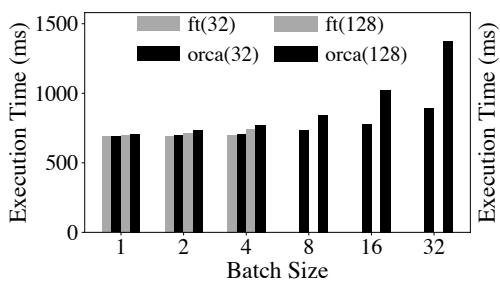  
(a) 13B model, 1 GPU.

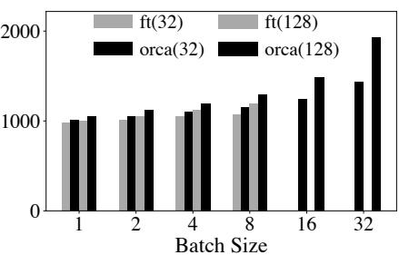  
(b) 101B model, 8 GPUs.

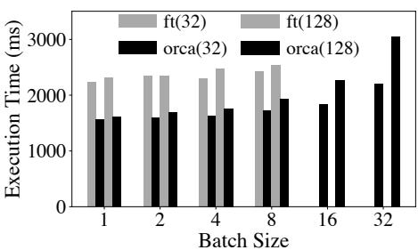  
(c) 175B model, 16 GPUs.

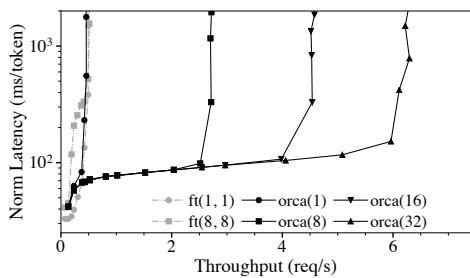  
Figure 9: Execution time of a batch of requests using FasterTransformer and the ORCA engine without the scheduling component. Label “ft(n)” represents results from FasterTransformer processing requests with $n$ input tokens. Configurations that incurs out of memory error are represented as missing entries (e.g., ft(32) for the 101B model with a batch size of 16).   
(a) 101B model, 8 GPU.

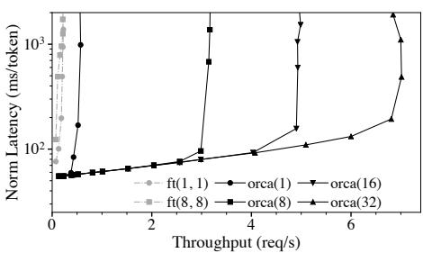  
(b) 175B model, 16 GPUs.

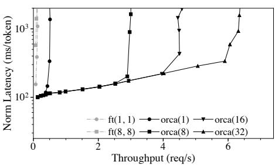  
(c) 341B model, 32 GPUs.   
Figure 10: Median end-to-end latency normalized by the number of generated tokens and throughput. Label “orca(max_bs)” represents results from ORCA with a max batch size of max_bs. Label “ft(max_bs, mbs)” represents results from FasterTransformer with a max batch size of max_bs and a microbatch size of mbs.

allocation by setting the size of buffers for the keys and values separately for each request based on the max_tokens attribute.

Next, we go one step further and experiment with the 175B model, which splits the layers into two inter-layer partitions. In this case, for better comparison, we disable pipelined execution of the inter-layer partitions for both systems. For Faster-Transformer, we set the size of a microbatch to be equal to the batch size to disable pipelining. As shown in Figure 9c, the ORCA engine outperforms FasterTransformer by up to $47 \%$ . We attribute this performance improvement to the controldata plane separation described in Section 4.1. We omit the 341B model as it has similar results compared to the 175B model.

# 6.2 End-to-end Performance

Now we assess the end-to-end performance of ORCA by measuring the latency and throughput with the synthesized request trace under varying load. When synthesizing the trace, we sample each request’s number of input tokens from $U ( 3 2 , 5 1 2 )$ , a uniform distribution ranging from 32 to 512 (inclusive). The max_gen_tokens attributed is sampled from $U ( 1 , 1 2 8 )$ , which means that the least and the most timeconsuming requests require 1 and 128 iterations of the model for processing, respectively.

Unlike the microbenchmark shown in Section 6.1, to measure the end-to-end performance, we test the entire ORCA software stack including the ORCA scheduler. Client requests arrive to the ORCA scheduler following the synthesized trace described above. We report results from various max batch size configurations. For FasterTransformer that does not have its own scheduler, we implement a custom scheduler that receives client requests, creates batches, and injects the batches to an instance of FasterTransformer. We make the custom scheduler create batches dynamically by taking at most max batch size requests from the request queue, which is the most common scheduling algorithm used by existing serving systems like Triton [7] and TensorFlow Serving [42]. Again, we report results from various max batch size configurations, along with varying microbatch sizes, an additional knob in FasterTransformer that governs the pipelining behavior (see Section 4.2).

Figure 10 shows median end-to-end latency and throughput. Since each request in the trace requires different processing time, which is (roughly) in proportion to the number of generated tokens, we report median latency normalized by the number of generated tokens of each request. From the figure, we can see that ORCA provides significantly higher throughput and lower latency than FasterTransformer. The only exception is the 101B model under low load (Figure 10a). In this

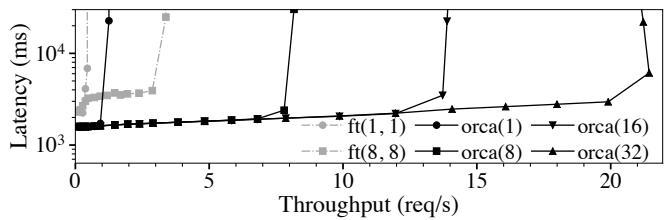

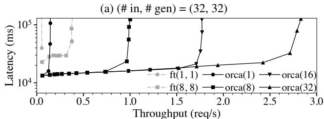  
$( \boldsymbol { \mathrm { b } } ) ( \# \ \mathrm { i n } , \# \ \mathrm { g e n } ) = ( 2 5 6 , 2 5 6 )$   
Figure 11: Median end-to-end latency and throughput, using the 175B model with traces composed of homogeneous requests. We do not normalize the latency since all requests have the same characteristic.

case, both ORCA and FasterTransformer do not have enough number of requests to process in a batch. That is, the latency will mostly depend on the engine’s performance, which is shown in Figure 9b. As the load becomes heavier, ORCA provides higher throughput with a relatively small increase in latency, because the ORCA scheduler makes late-arrived requests hitch a ride with the current ongoing batch. In contrast, FasterTransformer fails to efficiently handle multiple requests that (1) arrive at different times; (2) require different number of iterations to finish; or (3) start with different number of input tokens, resulting in a peak throughput of 0.49 req/s and much higher latency. If we use the 175B or 341B model (Figures 10b and 10c) that employs more than one inter-layer partitions, ORCA outperforms FasterTransformer under every level of load in terms of both latency and throughput, resulting in an order of magnitude higher throughput when we compare results at a similar level of latency. For example, to match a median normalized latency of 190ms for the 175B model, which is a double of the normalized execution time (by the number of generated tokens) of “orca(128)” shown in Figure 9c, FasterTransformer provides a throughput of $0 . 1 8 5 \mathrm { r e q / s }$ whereas ORCA provides a throughput of 6.81 req/s, which is a $3 6 . 9 \times$ speedup.

Varying batch size configurations. Figure 10 shows that the increase of the max batch size of ORCA results in a higher throughput without affecting the latency. This is because the iteration-level scheduling of ORCA resolves the problem of early-finished and late-joining requests. Nevertheless, there is no guarantee that increasing the batch size will not negatively affect the latency, for arbitrary hardware settings, models, and workloads. As mentioned in Section 4.2, the max batch size

must be set carefully by considering both the required latency and throughput requirements.

Interestingly, larger max batch size in FasterTransformer does not necessarily help improving throughput. By testing all possible combinations of max batch size (max_bs) and microbatch size (mbs) on all models under varying load, we find that $( m a x \_ b s , m b s ) = ( 1 , 1 )$ or (8, 8) are the best options. Per our discussion in Section 4.1, FasterTransformer’s microbatch-based pipelining can be less efficient because the engine is going to process at most mbs number of requests in the batched manner, which explains why the configurations with the maximum possible mbs (which is the same as max_bs) have better performance than others. In addition, while increasing max_bs can improve performance due to the increased batch size, at the same time, this also increases the likelihood of batching requests with large difference in the number of input tokens or the number of generated tokens. In such cases, FasterTransformer cannot efficiently handle the batch because (1) for the first iteration of the batch, Faster-Transformer processes requests as if they all had the same input length as the shortest one; and (2) early-finished requests cannot immediately return to the clients.

Trace of homogeneous requests. We test the behavior of ORCA and FasterTransformer when using a trace of homogeneous requests, i.e., all requests in a trace have the same number of input tokens and the same max_gen_tokens attribute. Since all requests require the same number of iterations to finish processing, the problem of early-leaving requests does not occur for this trace. As a result, now the increase of the max_bs has a noticeable positive impact on the performance of FasterTransformer, as shown in Figure 11. Still, ORCA outperforms FasterTransformer (max_bs=8) except for the case using a max batch size of 1, where ORCA degenerates into a simple pipeline of the ORCA workers that does not perform batching.

# 7 Related Work and Discussion

Fine-grained batching for recurrent models. We would like to highlight BatchMaker [23] as one of the most relevant previous works. BatchMaker is a serving system for RNNs that performs scheduling and batching at the granularity of RNN cells, motivated by the unique RNN characteristic of repeating the same computation. Once a request arrives, Batch-Maker breaks the dataflow graph for processing the request into RNN cells, schedules execution at the granularity of cells (instead of the entire graph), and batches the execution of identical cells (if any). Since each RNN cell always performs the exact same computation, BatchMaker can execute multiple RNN cells in a batched manner regardless of the position (i.e., token index) of the cell. By doing so, BatchMaker allows a newly arrived request for RNN to join (or a finished request

to leave) the current executing batch without waiting for the batch to completely finish.

However, BatchMaker cannot make batches of cells for Transformer models because there are too many distinct cells (a subgraph that encapsulates the computation for processing a token; Figure 1c) in the graph. Each cell at a different token index t must use a different set of Attention Keys/Values. As the cell for each $t$ is different, the graph comprises $L$ different cells ( $L$ denotes the number of input and generated tokens), significantly lowering the likelihood of cells of the same computation being present at a given moment (e.g., in Figure 10, L ranges from $3 3 = 3 2 + 1$ to $6 4 0 = 5 1 2 + 1 2 8$ ). Thus execution of the cells will be mostly serialized, making BatchMaker fall back to non-batched execution. BatchMaker also lacks support for large models that require model and pipeline parallelism.

While BatchMaker is geared towards detecting and aligning batch-able RNN cells, our key principle in designing ORCA is to perform as much computation as possible per each round of model parameter read. This is based on the insight that reading parameters from GPU global memory is a major bottleneck in terms of end-to-end execution time, for large-scale models. Adhering to this principle, we apply iteration-level scheduling and selective batching to process all “ready” tokens in a single round of parameter read, regardless of whether the processing of tokens can be batched (non-Attention ops) or not (Attention ops).

Specialized execution engines for Transformer models. The outstanding performance of Transformer-based models encourages the development of inference systems specialized for them. FasterTransformer [4], LightSeq [61], TurboTransformers [22] and EET [36] are such examples. Each of these systems behave as an backend execution engine of existing serving systems like Triton Inference Server [7] and Tensor-Flow Serving [42]. That is, these systems delegate the role of scheduling to the serving system layer, adhering to the canonical request-level scheduling. Instead, ORCA suggests to schedule executions at a finer granularity, which is not possible in current systems without changing the mechanism for coordination between the scheduler and the execution engine. Note that among these systems, FasterTransformer is the only one with the support for distributed execution. While systems like Megatron-LM [3] and DeepSpeed [1] can also be used for distributed execution, these systems are primarily optimized for large-scale training rather than inference serving.

Interface between serving systems and execution engines. Current general-purpose serving systems such as Triton Inference Server [7] and Clipper [16] serve as an abstraction for handling client requests and scheduling executions of the underlying execution engines. This approach is found to be beneficial by separating the design and implementation of the serving layer and the execution layer. However, we find

that the prevalent interface between the two layers is too restricted for handling models like GPT [12], which has the multi-iteration characteristic. Instead, we design ORCA to tightly integrate the scheduler and the engine, simplifying the application of the two proposed techniques: iteration-level scheduling and selective batching. While in this paper we do not study a general interface design that supports the two techniques without losing the separation of abstractions, it can be an interesting topic to explore such possibility; we leave this issue to future work.

# 8 Conclusion

We present iteration-level scheduling with selective batching, a novel approach that achieves low latency and high throughput for serving Transformer-based generative models. Iteration-level scheduling makes the scheduler interact with the execution engine at the granularity of iteration instead of request, while selective batching enables batching arbitrary requests processing tokens at different positions, which is crucial for applying batching with iteration-level scheduling. Based on these techniques, we have designed and implemented a distributed serving system named ORCA. Experiments show the effectiveness of our approach: ORCA provides an order of magnitude higher throughput than current state-of-the-art systems at the same level of latency.

# Acknowledgments

We thank our shepherd Amar Phanishayee and the anonymous reviewers for their insightful comments. This work was supported by FriendliAI Inc.

# References

[1] DeepSpeed. Retrieved Dec 13, 2021 from https:// github.com/microsoft/DeepSpeed.   
[2] gRPC. Retrieved Dec 13, 2021 from https://grpc. io.   
[3] Megatron-LM. Retrieved Dec 13, 2021 from https: //github.com/NVIDIA/Megatron-LM.   
[4] NVIDIA FasterTransformer. Retrieved Dec 13, 2021 from https://github.com/NVIDIA/ FasterTransformer.   
[5] NVIDIA NCCL. Retrieved Dec 13, 2021 from https: //github.com/NVIDIA/nccl.   
[6] NVIDIA TensorRT. Retrieved Dec 13, 2021 from https://developer.nvidia.com/tensorrt.

[7] NVIDIA Triton Inference Server. Retrieved Dec 13, 2021 from https://developer.nvidia.com/ nvidia-triton-inference-server.   
[8] Martín Abadi, Paul Barham, Jianmin Chen, Zhifeng Chen, Andy Davis, Jeffrey Dean, Matthieu Devin, Sanjay Ghemawat, Geoffrey Irving, Michael Isard, Manjunath Kudlur, Josh Levenberg, Rajat Monga, Sherry Moore, Derek G. Murray, Benoit Steiner, Paul Tucker, Vijay Vasudevan, Pete Warden, Martin Wicke, Yuan Yu, and Xiaoqiang Zheng. TensorFlow: A System for Large-Scale Machine Learning. In Proceedings of the 12th USENIX Conference on Operating Systems Design and Implementation, pages 265–283, 2016.   
[9] Daniel Adiwardana, Minh-Thang Luong, David R So, Jamie Hall, Noah Fiedel, Romal Thoppilan, Zi Yang, Apoorv Kulshreshtha, Gaurav Nemade, Yifeng Lu, et al. Towards a Human-like Open-Domain Chatbot. arXiv preprint arXiv:2001.09977, 2020.   
[10] Mikel Artetxe, Shruti Bhosale, Naman Goyal, Todor Mihaylov, Myle Ott, Sam Shleifer, Xi Victoria Lin, Jingfei Du, Srinivasan Iyer, Ramakanth Pasunuru, Giri Anantharaman, Xian Li, Shuohui Chen, Halil Akin, Mandeep Baines, Louis Martin, Xing Zhou, Punit Singh Koura, Brian O’Horo, Jeff Wang, Luke Zettlemoyer, Mona Diab, Zornitsa Kozareva, and Ves Stoyanov. Efficient Large Scale Language Modeling with Mixtures of Experts. arXiv preprint arXiv:2112.10684, 2021.   
[11] Peter F. Brown, John Cocke, Stephen A. Della Pietra, Vincent J. Della Pietra, Fredrick Jelinek, John D. Lafferty, Robert L. Mercer, and Paul S. Roossin. A Statistical Approach to Machine Translation. Computational Linguistics, 16(2):79–85, 1990.   
[12] Tom Brown, Benjamin Mann, Nick Ryder, Melanie Subbiah, Jared D Kaplan, Prafulla Dhariwal, Arvind Neelakantan, Pranav Shyam, Girish Sastry, Amanda Askell, Sandhini Agarwal, Ariel Herbert-Voss, Gretchen Krueger, Tom Henighan, Rewon Child, Aditya Ramesh, Daniel Ziegler, Jeffrey Wu, Clemens Winter, Chris Hesse, Mark Chen, Eric Sigler, Mateusz Litwin, Scott Gray, Benjamin Chess, Jack Clark, Christopher Berner, Sam McCandlish, Alec Radford, Ilya Sutskever, and Dario Amodei. Language Models are Few-Shot Learners. Advances in Neural Information Processing Systems, 2020.   
[13] Mark Chen, Jerry Tworek, Heewoo Jun, Qiming Yuan, Henrique Ponde de Oliveira Pinto, Jared Kaplan, Harrison Edwards, Yuri Burda, Nicholas Joseph, Greg Brockman, Alex Ray, Raul Puri, Gretchen Krueger, Michael Petrov, Heidy Khlaaf, Girish Sastry, Pamela Mishkin, Brooke Chan, Scott Gray, Nick Ryder, Mikhail Pavlov,

Alethea Power, Lukasz Kaiser, Mohammad Bavarian, Clemens Winter, Philippe Tillet, Felipe Petroski Such, Dave Cummings, Matthias Plappert, Fotios Chantzis, Elizabeth Barnes, Ariel Herbert-Voss, William Hebgen Guss, Alex Nichol, Alex Paino, Nikolas Tezak, Jie Tang, Igor Babuschkin, Suchir Balaji, Shantanu Jain, William Saunders, Christopher Hesse, Andrew N. Carr, Jan Leike, Joshua Achiam, Vedant Misra, Evan Morikawa, Alec Radford, Matthew Knight, Miles Brundage, Mira Murati, Katie Mayer, Peter Welinder, Bob McGrew, Dario Amodei, Sam McCandlish, Ilya Sutskever, and Wojciech Zaremba. Evaluating Large Language Models Trained on Code. arXiv preprint arXiv:2107.03374, 2021.   
[14] Tianqi Chen, Thierry Moreau, Ziheng Jiang, Lianmin Zheng, Eddie Yan, Meghan Cowan, Haichen Shen, Leyuan Wang, Yuwei Hu, Luis Ceze, Carlos Guestrin, and Arvind Krishnamurthy. TVM: An Automated Endto-End Optimizing Compiler for Deep Learning. In Proceedings of the 13th USENIX Conference on Operating Systems Design and Implementation, pages 579–594, 2018.   
[15] Aakanksha Chowdhery, Sharan Narang, Jacob Devlin, Maarten Bosma, Gaurav Mishra, Adam Roberts, Paul Barham, Hyung Won Chung, Charles Sutton, Sebastian Gehrmann, Parker Schuh, Kensen Shi, Sasha Tsvyashchenko, Joshua Maynez, Abhishek Rao, Parker Barnes, Yi Tay, Noam Shazeer, Vinodkumar Prabhakaran, Emily Reif, Nan Du, Ben Hutchinson, Reiner Pope, James Bradbury, Jacob Austin, Michael Isard, Guy Gur-Ari, Pengcheng Yin, Toju Duke, Anselm Levskaya, Sanjay Ghemawat, Sunipa Dev, Henryk Michalewski, Xavier Garcia, Vedant Misra, Kevin Robinson, Liam Fedus, Denny Zhou, Daphne Ippolito, David Luan, Hyeontaek Lim, Barret Zoph, Alexander Spiridonov, Ryan Sepassi, David Dohan, Shivani Agrawal, Mark Omernick, Andrew M. Dai, Thanumalayan Sankaranarayana Pillai, Marie Pellat, Aitor Lewkowycz, Erica Moreira, Rewon Child, Oleksandr Polozov, Katherine Lee, Zongwei Zhou, Xuezhi Wang, Brennan Saeta, Mark Diaz, Orhan Firat, Michele Catasta, Jason Wei, Kathy Meier-Hellstern, Douglas Eck, Jeff Dean, Slav Petrov, and Noah Fiedel. PaLM: Scaling Language Modeling with Pathways. arXiv preprint arXiv:2204.02311, 2022.   
[16] Daniel Crankshaw, Xin Wang, Giulio Zhou, Michael J. Franklin, Joseph E. Gonzalez, and Ion Stoica. Clipper: A Low-Latency Online Prediction Serving System. In Proceedings of the 14th USENIX Symposium on Networked Systems Design and Implementation, pages 613–627, 2017.

[17] Raj Dabre, Chenhui Chu, and Anoop Kunchukuttan. A Survey of Multilingual Neural Machine Translation. ACM Computing Surveys, 53(5), 2020.   
[18] Jacob Devlin, Ming-Wei Chang, Kenton Lee, and Kristina Toutanova. BERT: Pre-training of Deep Bidirectional Transformers for Language Understanding. In Proceedings of the 2019 Conference of the North American Chapter of the Association for Computational Linguistics: Human Language Technologies, Volume 1 (Long and Short Papers), pages 4171–4186, 2019.   
[19] Ming Ding, Zhuoyi Yang, Wenyi Hong, Wendi Zheng, Chang Zhou, Da Yin, Junyang Lin, Xu Zou, Zhou Shao, Hongxia Yang, and Jie Tang. CogView: Mastering Textto-Image Generation via Transformers. Advances in Neural Information Processing Systems, 2021.   
[20] Lucas Dixon, John Li, Jeffrey Sorensen, Nithum Thain, and Lucy Vasserman. Measuring and Mitigating Unintended Bias in Text Classification. In Proceedings of the 2018 AAAI/ACM Conference on AI, Ethics, and Society, pages 67–73, 2018.   
[21] Nan Du, Yanping Huang, Andrew M. Dai, Simon Tong, Dmitry Lepikhin, Yuanzhong Xu, Maxim Krikun, Yanqi Zhou, Adams Wei Yu, Orhan Firat, Barret Zoph, Liam Fedus, Maarten Bosma, Zongwei Zhou, Tao Wang, Yu Emma Wang, Kellie Webster, Marie Pellat, Kevin Robinson, Kathy Meier-Hellstern, Toju Duke, Lucas Dixon, Kun Zhang, Quoc V Le, Yonghui Wu, Zhifeng Chen, and Claire Cui. GLaM: Efficient Scaling of Language Models with Mixture-of-Experts. arXiv preprint arXiv:2112.06905, 2021.   
[22] Jiarui Fang, Yang Yu, Chengduo Zhao, and Jie Zhou. TurboTransformers: An Efficient GPU Serving System for Transformer Models. In Proceedings of the 26th ACM SIGPLAN Symposium on Principles and Practice of Parallel Programming, pages 389–402, 2021.   
[23] Pin Gao, Lingfan Yu, Yongwei Wu, and Jinyang Li. Low Latency RNN Inference with Cellular Batching. In Proceedings of the Thirteenth EuroSys Conference, 2018.   
[24] Kaiming He, Xiangyu Zhang, Shaoqing Ren, and Jian Sun. Deep Residual Learning for Image Recognition. In Proceedings of the 2016 IEEE Conference on Computer Vision and Pattern Recognition, pages 770–778, 2016.   
[25] Sepp Hochreiter and Jürgen Schmidhuber. Long Short-Term Memory. Neural Computation, 9(8):1735–1780, 1997.   
[26] Jordan Hoffmann, Sebastian Borgeaud, Arthur Mensch, Elena Buchatskaya, Trevor Cai, Eliza Rutherford, Diego de Las Casas, Lisa Anne Hendricks, Johannes Welbl,

Aidan Clark, Tom Hennigan, Eric Noland, Katie Millican, George van den Driessche, Bogdan Damoc, Aurelia Guy, Simon Osindero, Karen Simonyan, Erich Elsen, Jack W. Rae, Oriol Vinyals, and Laurent Sifre. Training Compute-Optimal Large Language Models. arXiv preprint arXiv:2203.15556, 2022.   
[27] Kevin Hsieh, Ganesh Ananthanarayanan, Peter Bodik, Shivaram Venkataraman, Paramvir Bahl, Matthai Philipose, Phillip B. Gibbons, and Onur Mutlu. Focus: Querying Large Video Datasets with Low Latency and Low Cost. In Proceedings of the 13th USENIX Conference on Operating Systems Design and Implementation, pages 269–286, 2018.   
[28] Yanping Huang, Youlong Cheng, Ankur Bapna, Orhan Firat, Dehao Chen, Mia Chen, HyoukJoong Lee, Jiquan Ngiam, Quoc V Le, Yonghui Wu, et al. GPipe: Efficient Training of Giant Neural Networks Using Pipeline Parallelism. Advances in Neural Information Processing Systems, 2019.   
[29] Angela H. Jiang, Daniel L.-K. Wong, Christopher Canel, Lilia Tang, Ishan Misra, Michael Kaminsky, Michael A. Kozuch, Padmanabhan Pillai, David G. Andersen, and Gregory R. Ganger. Mainstream: Dynamic Stem-Sharing for Multi-Tenant Video Processing. In Proceedings of the 2018 USENIX Annual Technical Conference, pages 29–42, 2018.   
[30] Daniel Kang, John Emmons, Firas Abuzaid, Peter Bailis, and Matei Zaharia. NoScope: Optimizing Neural Network Queries over Video at Scale. Proceedings of the VLDB Endowment, 10(11):1586–1597, 2017.   
[31] Jared Kaplan, Sam McCandlish, Tom Henighan, Tom B. Brown, Benjamin Chess, Rewon Child, Scott Gray, Alec Radford, Jeffrey Wu, and Dario Amodei. Scaling Laws for Neural Language Models. arXiv preprint arXiv:2001.08361, 2020.   
[32] Daniel Khashabi, Sewon Min, Tushar Khot, Ashish Sabharwal, Oyvind Tafjord, Peter Clark, and Hannaneh Hajishirzi. UNIFIEDQA: Crossing Format Boundaries with a Single QA System. In Findings of the Association for Computational Linguistics: EMNLP 2020, pages 1896–1907, 2020.   
[33] Tom Kwiatkowski, Jennimaria Palomaki, Olivia Redfield, Michael Collins, Ankur Parikh, Chris Alberti, Danielle Epstein, Illia Polosukhin, Jacob Devlin, Kenton Lee, et al. Natural Questions: a Benchmark for Question Answering Research. Transactions of the Association for Computational Linguistics, 7:452–466, 2019.   
[34] Woosuk Kwon, Gyeong-In Yu, Eunji Jeong, and Byung-Gon Chun. Nimble: Lightweight and Parallel GPU Task

Scheduling for Deep Learning. Advances in Neural Information Processing Systems, 2020.   
[35] Yunseong Lee, Alberto Scolari, Byung-Gon Chun, Marco Domenico Santambrogio, Markus Weimer, and Matteo Interlandi. PRETZEL: Opening the Black Box of Machine Learning Prediction Serving Systems. In Proceedings of the 13th USENIX Symposium on Operating Systems Design and Implementation, pages 611–626, 2018.   
[36] Gongzheng Li, Yadong Xi, Jingzhen Ding, Duan Wang, Bai Liu, Changjie Fan, Xiaoxi Mao, and Zeng Zhao. Easy and Efficient Transformer: Scalable Inference Solution For large NLP model. arXiv preprint arXiv:2104.12470, 2021.   
[37] Opher Lieber, Or Sharir, Barak Lenz, and Yoav Shoham. Jurassic-1: Technical details and evaluation. 2021.   
[38] Xudong Lin, Gedas Bertasius, Jue Wang, Shih-Fu Chang, Devi Parikh, and Lorenzo Torresani. Vx2text: End-to-end learning of video-based text generation from multimodal inputs. In Proceedings of the 2021 IEEE Conference on Computer Vision and Pattern Recognition, pages 7005–7015, 2021.   
[39] Lingxiao Ma, Zhiqiang Xie, Zhi Yang, Jilong Xue, Youshan Miao, Wei Cui, Wenxiang Hu, Fan Yang, Lintao Zhang, and Lidong Zhou. Rammer: Enabling Holistic Deep Learning Compiler Optimizations with rTasks, pages 881–897. 2020.   
[40] Todor Mihaylov, Peter Clark, Tushar Khot, and Ashish Sabharwal. Can a Suit of Armor Conduct Electricity? A New Dataset for Open Book Question Answering. In Proceedings of the 2018 Conference on Empirical Methods in Natural Language Processing, pages 2381– 2391, 2018.   
[41] Ramesh Nallapati, Bowen Zhou, Cícero Nogueira dos Santos, Çaglar Gülçehre, and Bing Xiang. Abstractive Text Summarization using Sequence-to-sequence RNNs and Beyond. In Proceedings of the 20th SIGNLL Conference on Computational Natural Language Learning, pages 280–290, 2016.   
[42] Christopher Olston, Noah Fiedel, Kiril Gorovoy, Jeremiah Harmsen, Li Lao, Fangwei Li, Vinu Rajashekhar, Sukriti Ramesh, and Jordan Soyke. TensorFlow-Serving: Flexible, High-Performance ML Serving. Workshop on Machine Learning Systems at NIPS 2017, 2017.   
[43] Myle Ott, Sergey Edunov, Alexei Baevski, Angela Fan, Sam Gross, Nathan Ng, David Grangier, and Michael Auli. fairseq: A Fast, Extensible Toolkit for Sequence

Modeling. In Proceedings of the 2019 Conference of the North American Chapter of the Association for Computational Linguistics (Demonstrations), pages 48–53, 2019.   
[44] Adam Paszke, Sam Gross, Francisco Massa, Adam Lerer, James Bradbury, Gregory Chanan, Trevor Killeen, Zeming Lin, Natalia Gimelshein, Luca Antiga, Alban Desmaison, Andreas Kopf, Edward Yang, Zachary DeVito, Martin Raison, Alykhan Tejani, Sasank Chilamkurthy, Benoit Steiner, Lu Fang, Junjie Bai, and Soumith Chintala. PyTorch: An Imperative Style, High-Performance Deep Learning Library. Advances in Neural Information Processing Systems, 2019.   
[45] Romain Paulus, Caiming Xiong, and Richard Socher. A Deep Reinforced Model for Abstractive Summarization. In Proceedings of the 6th International Conference on Learning Representations, 2018.   
[46] Fabian Pedregosa, Gaël Varoquaux, Alexandre Gramfort, Vincent Michel, Bertrand Thirion, Olivier Grisel, Mathieu Blondel, Peter Prettenhofer, Ron Weiss, Vincent Dubourg, Jake Vanderplas, Alexandre Passos, David Cournapeau, Matthieu Brucher, Matthieu Perrot, and Édouard Duchesnay. Scikit-Learn: Machine Learning in Python. Journal of Machine Learning Research, 12(85):2825–2830, 2011.   
[47] Alec Radford, Jeff Wu, Rewon Child, David Luan, Dario Amodei, and Ilya Sutskever. Language Models are Unsupervised Multitask Learners. 2019.   
[48] Jack W. Rae, Sebastian Borgeaud, Trevor Cai, Katie Millican, Jordan Hoffmann, Francis Song, John Aslanides, Sarah Henderson, Roman Ring, Susannah Young, Eliza Rutherford, Tom Hennigan, Jacob Menick, Albin Cassirer, Richard Powell, George van den Driessche, Lisa Anne Hendricks, Maribeth Rauh, Po-Sen Huang, Amelia Glaese, Johannes Welbl, Sumanth Dathathri, Saffron Huang, Jonathan Uesato, John Mellor, Irina Higgins, Antonia Creswell, Nat McAleese, Amy Wu, Erich Elsen, Siddhant Jayakumar, Elena Buchatskaya, David Budden, Esme Sutherland, Karen Simonyan, Michela Paganini, Laurent Sifre, Lena Martens, Xiang Lorraine Li, Adhiguna Kuncoro, Aida Nematzadeh, Elena Gribovskaya, Domenic Donato, Angeliki Lazaridou, Arthur Mensch, Jean-Baptiste Lespiau, Maria Tsimpoukelli, Nikolai Grigorev, Doug Fritz, Thibault Sottiaux, Mantas Pajarskas, Toby Pohlen, Zhitao Gong, Daniel Toyama, Cyprien de Masson d’Autume, Yujia Li, Tayfun Terzi, Vladimir Mikulik, Igor Babuschkin, Aidan Clark, Diego de Las Casas, Aurelia Guy, Chris Jones, James Bradbury, Matthew Johnson, Blake Hechtman, Laura Weidinger, Iason Gabriel, William Isaac, Ed Lockhart, Simon Osindero, Laura Rimell, Chris Dyer, Oriol Vinyals, Kareem

Ayoub, Jeff Stanway, Lorrayne Bennett, Demis Hassabis, Koray Kavukcuoglu, and Geoffrey Irving. Scaling Language Models: Methods, Analysis & Insights from Training Gopher. arXiv preprint arXiv:2112.11446, 2021.   
[49] Colin Raffel, Noam Shazeer, Adam Roberts, Katherine Lee, Sharan Narang, Michael Matena, Yanqi Zhou, Wei Li, and Peter J. Liu. Exploring the Limits of Transfer Learning with a Unified Text-to-Text Transformer. Journal of Machine Learning Research, 21(140):1–67, 2020.   
[50] Samyam Rajbhandari, Conglong Li, Zhewei Yao, Minjia Zhang, Reza Yazdani Aminabadi, Ammar Ahmad Awan, Jeff Rasley, and Yuxiong He. DeepSpeed-MoE: Advancing Mixture-of-Experts Inference and Training to Power Next-Generation AI Scale. arXiv preprint arXiv:2201.05596, 2022.   
[51] Aditya Ramesh, Mikhail Pavlov, Gabriel Goh, Scott Gray, Chelsea Voss, Alec Radford, Mark Chen, and Ilya Sutskever. Zero-Shot Text-to-Image Generation. In Proceedings of the 38th International Conference on Machine Learning, pages 8821–8831, 2021.   
[52] Stephen Roller, Emily Dinan, Naman Goyal, Da Ju, Mary Williamson, Yinhan Liu, Jing Xu, Myle Ott, Eric Michael Smith, Y-Lan Boureau, and Jason Weston. Recipes for Building an Open-Domain Chatbot. In Proceedings of the 16th Conference of the European Chapter of the Association for Computational Linguistics: Main Volume, pages 300–325, 2021.   
[53] Timo Schick and Hinrich Schütze. Exploiting Cloze-Questions for Few-Shot Text Classification and Natural Language Inference. In Proceedings of the 16th Conference of the European Chapter of the Association for Computational Linguistics: Main Volume, pages 255– 269, 2021.   
[54] Abigail See, Peter J. Liu, and Christopher D. Manning. Get To The Point: Summarization with Pointer-Generator Networks. In Proceedings of the 55th Annual Meeting of the Association for Computational Linguistics (Volume 1: Long Papers), pages 1073–1083, 2017.   
[55] Noam Shazeer, Youlong Cheng, Niki Parmar, Dustin Tran, Ashish Vaswani, Penporn Koanantakool, Peter Hawkins, HyoukJoong Lee, Mingsheng Hong, Cliff Young, Ryan Sepassi, and Blake Hechtman. Mesh-TensorFlow: Deep Learning for Supercomputers. Advances in Neural Information Processing Systems, 2018.   
[56] Haichen Shen, Lequn Chen, Yuchen Jin, Liangyu Zhao, Bingyu Kong, Matthai Philipose, Arvind Krishnamurthy, and Ravi Sundaram. Nexus: A GPU Cluster Engine for

Accelerating DNN-Based Video Analysis. In Proceedings of the 27th ACM Symposium on Operating Systems Principles, pages 322–337, 2019.   
[57] Haichen Shen, Seungyeop Han, Matthai Philipose, and Arvind Krishnamurthy. Fast Video Classification via Adaptive Cascading of Deep Models. In Proceedings of the 2017 IEEE Conference on Computer Vision and Pattern Recognition, pages 3646–3654, 2017.   
[58] Mohammad Shoeybi, Mostofa Patwary, Raul Puri, Patrick LeGresley, Jared Casper, and Bryan Catanzaro. Megatron-LM: Training Multi-Billion Parameter Language Models Using Model Parallelism. arXiv preprint arXiv:1909.08053, 2019.   
[59] Shaden Smith, Mostofa Patwary, Brandon Norick, Patrick LeGresley, Samyam Rajbhandari, Jared Casper, Zhun Liu, Shrimai Prabhumoye, George Zerveas, Vijay Korthikanti, Elton Zhang, Rewon Child, Reza Yazdani Aminabadi, Julie Bernauer, Xia Song, Mohammad Shoeybi, Yuxiong He, Michael Houston, Saurabh Tiwary, and Bryan Catanzaro. Using DeepSpeed and Megatron to Train Megatron-Turing NLG 530B, A Large-Scale Generative Language Model. arXiv preprint arXiv:2201.11990, 2022.   
[60] Ashish Vaswani, Noam Shazeer, Niki Parmar, Jakob Uszkoreit, Llion Jones, Aidan N Gomez, Łukasz Kaiser, and Illia Polosukhin. Attention is All you Need. Advances in Neural Information Processing Systems, 2017.   
[61] Xiaohui Wang, Ying Xiong, Yang Wei, Mingxuan Wang, and Lei Li. LightSeq: A High Performance Inference Library for Transformers. In Proceedings of the 2021 Conference of the North American Chapter of the Association for Computational Linguistics: Human Language Technologies: Industry Papers, pages 113–120, 2021.   
[62] Zihao Wang, Wei Liu, Qian He, Xinglong Wu, and Zili Yi. Clip-gen: Language-free training of a text-to-image generator with clip. arXiv preprint arXiv:2203.00386, 2022.   
[63] Jason Wei, Maarten Bosma, Vincent Zhao, Kelvin Guu, Adams Wei Yu, Brian Lester, Nan Du, Andrew M. Dai, and Quoc V Le. Finetuned Language Models are Zero-Shot Learners. In Proceedings of the 10th International Conference on Learning Representations, 2022.   
[64] Ronald J. Williams and David Zipser. A Learning Algorithm for Continually Running Fully Recurrent Neural Networks. Neural Computation, 1(2):270–280, 1989.   
[65] Kelvin Xu, Jimmy Ba, Ryan Kiros, Kyunghyun Cho, Aaron Courville, Ruslan Salakhudinov, Rich Zemel, and Yoshua Bengio. Show, Attend and Tell: Neural Image

Caption Generation with Visual Attention. In Proceedings of the 32nd International Conference on Machine Learning, pages 2048–2057, 2015.   
[66] Zhilin Yang, Ye Yuan, Yuexin Wu, William W. Cohen, and Ruslan R. Salakhutdinov. Review Networks for Caption Generation. Advances in Neural Information Processing Systems, 2016.   
[67] Susan Zhang, Stephen Roller, Naman Goyal, Mikel Artetxe, Moya Chen, Shuohui Chen, Christopher Dewan, Mona Diab, Xian Li, Xi Victoria Lin, Todor Mihaylov, Myle Ott, Sam Shleifer, Kurt Shuster, Daniel Simig, Punit Singh Koura, Anjali Sridhar, Tianlu Wang, and Luke Zettlemoyer. OPT: Open Pre-trained Transformer Language Models. arXiv preprint arXiv:2205.01068, 2022.