# Quantization and Training of Neural Networks for Efficient Integer-Arithmetic-Only Inference

Benoit Jacob

Skirmantas Kligys

Bo Chen

Menglong Zhu

Matthew Tang

Andrew Howard

Hartwig Adam

Dmitry Kalenichenko

{benoitjacob,skligys,bochen,menglong,

mttang,howarda,hadam,dkalenichenko}@google.com

Google Inc.

# Abstract

The rising popularity of intelligent mobile devices and the daunting computational cost of deep learning-based models call for efficient and accurate on-device inference schemes. We propose a quantization scheme that allows inference to be carried out using integer-only arithmetic, which can be implemented more efficiently than floating point inference on commonly available integer-only hardware. We also co-design a training procedure to preserve end-to-end model accuracy post quantization. As a result, the proposed quantization scheme improves the tradeoff between accuracy and on-device latency. The improvements are significant even on MobileNets, a model family known for run-time efficiency, and are demonstrated in ImageNet classification and COCO detection on popular CPUs.

# 1. Introduction

Current state-of-the-art Convolutional Neural Networks (CNNs) are not well suited for use on mobile devices. Since the advent of AlexNet [20], modern CNNs have primarily been appraised according to classification / detection accuracy. Thus network architectures have evolved without regard to model complexity and computational efficiency. On the other hand, successful deployment of CNNs on mobile platforms such as smartphones, AR/VR devices (HoloLens, Daydream), and drones require small model sizes to accommodate limited on-device memory, and low latency to maintain user engagement. This has led to a burgeoning field of research that focuses on reducing the model size and inference time of CNNs with minimal accuracy losses.

Approaches in this field roughly fall into two categories. The first category, exemplified by MobileNet [10], SqueezeNet [16], ShuffleNet [32], and DenseNet [11], designs novel network architectures that exploit computation / memory efficient operations. The second category quan-

tizes the weights and / or activations of a CNN from 32 bit floating point into lower bit-depth representations. This methodology, embraced by approaches such as Ternary weight networks (TWN [22]), Binary Neural Networks (BNN [14]), XNOR-net [27], and more [8, 21, 26, 33, 34, 35], is the focus of our investigation. Despite their abundance, current quantization approaches are lacking in two respects when it comes to trading off latency with accuracy.

First, prior approaches have not been evaluated on a reasonable baseline architecture. The most common baseline architectures, AlexNet [20], VGG [28] and GoogleNet [29], are all over-parameterized by design in order to extract marginal accuracy improvements. Therefore, it is easy to obtain sizable compression of these architectures, reducing quantization experiments on these architectures to proofof-concepts at best. Instead, a more meaningful challenge would be to quantize model architectures that are already efficient at trading off latency with accuracy, e.g. MobileNets.

Second, many quantization approaches do not deliver verifiable efficiency improvements on real hardware. Approaches that quantize only the weights ([2, 4, 8, 33]) are primarily concerned with on-device storage and less with computational efficiency. Notable exceptions are binary, ternary and bit-shift networks [14, 22, 27]. These latter approaches employ weights that are either 0 or powers of 2, which allow multiplication to be implemented by bit shifts. However, while bit-shifts can be efficient in custom hardware, they provide little benefit on existing hardware with multiply-add instructions that, when properly used (i.e. pipelined), are not more expensive than additions alone. Moreover, multiplications are only expensive if the operands are wide, and the need to avoid multiplications diminishes with bit depth once both weights and activations are quantized. Notably, these approaches rarely provide on-device measurements to verify the promised timing improvements. More runtime-friendly approaches quantize both the weights and the activations into 1 bit representa-

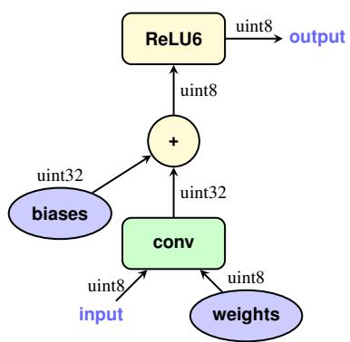  
(a) Integer-arithmetic-only inference

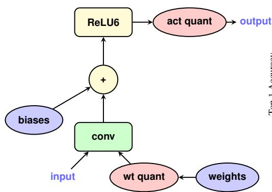  
(b) Training with simulated quantization

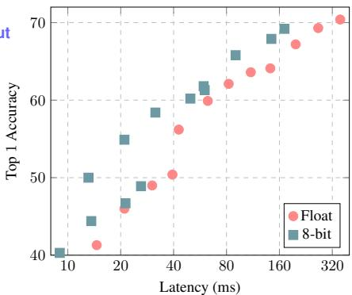  
(c) ImageNet latency-vs-accuracy tradeoff   
Figure 1.1: Integer-arithmetic-only quantization. a) Integer-arithmetic-only inference of a convolution layer. The input and output are represented as 8-bit integers according to equation 1. The convolution involves 8-bit integer operands and a 32-bit integer accumulator. The bias addition involves only 32-bit integers (section 2.4). The ReLU6 nonlinearity only involves 8-bit integer arithmetic. b) Training with simulated quantization of the convolution layer. All variables and computations are carried out using 32-bit floating-point arithmetic. Weight quantization (“wt quant”) and activation quantization (“act quant”) nodes are injected into the computation graph to simulate the effects of quantization of the variables (section 3). The resultant graph approximates the integer-arithmetic-only computation graph in panel a), while being trainable using conventional optimization algorithms for floating point models. c) Our quantization scheme benefits from the fast integer-arithmetic circuits in common CPUs to deliver an improved latency-vs-accuracy tradeoff (section 4). The figure compares integer quantized MobileNets [10] against floating point baselines on ImageNet [3] using Qualcomm Snapdragon 835 LITTLE cores.

tions [14, 27, 34]. With these approaches, both multiplications and additions can be implemented by efficient bit-shift and bit-count operations, which are showcased in custom GPU kernels (BNN [14]). However, 1 bit quantization often leads to substantial performance degradation, and may be overly stringent on model representation.

In this paper we address the above issues by improving the latency-vs-accuracy tradeoffs of MobileNets on common mobile hardware. Our specific contributions are:

• We provide a quantization scheme (section 2.1) that quantizesh both weights and activations as 8-bit integers, and just a few parameters (bias vectors) as 32-bit integers.   
• We provide a quantized inference framework that is efficiently implementable on integer-arithmetic-only hardware such as the Qualcomm Hexagon (sections 2.2, 2.3), and we describe an efficient, accurate implementation on ARM NEON (Appendix B).   
• We provide a quantized training framework (section 3) co-designed with our quantized inference to minimize the loss of accuracy from quantization on real models.   
• We apply our frameworks to efficient classification and detection systems based on MobileNets and provide benchmark results on popular ARM CPUs (section 4) that show significant improvements in the latency-vsaccuracy tradeoffs for state-of-the-art MobileNet architectures, demonstrated in ImageNet classification [3], COCO object detection [23], and other tasks.

Our work draws inspiration from [7], which leverages low-precision fixed-point arithmetic to accelerate the training speed of CNNs, and from [31], which uses 8-bit fixedpoint arithmetic to speed up inference on $\mathbf { \boldsymbol { x } } 8 6$ CPUs. Our quantization scheme focuses instead on improving the inference speed vs accuracy tradeoff on mobile CPUs.

# 2. Quantized Inference

# 2.1. Quantization scheme

In this section, we describe our general quantization scheme12, that is, the correspondence between the bitrepresentation of values (denoted $q$ below, for “quantized value”) and their interpretation as mathematical real numbers (denoted $r$ below, for “real value”). Our quantization scheme is implemented using integer-only arithmetic during inference and floating-point arithmetic during training, with both implementations maintaining a high degree of correspondence with each other. We achieve this by first providing a mathematically rigorous definition of our quantization scheme, and separately adopting this scheme for both integer-arithmetic inference and floating-point training.

A basic requirement of our quantization scheme is that it permits efficient implementation of all arithmetic using only integer arithmetic operations on the quantized values (we eschew implementations requiring lookup tables because these tend to perform poorly compared to pure arithmetic on SIMD hardware). This is equivalent to requiring that the quantization scheme be an affine mapping of integers $q$ to real numbers $r$ , i.e. of the form

$$
r = S (q - Z) \tag {1}
$$

for some constants $S$ and $Z$ . Equation (1) is our quantization scheme and the constants $S$ and $Z$ are our quantization parameters. Our quantization scheme uses a single set of quantization parameters for all values within each activations array and within each weights array; separate arrays use separate quantization parameters.

For 8-bit quantization, $q$ is quantized as an 8-bit integer (for $B$ -bit quantization, $q$ is quantized as an $B$ -bit integer). Some arrays, typically bias vectors, are quantized as 32-bit integers, see section 2.4.

The constant $S$ (for “scale”) is an arbitrary positive real number. It is typically represented in software as a floatingpoint quantity, like the real values $r$ . Section 2.2 describes methods for avoiding the representation of such floatingpoint quantities in the inference workload.

The constant $Z$ (for “zero-point”) is of the same type as quantized values $q$ , and is in fact the quantized value $q$ corresponding to the real value 0. This allows us to automatically meet the requirement that the real value $r = 0$ b e exactly representable by a quantized value. The motivation for this requirement is that efficient implementation of neural network operators often requires zero-padding of arrays around boundaries.

Our discussion so far is summarized in the following quantized buffer data structure3, with one instance of such a buffer existing for each activations array and weights array in a neural network. We use $\mathrm { C } { + + }$ syntax because it allows the unambiguous conveyance of types.

```txt
template<typename QName> // e.g. QName=uint8
struct QuantizedBuffer {
    vector<quette> q; // the quantized values
    float S; // the scale
    QName Z; // the zero-point
}; 
```

# 2.2. Integer-arithmetic-only matrix multiplication

We now turn to the question of how to perform inference using only integer arithmetic, i.e. how to use Equation (1) to translate real-numbers computation into quantized-values

computation, and how the latter can be designed to involve only integer arithmetic even though the scale values $S$ are not integers.

Consider the multiplication of two square $N \times N$ matrices of real numbers, $r _ { 1 }$ and $r _ { 2 }$ , with their product represented by $r _ { 3 } = r _ { 1 } r _ { 2 }$ . We denote the entries of each of these matrices $r _ { \alpha }$ $\mathbf { \Phi } _ { \cdot \alpha } = 1 \mathbf { \Phi } _ { \cdot }$ , 2 or 3) as $r _ { \alpha } ^ { ( i , j ) }$ for $1 \leqslant i , j \leqslant N$ and the quantization parameters with which they are quantized as $( S _ { \alpha } , Z _ { \alpha } )$ . We denote the quantized entries by $\bar { q _ { \alpha } ^ { ( i , j ) } }$ . Equation (1) then becomes:

$$
r _ {\alpha} ^ {(i, j)} = S _ {\alpha} \left(q _ {\alpha} ^ {(i, j)} - Z _ {\alpha}\right). \tag {2}
$$

From the definition of matrix multiplication, we have

$$
S _ {3} \left(q _ {3} ^ {(i, k)} - Z _ {3}\right) = \sum_ {j = 1} ^ {N} S _ {1} \left(q _ {1} ^ {(i, j)} - Z _ {1}\right) S _ {2} \left(q _ {2} ^ {(j, k)} - Z _ {2}\right), \tag {3}
$$

which can be rewritten as

$$
q _ {3} ^ {(i, k)} = Z _ {3} + M \sum_ {j = 1} ^ {N} \left(q _ {1} ^ {(i, j)} - Z _ {1}\right) \left(q _ {2} ^ {(j, k)} - Z _ {2}\right), \tag {4}
$$

where the multiplier $M$ is defined as

$$
M := \frac {S _ {1} S _ {2}}{S _ {3}}. \tag {5}
$$

In Equation (4), the only non-integer is the multiplier $M$ . As a constant depending only on the quantization scales $S _ { 1 } , S _ { 2 } , S _ { 3 }$ , it can be computed offline. We empirically find it to always be in the interval $( 0 , 1 )$ , and can therefore express it in the normalized form

$$
M = 2 ^ {- n} M _ {0} \tag {6}
$$

where $M _ { 0 }$ is in the interval [0.5, 1) and $n$ is a non-negative integer. The normalized multiplier $M _ { 0 }$ now lends itself well to being expressed as a fixed-point multiplier (e.g. int16 or int32 depending on hardware capability). For example, if int32 is used, the integer representing $M _ { 0 }$ is the int32 value nearest to $2 ^ { 3 1 } M _ { 0 }$ . Since $M _ { 0 } \geqslant 0 . 5$ , this value is always at least $2 ^ { 3 0 }$ and will therefore always have at least 30 bits of relative accuracy. Multiplication by $M _ { 0 }$ can thus be implemented as a fixed-point multiplication4. Meanwhile, multiplication by $2 ^ { - n }$ can be implemented with an efficient bitshift, albeit one that needs to have correct round-to-nearest behavior, an issue that we return to in Appendix B.

# 2.3. Efficient handling of zero-points

In order to efficiently implement the evaluation of Equation (4) without having to perform $2 N ^ { 3 }$ subtractions and

without having to expand the operands of the multiplication into 16-bit integers, we first notice that by distributing the multiplication in Equation (4), we can rewrite it as

$$
\begin{array}{l} q _ {3} ^ {(i, k)} = Z _ {3} + M \left(N Z _ {1} Z _ {2} - Z _ {1} a _ {2} ^ {(k)} \right. \tag {7} \\ \left. - Z _ {2} \bar {a} _ {1} ^ {(i)} + \sum_ {j = 1} ^ {N} q _ {1} ^ {(i, j)} q _ {2} ^ {(j, k)}\right) \\ \end{array}
$$

where

$$
a _ {2} ^ {(k)} := \sum_ {j = 1} ^ {N} q _ {2} ^ {(j, k)}, \bar {a} _ {1} ^ {(i)} := \sum_ {j = 1} ^ {N} q _ {1} ^ {(i, j)}. \tag {8}
$$

Each $a _ { 2 } ^ { ( k ) }$ or $\bar { a } _ { 1 } ^ { ( i ) }$ takes only $N$ additions to compute, so they collectively take only $2 N ^ { 2 }$ additions. The rest of the cost of the evaluation of (7) is almost entirely concentrated in the core integer matrix multiplication accumulation

$$
\sum_ {j = 1} ^ {N} q _ {1} ^ {(i, j)} q _ {2} ^ {(j, k)} \tag {9}
$$

which takes $2 N ^ { 3 }$ arithmetic operations; indeed, everything else involved in (7) is $O ( N ^ { 2 } )$ with a small constant in the $O$ . Thus, the expansion into the form (7) and the factored-out computation of $a _ { 2 } ^ { ( k ) }$ and $\bar { a } _ { 1 } ^ { ( i ) }$ enable low-overhead handling of arbitrary zero-points for anything but the smallest values of $N$ , reducing the problem to the same core integer matrix multiplication accumulation (9) as we would have to compute in any other zero-points-free quantization scheme.

# 2.4. Implementation of a typical fused layer

We continue the discussion of section 2.3, but now explicitly define the data types of all quantities involved, and modify the quantized matrix multiplication (7) to merge the bias-addition and activation function evaluation directly into it. This fusing of whole layers into a single operation is not only an optimization. As we must reproduce in inference code the same arithmetic that is used in training, the granularity of fused operators in inference code (taking an 8-bit quantized input and producing an 8-bit quantized output) must match the placement of “fake quantization” operators in the training graph (section 3).

For our implementation on ARM and $\mathbf { \boldsymbol { x } } 8 6$ CPU architectures, we use the gemmlowp library [18], whose GemmWithOutputPipeline entry point provides supports the fused operations that we now describe5.

We take the $q _ { 1 }$ matrix to be the weights, and the $q _ { 2 }$ matrix to be the activations. Both the weights and activations are of type uint8 (we could have equivalently chosen int8, with suitably modified zero-points). Accumulating products of uint8 values requires a 32-bit accumulator, and we choose a signed type for the accumulator for a reason that will soon become clear. The sum in (9) is thus of the form:

$$
i n t 3 2 + = u i n t 8 * u i n t 8. \tag {10}
$$

In order to have the quantized bias-addition be the addition of an int32 bias into this int32 accumulator, the bias-vector is quantized such that: it uses int32 as its quantized data type; it uses 0 as its quantization zero-point $Z _ { \mathrm { b i a s } }$ ; and its quantization scale $S _ { \mathrm { b i a s } }$ is the same as that of the accumulators, which is the product of the scales of the weights and of the input activations. In the notation of section 2.3,

$$
S _ {\text {b i a s}} = S _ {1} S _ {2}, \quad Z _ {\text {b i a s}} = 0. \tag {11}
$$

Although the bias-vectors are quantized as 32-bit values, they account for only a tiny fraction of the parameters in a neural network. Furthermore, the use of higher precision for bias vectors meets a real need: as each bias-vector entry is added to many output activations, any quantization error in the bias-vector tends to act as an overall bias (i.e. an error term with nonzero mean), which must be avoided in order to preserve good end-to-end neural network accuracy6.

With the final value of the int32 accumulator, there remain three things left to do: scale down to the final scale used by the 8-bit output activations, cast down to uint8 and apply the activation function to yield the final 8-bit output activation.

The down-scaling corresponds to multiplication by the multiplier $M$ in equation (7). As explained in section 2.2, it is implemented as a fixed-point multiplication by a normalized multiplier $M _ { 0 }$ and a rounding bit-shift. Afterwards, we perform a saturating cast to uint8, saturating to the range [0, 255].

We focus on activation functions that are mere clamps, e.g. ReLU, ReLU6. Mathematical functions are discussed in appendix A.1 and we do not currently fuse them into such layers. Thus, the only thing that our fused activation functions need to do is to further clamp the uint8 value to some sub-interval of [0, 255] before storing the final uint8 output activation. In practice, the quantized training process (section 3) tends to learn to make use of the whole output uint8 [0, 255] interval so that the activation function no longer does anything, its effect being subsumed in the clamping to [0, 255] implied in the saturating cast to uint8.

# 3. Training with simulated quantization

A common approach to training quantized networks is to train in floating point and then quantize the resulting weights (sometimes with additional post-quantization training for fine-tuning). We found that this approach works sufficiently well for large models with considerable representational capacity, but leads to significant accuracy drops for small models. Common failure modes for simple posttraining quantization include: 1) large differences (more than $1 0 0 \times$ ) in ranges of weights for different output channels (section 2 mandates that all channels of the same layer be quantized to the same resolution, which causes weights in channels with smaller ranges to have much higher relative error) and 2) outlier weight values that make all remaining weights less precise after quantization.

We propose an approach that simulates quantization effects in the forward pass of training. Backpropagation still happens as usual, and all weights and biases are stored in floating point so that they can be easily nudged by small amounts. The forward propagation pass however simulates quantized inference as it will happen in the inference engine, by implementing in floating-point arithmetic the rounding behavior of the quantization scheme that we introduced in section 2:

• Weights are quantized before they are convolved with the input. If batch normalization (see [17]) is used for the layer, the batch normalization parameters are “folded into” the weights before quantization, see section 3.2.   
• Activations are quantized at points where they would be during inference, e.g. after the activation function is applied to a convolutional or fully connected layer’s output, or after a bypass connection adds or concatenates the outputs of several layers together such as in ResNets.

For each layer, quantization is parameterized by the number of quantization levels and clamping range, and is performed by applying point-wise the quantization function $q$ defined as follows:

$$
\begin{array}{l} \operatorname {c l a m p} (r; a, b) := \min  (\max  (x, a), b) \\ s (a, b, n) := \frac {b - a}{n - 1} \\ q (r; a, b, n) := \left\lfloor \frac {\operatorname {c l a m p} (r ; a , b) - a}{s (a , b , n)} \right] s (a, b, n) + a, \tag {12} \\ \end{array}
$$

where $r$ is a real-valued number to be quantized, $[ a ; b ]$ is the quantization range, $n$ is the number of quantization levels, and $\lfloor \cdot \rceil$ denotes rounding to the nearest integer. $n$ is fixed for all layers in our experiments, e.g. $n = 2 ^ { 8 } = 2 5 6$ for 8 bit quantization.

# 3.1. Learning quantization ranges

Quantization ranges are treated differently for weight quantization vs. activation quantization:

• For weights, the basic idea is simply to set $a : = \operatorname* { m i n } w$ , $b : = \operatorname* { m a x } w$ . We apply a minor tweak to this so that the weights, once quantized as int8 values, only range in $[ - 1 2 7 , 1 2 7 ]$ and never take the value $- 1 2 8$ , as this enables a substantial optimization opportunity (for more details, see Appendix B).   
• For activations, ranges depend on the inputs to the network. To estimate the ranges, we collect $[ a ; b ]$ ranges seen on activations during training and then aggregate them via exponential moving averages (EMA) with the smoothing parameter being close to 1 so that observed ranges are smoothed across thousands of training steps. Given significant delay in the EMA updating activation ranges when the ranges shift rapidly, we found it useful to completely disable activation quantization at the start of training (say, for 50 thousand to 2 million steps). This allows the network to enter a more stable state where activation quantization ranges do not exclude a significant fraction of values.

In both cases, the boundaries $[ a ; b ]$ are nudged so that value 0.0 is exactly representable as an integer $z ( a , b , n )$ after quantization. As a result, the learned quantization parameters map to the scale $S$ and zero-point $Z$ in equation 1:

$$
S = s (a, b, n), \quad Z = z (a, b, n) \tag {13}
$$

Below we depict simulated quantization assuming that the computations of a neural network are captured as a TensorFlow graph [1]. A typical workflow is described in Algorithm 1. Optimization of the inference graph by fusing

# Algorithm 1 Quantized graph training and inference

1: Create a training graph of the floating-point model.   
2: Insert fake quantization TensorFlow operations in locations where tensors will be downcasted to fewer bits during inference according to equation 12.   
3: Train in simulated quantized mode until convergence.   
4: Create and optimize the inference graph for running in a low bit inference engine.   
5: Run inference using the quantized inference graph.

and removing operations is outside the scope of this paper. Source code for graph modifications (inserting fake quantization operations, creating and optimizing the inference graph) and a low bit inference engine has been opensourced with TensorFlow contributions in [19].

Figure 1.1a and b illustrate TensorFlow graphs before and after quantization for a simple convolutional layer. Illustrations of the more complex convolution with a bypass connection in figure C.3 can be found in figure C.4.

Note that the biases are not quantized because they are represented as 32-bit integers in the inference process, with a much higher range and precision compared to the 8 bit weights and activations. Furthermore, quantization parameters used for biases are inferred from the quantization parameters of the weights and activations. See section 2.4.

Typical TensorFlow code illustrating use of [19] follows:

from tf.contrib quantize \ import quantize_graph as qg $\mathsf{g} = \mathsf{tf}.G$ raph()   
with g.as_default(): output $= \ldots$ total_loss $= \ldots$ optimizer $= \ldots$ train_tensor $= \ldots$ if is_training: quantized_graph $= \backslash$ qg.create_training_graph(g)   
else: quantized_graph $= \backslash$ qg.create_eval_graph(g)   
# Train or evaluate quantized_graph.

# 3.2. Batch normalization folding

For models that use batch normalization (see [17]), there is additional complexity: the training graph contains batch normalization as a separate block of operations, whereas the inference graph has batch normalization parameters “folded” into the convolutional or fully connected layer’s weights and biases, for efficiency. To accurately simulate quantization effects, we need to simulate this folding, and quantize weights after they have been scaled by the batch normalization parameters. We do so with the following:

$$
w _ {\text {f o l d}} := \frac {\gamma w}{\sqrt {E M A \left(\sigma_ {B} ^ {2}\right) + \varepsilon}}. \tag {14}
$$

Here $\gamma$ is the batch normalization’s scale parameter, $E M A ( \sigma _ { B } ^ { 2 } )$ is the moving average estimate of the variance of convolution results across the batch, and $\varepsilon$ is just a small constant for numerical stability.

After folding, the batch-normalized convolutional layer reduces to the simple convolutional layer depicted in figure 1.1a with the folded weights $w _ { \mathrm { f o l d } }$ and the corresponding folded biases. Therefore the same recipe in figure 1.1b applies. See the appendix for the training graph (figure C.5) for a batch-normalized convolutional layer, the corresponding inference graph (figure C.6), the training graph after batch-norm folding (figure C.7) and the training graph after both folding and quantization (figure C.8).

Table 4.1: ResNet on ImageNet: Floating-point vs quantized network accuracy for various network depths.   

<table><tr><td>ResNet depth</td><td>50</td><td>100</td><td>150</td></tr><tr><td>Floating-point accuracy</td><td>76.4%</td><td>78.0%</td><td>78.8%</td></tr><tr><td>Integer-quantized accuracy</td><td>74.9%</td><td>76.6%</td><td>76.7%</td></tr></table>

Table 4.2: ResNet on ImageNet: Accuracy under various quantization schemes, including binary weight networks (BWN [21, 15]), ternary weight networks (TWN [21, 22]), incremental network quantization (INQ [33]) and fine-grained quantization (FGQ [26])   

<table><tr><td>Scheme</td><td>BWN</td><td>TWN</td><td>INQ</td><td>FGQ</td><td>Ours</td></tr><tr><td>Weight bits</td><td>1</td><td>2</td><td>5</td><td>2</td><td>8</td></tr><tr><td>Activation bits</td><td>float32</td><td>float32</td><td>float32</td><td>8</td><td>8</td></tr><tr><td>Accuracy</td><td>68.7%</td><td>72.5%</td><td>74.8%</td><td>70.8%</td><td>74.9%</td></tr></table>

# 4. Experiments

We conducted two set of experiments, one showcasing the effectiveness of quantized training (Section. 4.1), and the other illustrating the improved latency-vs-accuracy tradeoff of quantized models on common hardware (Section. 4.2). The most performance-critical part of the inference workload on the neural networks being benchmarked is matrix multiplication (GEMM). The 8-bit and 32-bit floating-point GEMM inference code uses the gemmlowp library [18] for 8-bit quantized inference, and the Eigen library [6] for 32-bit floating-point inference.

# 4.1. Quantized training of Large Networks

We apply quantized training to ResNets [9] and InceptionV3 [30] on the ImageNet dataset. These popular networks are too computationally intensive to be deployed on mobile devices, but are included for comparison purposes. Training protocols are discussed in Appendix D.1 and D.2.

# 4.1.1 ResNets

We compare floating-point vs integer-quantized ResNets for various depths in table 4.1. Accuracies of integer-only quantized networks are within $2 \%$ of their floating-point counterparts.

We also list ResNet50 accuracies under different quantization schemes in table 4.2. As expected, integer-only quantization outperforms FGQ [26], which uses 2 bits for weight quantization. INQ [33] (5-bit weight floating-point activation) achieves a similar accuracy as ours, but we provide additional run-time improvements (see section 4.2).

Table 4.3: Inception v3 on ImageNet: Accuracy and recall 5 comparison of floating point and quantized models.   

<table><tr><td rowspan="2">Act.</td><td rowspan="2">type</td><td colspan="2">accuracy</td><td colspan="2">recall 5</td></tr><tr><td>mean</td><td>std. dev.</td><td>mean</td><td>std.dev.</td></tr><tr><td rowspan="3">ReLU6</td><td>floats</td><td>78.4%</td><td>0.1%</td><td>94.1%</td><td>0.1%</td></tr><tr><td>8 bits</td><td>75.4%</td><td>0.1%</td><td>92.5%</td><td>0.1%</td></tr><tr><td>7 bits</td><td>75.0%</td><td>0.3%</td><td>92.4%</td><td>0.2%</td></tr><tr><td rowspan="3">ReLU</td><td>floats</td><td>78.3%</td><td>0.1%</td><td>94.2%</td><td>0.1%</td></tr><tr><td>8 bits</td><td>74.2%</td><td>0.2%</td><td>92.2%</td><td>0.1%</td></tr><tr><td>7 bits</td><td>73.7%</td><td>0.3%</td><td>92.0%</td><td>0.1%</td></tr></table>

# 4.1.2 Inception v3 on ImageNet

We compare the Inception v3 model quantized into 8 and 7 bits, respectively. 7-bit quantization is obtained by setting the number of quantization levels in equation 12 to $n = 2 ^ { 7 }$ . We additionally probe the sensitivity of activation quantization by comparing networks with two activation nonlinearities, ReLU6 and ReLU. The training protocol is in Appendix D.2.

Table 4.3 shows that 7-bit quantized training produces model accuracies close to that of 8-bit quantized training, and quantized models with ReLU6 have less accuracy degradation. The latter can be explained by noticing that ReLU6 introduces the interval [0, 6] as a natural range for activations, while ReLU allows activations to take values from a possibly larger interval, with different ranges in different channels. Values in a fixed range are easier to quantize with high precision.

# 4.2. Quantization of MobileNets

MobileNets are a family of architectures that achieve a state-of-the-art tradeoff between on-device latency and ImageNet classification accuracy. In this section we demonstrate how integer-only quantization can further improve the tradeoff on common hardware.

# 4.2.1 ImageNet

We benchmarked the MobileNet architecture with varying depth-multipliers (DM) and resolutions on ImageNet on three types of Qualcomm cores, which represent three different micro-architectures: 1) Snapdragon 835 LITTLE core, (figure. 1.1c), a power-efficient processor found in Google Pixel 2; 2) Snapdragon 835 big core (figure. 4.1), a high-performance core employed by Google Pixel 2; and 3) Snapdragon 821 big core (figure. 4.2), a high-performance core used in Google Pixel 1.

Integer-only quantized MobileNets achieve higher accuracies than floating-point MobileNets given the same run-

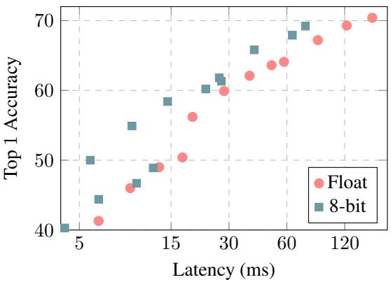

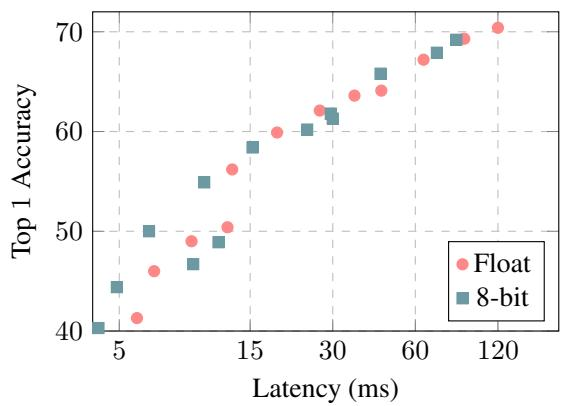  
Figure 4.1: ImageNet classifier on Qualcomm Snapdragon 835 big cores: Latency-vs-accuracy tradeoff of floatingpoint and integer-only MobileNets.   
Figure 4.2: ImageNet classifier on Qualcomm Snapdragon 821: Latency-vs-accuracy tradeoff of floating-point and integer-only MobileNets.

time budget. The accuracy gap is quite substantial $( \sim 1 0 \% )$ for Snapdragon 835 LITTLE cores at the 33ms latency needed for real-time (30 fps) operation. While most of the quantization literature focuses on minimizing accuracy loss for a given architecture, we advocate for a more comprehensive latency-vs-accuracy tradeoff as a better measure. Note that this tradeoff depends critically on the relative speed of floating-point vs integer-only arithmetic in hardware. Floating-point computation is better optimized in the Snapdragon 821, for example, resulting in a less noticeable reduction in latency for quantized models.

# 4.2.2 COCO

We evaluated quantization in the context of mobile real time object detection, comparing the performance of quantized 8-bit and float models of MobileNet SSD [10, 25] on the COCO dataset [24]. We replaced all the regular convolutions in the SSD prediction layers with separable convolu-

Table 4.4: Object detection speed and accuracy on COCO dataset of floating point and integer-only quantized models. Latency (ms) is measured on Qualcomm Snapdragon 835 big and LITTLE cores.   

<table><tr><td>DM</td><td>Type</td><td>mAP</td><td>LITTLE (ms)</td><td>big (ms)</td></tr><tr><td rowspan="2">100%</td><td>floats</td><td>22.1</td><td>778</td><td>370</td></tr><tr><td>8 bits</td><td>21.7</td><td>687</td><td>272</td></tr><tr><td rowspan="2">50%</td><td>floats</td><td>16.7</td><td>270</td><td>121</td></tr><tr><td>8 bits</td><td>16.6</td><td>146</td><td>61</td></tr></table>

tions (depthwise followed by $1 \times 1$ projection). This modification is consistent with the overall design of MobileNets and makes them more computationally efficient. We utilized the Open Source TensorFlow Object Detection API [12] to train and evaluate our models. The training protocol is described in Appendix D.3. We also delayed quantization for 500 thousand steps (see section 3.1), finding that it significantly decreases the time to convergence.

Table 4.4 shows the latency-vs-accuracy tradeoff between floating-point and integer-quantized models. Latency was measured on a single thread using Snapdragon 835 cores (big and LITTLE). Quantized training and inference results in up to a $5 0 \%$ reduction in running time, with a minimal loss in accuracy $( - 1 . 8 \%$ relative).

# 4.2.3 Face detection

To better examine quantized MobileNet SSD on a smaller scale, we benchmarked face detection on the face attribute classification dataset (a Flickr-based dataset used in [10]). We contacted the authors of [10] to evaluate our quantized MobileNets on detection and face attributes following the same protocols (detailed in Appendix D.4).

As indicated by tables 4.5 and 4.6, quantization provides close to a $2 \times$ latency reduction with a Qualcomm Snapdragon 835 big or LITTLE core at the cost of a $\sim 2 \%$ drop in the average precision. Notably, quantization allows the $2 5 \%$ face detector to run in real-time $( 1 K / 2 8 \approx 3 6 $ fps) on a single big core, whereas the floating-point model remains slower than real-time $1 K / 4 4 \approx 2 3$ fps).

We additionally examine the effect of multi-threading on the latency of quantized models. Table 4.6 shows a 1.5 to $2 . 2 \times \phantom { 2 }$ ) speedup when using 4 cores. The speedup ratios are comparable between the two cores, and are higher for larger models where the overhead of multi-threading occupies a smaller fraction of the total computation.

# 4.2.4 Face attributes

Figure 4.3 shows the latency-vs-accuracy tradeoff of face attribute classification on the Qualcomm Snapdragon 821.

<table><tr><td>DM</td><td>type</td><td>Precision</td><td>Recall</td></tr><tr><td>100%</td><td>floats</td><td>68%</td><td>76%</td></tr><tr><td></td><td>8 bits</td><td>66%</td><td>75%</td></tr><tr><td>50%</td><td>floats</td><td>65%</td><td>70%</td></tr><tr><td></td><td>8 bits</td><td>62%</td><td>70%</td></tr><tr><td>25%</td><td>floats</td><td>56%</td><td>64%</td></tr><tr><td></td><td>8 bits</td><td>54%</td><td>63%</td></tr></table>

Table 4.5: Face detection accuracy of floating point and integer-only quantized models. The reported precision / recall is averaged over different precision / recall values where an IOU of $x$ between the groundtruth and predicted windows is considered a correct detection, for $x$ in $\{ 0 . 5 , 0 . 5 5 , \hdots , 0 . 9 5 \}$ .   
Table 4.6: Face detection: latency of floating point and quantized models on Qualcomm Snapdragon 835 cores.   

<table><tr><td rowspan="2">DM</td><td rowspan="2">type</td><td colspan="3">LITTLE Cores</td><td colspan="3">big Cores</td></tr><tr><td>1</td><td>2</td><td>4</td><td>1</td><td>2</td><td>4</td></tr><tr><td rowspan="2">100%</td><td>floats</td><td>711</td><td>-</td><td>-</td><td>337</td><td>-</td><td>-</td></tr><tr><td>8 bits</td><td>372</td><td>238</td><td>167</td><td>154</td><td>100</td><td>69</td></tr><tr><td rowspan="2">50%</td><td>floats</td><td>233</td><td>-</td><td>-</td><td>106</td><td>-</td><td>-</td></tr><tr><td>8 bits</td><td>134</td><td>96</td><td>74</td><td>56</td><td>40</td><td>30</td></tr><tr><td rowspan="2">25%</td><td>floats</td><td>100</td><td>-</td><td>-</td><td>44</td><td>-</td><td>-</td></tr><tr><td>8 bits</td><td>67</td><td>52</td><td>43</td><td>28</td><td>22</td><td>18</td></tr></table>

Since quantized training results in little accuracy degradation, we see an improved tradeoff even though the Qualcomm Snapdragon 821 is highly optimized for floating point arithmetic (see Figure 4.2 for comparison).

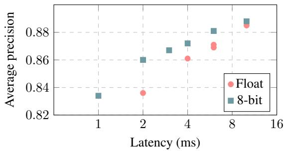  
Figure 4.3: Face attribute classifier on Qualcomm Snapdragon 821: Latency-vs-accuracy tradeoff of floating-point and integer-only MobileNets.

Ablation study To understand performance sensitivity to the quantization scheme, we further evaluate quantized

<table><tr><td>wt. \act.</td><td>8</td><td>7</td><td>6</td><td>5</td><td>4</td></tr><tr><td>8</td><td>-0.9%</td><td>-0.3%</td><td>-0.4%</td><td>-1.3%</td><td>-3.5%</td></tr><tr><td>7</td><td>-1.3%</td><td>-0.5%</td><td>-1.2%</td><td>-1.0%</td><td>-2.6%</td></tr><tr><td>6</td><td>-1.1%</td><td>-1.2%</td><td>-1.6%</td><td>-1.6%</td><td>-3.1%</td></tr><tr><td>5</td><td>-3.1%</td><td>-3.7%</td><td>-3.4%</td><td>-3.4%</td><td>-4.8%</td></tr><tr><td>4</td><td>-11.4%</td><td>-13.6%</td><td>-10.8%</td><td>-13.1%</td><td>-14.0%</td></tr></table>

Table 4.7: Face attributes: relative average category precision of integer-quantized MobileNets (varying weight and activation bit depths) compared with floating point.   
Table 4.8: Face attributes: Age precision at difference of 5 years for quantized model (varying weight and activation bit depths) compared with floating point.   

<table><tr><td>wt. \act.</td><td>8</td><td>7</td><td>6</td><td>5</td><td>4</td></tr><tr><td>8</td><td>-1.3%</td><td>-1.6%</td><td>-3.2%</td><td>-6.0%</td><td>-9.8%</td></tr><tr><td>7</td><td>-1.8%</td><td>-1.2%</td><td>-4.6%</td><td>-7.0%</td><td>-9.9%</td></tr><tr><td>6</td><td>-2.1%</td><td>-4.9%</td><td>-2.6%</td><td>-7.3%</td><td>-9.6%</td></tr><tr><td>5</td><td>-3.1%</td><td>-6.1%</td><td>-7.8%</td><td>-4.4%</td><td>-10.0%</td></tr><tr><td>4</td><td>-10.6%</td><td>-20.8%</td><td>-17.9%</td><td>-19.0%</td><td>-19.5%</td></tr></table>

training with varying weight and activation quantization bit depths. The degradation in average precision for binary attributes and age precision relative to the floating-point baseline are shown in Tables 4.7 and 4.8, respectively. The tables suggest that 1) weights are more sensitive to reduced quantization bit depth than activations, 2) 8 and 7-bit quantized models perform similarly to floating point models, and 3) when the total bit-depths are equal, it is better to keep weight and activation bit depths the same.

# 5. Discussion

We propose a quantization scheme that relies only on integer arithmetic to approximate the floating-point computations in a neural network. Training that simulates the effect of quantization helps to restore model accuracy to near-identical levels as the original. In addition to the $4 \times$ reduction of model size, inference efficiency is improved via ARM NEON-based implementations. The improvement advances the state-of-the-art tradeoff between latency on common ARM CPUs and the accuracy of popular computer vision models. The synergy between our quantization scheme and efficient architecture design suggests that integer-arithmetic-only inference could be a key enabler that propels visual recognition technologies into the realtime and low-end phone market.

# References

[1] M. Abadi, A. Agarwal, P. Barham, E. Brevdo, Z. Chen, C. Citro, G. S. Corrado, A. Davis, J. Dean, M. Devin, et al. Tensorflow: Large-scale machine learning on heterogeneous systems, 2015. Software available from tensorflow. org, 1, 2015. 5, 11, 12, 13   
[2] W. Chen, J. T. Wilson, S. Tyree, K. Q. Weinberger, and Y. Chen. Compressing neural networks with the hashing trick. CoRR, abs/1504.04788, 2015. 1   
[3] J. Deng, W. Dong, R. Socher, L.-J. Li, K. Li, and L. Fei-Fei. Imagenet: A large-scale hierarchical image database. In Computer Vision and Pattern Recognition, 2009. CVPR 2009. IEEE Conference on, pages 248–255. IEEE, 2009. 2, 11   
[4] Y. Gong, L. Liu, M. Yang, and L. Bourdev. Compressing deep convolutional networks using vector quantization. arXiv preprint arXiv:1412.6115, 2014. 1   
[5] Google. TensorFlow Lite. https://www.tensorflow.org/mobile/tflite. 2, 3, 4, 11   
[6] G. Guennebaud, B. Jacob, et al. Eigen v3. http://eigen.tuxfamily.org. 6   
[7] S. Gupta, A. Agrawal, K. Gopalakrishnan, and P. Narayanan. Deep learning with limited numerical precision. In Proceedings of the 32nd International Conference on Machine Learning (ICML-15), pages 1737–1746, 2015. 2   
[8] S. Han, H. Mao, and W. J. Dally. Deep compression: Compressing deep neural network with pruning, trained quantization and huffman coding. CoRR, abs/1510.00149, 2, 2015. 1   
[9] K. He, X. Zhang, S. Ren, and J. Sun. Deep residual learning for image recognition. In Proceedings of the IEEE conference on computer vision and pattern recognition, pages 770–778, 2016. 6   
[10] A. G. Howard, M. Zhu, B. Chen, D. Kalenichenko, W. Wang, T. Weyand, M. Andreetto, and H. Adam. Mobilenets: Efficient convolutional neural networks for mobile vision applications. CoRR, abs/1704.04861, 2017. 1, 2, 7, 8, 12, 13   
[11] G. Huang, Z. Liu, L. van der Maaten, and K. Q. Weinberger. Densely connected convolutional networks. In The IEEE Conference on Computer Vision and Pattern Recognition (CVPR), July 2017. 1   
[12] J. Huang, V. Rathod, D. Chow, C. Sun, and M. Zhu. Tensorflow object detection api, 2017. 8   
[13] J. Huang, V. Rathod, C. Sun, M. Zhu, A. Korattikara, A. Fathi, I. Fischer, Z. Wojna, Y. Song, S. Guadarrama, et al. Speed/accuracy trade-offs for modern convolutional object detectors. arXiv preprint arXiv:1611.10012, 2016. 12   
[14] I. Hubara, M. Courbariaux, D. Soudry, R. El-Yaniv, and Y. Bengio. Binarized neural networks. In Advances in neural information processing systems, pages 4107–4115, 2016. 1, 2   
[15] I. Hubara, M. Courbariaux, D. Soudry, R. El-Yaniv, and Y. Bengio. Quantized neural networks: Training neural networks with low precision weights and activations. arXiv preprint arXiv:1609.07061, 2016. 6

[16] F. N. Iandola, M. W. Moskewicz, K. Ashraf, S. Han, W. J. Dally, and K. Keutzer. Squeezenet: Alexnet-level accuracy with 50x fewer parameters and¡ 1mb model size. arXiv preprint arXiv:1602.07360, 2016. 1   
[17] S. Ioffe and C. Szegedy. Batch normalization: Accelerating deep network training by reducing internal covariate shift. In Proceedings of the 32Nd International Conference on International Conference on Machine Learning - Volume 37, ICML’15, pages 448–456. JMLR.org, 2015. 5, 6   
[18] B. Jacob, P. Warden, et al. gemmlowp: a small self-contained low-precision gemm library. https://github.com/google/gemmlowp. 2, 4, 6, 11   
[19] S. Kligys, S. Sivakumar, et al. Tensorflow quantized training support. https://github.com/tensorflow/tensorflow 5, 6   
[20] A. Krizhevsky, I. Sutskever, and G. E. Hinton. Imagenet classification with deep convolutional neural networks. In Advances in neural information processing systems, pages 1097–1105, 2012. 1   
[21] C. Leng, H. Li, S. Zhu, and R. Jin. Extremely low bit neural network: Squeeze the last bit out with admm. arXiv preprint arXiv:1707.09870, 2017. 1, 6   
[22] F. Li, B. Zhang, and B. Liu. Ternary weight networks. arXiv preprint arXiv:1605.04711, 2016. 1, 6   
[23] T.-Y. Lin, M. Maire, S. Belongie, J. Hays, P. Perona, D. Ramanan, P. Doll´ar, and C. L. Zitnick. Microsoft coco: Common objects in context. In European conference on computer vision, pages 740–755. Springer, 2014. 2   
[24] T.-Y. Lin, M. Maire, S. Belongie, J. Hays, P. Perona, D. Ramanan, P. Doll´ar, and C. L. Zitnick. Microsoft COCO: Common objects in context. In ECCV, 2014. 7   
[25] W. Liu, D. Anguelov, D. Erhan, C. Szegedy, and S. Reed. Ssd: Single shot multibox detector. arXiv preprint arXiv:1512.02325, 2015. 7   
[26] N. Mellempudi, A. Kundu, D. Mudigere, D. Das, B. Kaul, and P. Dubey. Ternary neural networks with fine-grained quantization. arXiv preprint arXiv:1705.01462, 2017. 1, 6   
[27] M. Rastegari, V. Ordonez, J. Redmon, and A. Farhadi. Xnornet: Imagenet classification using binary convolutional neural networks. arXiv preprint arXiv:1603.05279, 2016. 1, 2   
[28] K. Simonyan and A. Zisserman. Very deep convolutional networks for large-scale image recognition. arXiv preprint arXiv:1409.1556, 2014. 1   
[29] C. Szegedy, W. Liu, Y. Jia, P. Sermanet, S. Reed, D. Anguelov, D. Erhan, V. Vanhoucke, and A. Rabinovich. Going deeper with convolutions. In Proceedings of the IEEE Conference on Computer Vision and Pattern Recognition, pages 1–9, 2015. 1   
[30] C. Szegedy, V. Vanhoucke, S. Ioffe, J. Shlens, and Z. Wojna. Rethinking the inception architecture for computer vision. In Proceedings of the IEEE Conference on Computer Vision and Pattern Recognition, pages 2818–2826, 2016. 6   
[31] V. Vanhoucke, A. Senior, and M. Z. Mao. Improving the speed of neural networks on cpus. In Proc. Deep Learning and Unsupervised Feature Learning NIPS Workshop, volume 1, page 4, 2011. 2

[32] X. Zhang, X. Zhou, M. Lin, and J. Sun. Shufflenet: An extremely efficient convolutional neural network for mobile devices. CoRR, abs/1707.01083, 2017. 1   
[33] A. Zhou, A. Yao, Y. Guo, L. Xu, and Y. Chen. Incremental network quantization: Towards lossless cnns with lowprecision weights. arXiv preprint arXiv:1702.03044, 2017. 1, 6   
[34] S. Zhou, Y. Wu, Z. Ni, X. Zhou, H. Wen, and Y. Zou. Dorefa-net: Training low bitwidth convolutional neural networks with low bitwidth gradients. arXiv preprint arXiv:1606.06160, 2016. 1, 2   
[35] C. Zhu, S. Han, H. Mao, and W. J. Dally. Trained ternary quantization. arXiv preprint arXiv:1612.01064, 2016. 1

# A. Appendix: Layer-specific details

# A.1. Mathematical functions

Math functions such as hyperbolic tangent, the logistic function, and softmax often appear in neural networks. No lookup tables are needed since these functions are implemented in pure fixed-point arithmetic similarly to how they would be implemented in floating-point arithmetic7.

# A.2. Addition

Some neural networks use a plain Addition layer type, that simply adds two activation arrays together. Such Addition layers are more expensive in quantized inference compared to floating-point because rescaling is needed: one input needs to be rescaled onto the other’s scale using a fixedpoint multiplication by the multiplier $M = S _ { 1 } / S _ { 2 }$ similar to what we have seen earlier (end of section 2.2), before the actual addition can be performed as a simple integer addition; finally, the result must be rescaled again to fit the output array’s scale8.

# A.3. Concatenation

Fully general support for concatenation layers poses the same rescaling problem as Addition layers. Because such rescaling of uint8 values would be a lossy operation, and as it seems that concatenation ought to be a lossless operation, we prefer to handle this problem differently: instead of implementing lossy rescaling, we introduce a requirement that all the input activations and the output activations in a Concatenation layer have the same quantization parameters. This removes the need for rescaling and concatenations are thus lossless and free of any arithmetic9.

# B. Appendix: ARM NEON details

This section assumes familiarity with assembly programming on the ARM NEON instruction set. The instruction mnemonics below refer to the 64-bit ARM instruction set, but the discussion applies equally to 32-bit ARM instructions.

The fixed-point multiplications referenced throughout this article map exactly to the SQRDMULH instruction. It is very important to use the correctly-rounding instruction SQRDMULH and not SQDMULH1

The rounding-to-nearest right-shifts referenced in section 2.2 do not map exactly to any ARM NEON instruction.

7Pure-arithmetic, SIMD-ready, branch-free, fixed-point implementations of at least tanh and the logistic functions are given in gemmlowp [18]’s fixedpoint directory, with specializations for NEON and SSE instruction sets. One can see in TensorFlow Lite [5] how these are called.   
8See the TensorFlow Lite [5] implementation.   
9This is implemented in this part of the TensorFlow Lite [5] Converter   
10The fixed-point math function implementations in gemmlowp [18] use such fixed-point multiplications, and ordinary (non-saturating) integer additions. We have no use for general saturated arithmetic.

The problem is that the “rounding right shift” instruction, RSHL with variable negative offset, breaks ties by rounding upward, instead of rounding them away from zero. For example, if we use RSHL to implement the division $- 1 2 / 2 ^ { 3 }$ , the result will be $- 1$ whereas it should be $- 2$ with “round to nearest”. This is problematic as it results in an overall upward bias, which has been observed to cause significant loss of end-to-end accuracy in neural network inference. A correct round-to-nearest right-shift can still be implemented using RSHL but with suitable fix-up arithmetic around it11.

For efficient NEON implementation of the matrix multiplication’s core accumulation, we use the following trick. In the multiply-add operation in (10), we first change the operands’ type from uint8 to int8 (which can be done by subtracting 128 from the quantized values and zero-points). Thus the core multiply-add becomes

$$
\text {i n t 3 2} + = \text {i n t 8} \star \text {i n t 8}. \tag {B.1}
$$

As mentioned in section 3, with a minor tweak of the quantized training process, we can ensure that the weights, once quantized as int8 values, never take the value $- 1 2 8$ . Hence, the product in (B.1) is never $- 1 2 8 * - 1 2 8$ , and is therefore always less than $2 ^ { 1 4 }$ in absolute value. Hence, (B.1) can accumulate two products on a local int16 accumulator before that needs to be accumulated into the true int32 accumulator. This allows the use of an 8-way SIMD multiplication (SMULL on int8 operands), followed by an 8-way SIMD multiply-add (SMLAL on int8 operands), followed by a pairwise-add-and-accumulate into the int32 accumulators (SADALP)12.

# C. Appendix: Graph diagrams

# D. Experimental protocols

# D.1. ResNet protocol

Preprocessing. All images from ImageNet [3] are resized preserving aspect ratio so that the smallest side of the image is 256. Then the center $2 2 4 \times 2 2 4$ patch is cropped and the means are subtracted for each of the RGB channels.

Optimization. We use the momentum optimizer from TensorFlow [1] with momentum 0.9 and a batch size of 32. The learning rate starts from $1 0 ^ { - 5 }$ and decays in a staircase fashion by 0.1 for every 30 epochs. Activation quantization is delayed for 500, 000 steps for reasons discussed in section 3. Training uses 50 workers asynchronously, and stops after validation accuracy plateaus, normally after 100 epochs.

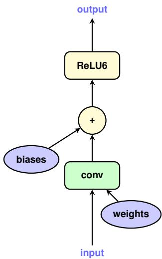  
Figure C.1: Simple graph: original

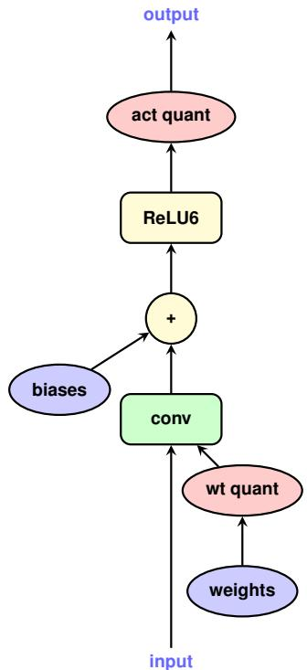  
Figure C.2: Simple graph: quantized

# D.2. Inception protocol

All results in table 4.3 were obtained after training for approximately 10 million steps, with batches of 32 samples, using 50 distributed workers, asynchronously. Training data were ImageNet 2012 $, 2 9 9 \times 2 9 9$ images with labels. Image augmentation consisted of: random crops, random horizontal flips, and random color distortion. The optimizer used was RMSProp with learning rate starting at 0.045 and de-

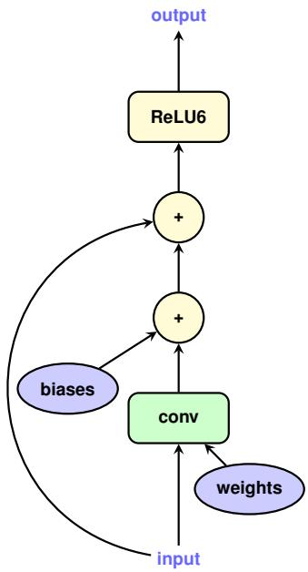  
Figure C.3: Layer with a bypass connection: original

caying exponentially and stepwise with factor 0.94 after every 2 epochs. Other RMSProp parameters were: 0.9 momentum, 0.9 decay, 1.0 epsilon term. Trained parameters were EMA averaged with decay 0.9999.

# D.3. COCO detection protocol

Preprocessing. During training, all images are randomly cropped and resized to $3 2 0 \times 3 2 0$ . During evaluation, all images are directly resized to $3 2 0 \times 3 2 0$ . All input values are normalized to $[ - 1 , 1 ]$ .

Optimization. We used the RMSprop optimizer from TensorFlow [1] with a batch size of 32. The learning rate starts from $4 \times 1 0 ^ { - 3 }$ and decays in a staircase fashion by a factor of 0.1 for every 100 epochs. Activation quantization is delayed for 500, 000 steps for reasons discussed in section 3. Training uses 20 workers asynchronously, and stops after validation accuracy plateaus, normally after approximately 6 million steps.

Metrics. Evaluation results are reported with the COCO primary challenge metric: AP at IoU=.50:.05:.95. We follow the same train/eval split in [13].

# D.4. Face detection and face attribute classification protocol

Preprocessing. Random 1:1 crops are taken from images in the Flickr-based dataset used in [10] and resized to $3 2 0 \times 3 2 0$ pixels for face detection and $1 2 8 \times 1 2 8$ pixels for face attribute classification. The resulting crops are flipped horizontally with a $5 0 \%$ probability. The values for each of the RGB channels are renormalized to be in the range $[ - 1 , 1 ]$ .

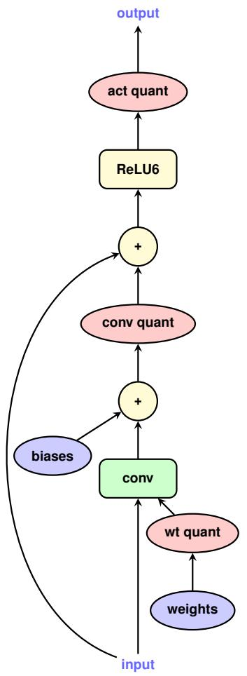  
Figure C.4: Layer with a bypass connection: quantized

Face Detection Optimization. We used the RMSprop optimizer from TensorFlow [1] with a batch size of 32. The learning rate starts from $4 \times 1 0 ^ { - 3 }$ and decays in a staircase fashion by a factor of 0.1 for every 100 epochs. Activation quantization is delayed for 500, 000 steps for reasons discussed in section 3. Training uses 20 workers asynchronously, and stops after validation accuracy plateaus, normally after approximately 3 million steps.

Face Attribute Classification Optimization. We followed the optimization protocol in [10]. We used the Adagrad optimizer from Tensorflow[1] with a batch size of 32 and a constant learning rate of 0.1. Training uses 12 workers asynchronously, and stops at 20 million steps.

Latency Measurements. We created a binary that runs the face detection and face attributes classification models repeatedly on random inputs for 100 seconds. We pushed this binary to Pixel and Pixel 2 phones using the adb push command, and executed it on 1, 2, and 4 LITTLE cores, and 1, 2, and 4 big cores using the adb shell command with the appropriate taskset specified. We reported the average runtime of the face detector model on

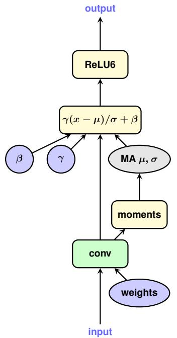

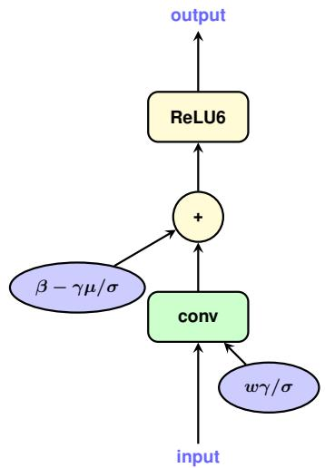  
Figure C.5: Convolutional layer with batch normalization: training graph   
Figure C.6: Convolutional layer with batch normalization: inference graph

$3 2 0 \times 3 2 0$ inputs, and of the face attributes classifier model on $1 2 8 \times 1 2 8$ inputs.

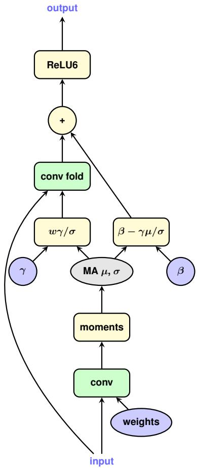  
Figure C.7: Convolutional layer with batch normalization: training graph, folded

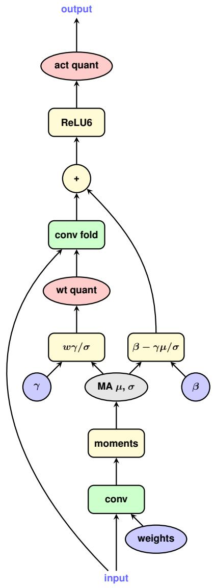  
Figure C.8: Convolutional layer with batch normalization: training graph, folded and quantized